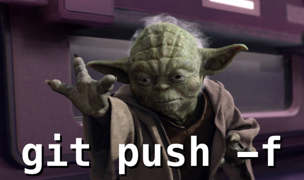

# [→ Máster en Big Data y Machine Learning](https://fictizia.com/formacion/master-big-data)
### Big Data, Machine Learning, Tensor Flow, Data Science, Data Analytics, Arquitecturas Big Data, Plataformas Big Data

## Capítulo 1 - Clase 01

En esta primera clase del capítulo uno se describe como utilizar GIT la herramiento de gestión de código fuente que ser utilizada durante el Máster. Esta herramienta será utilizada para el almacenamiento de todos los contenidos del máster, así
como los diferentes ejemplos de código fuente que serán utilizados.

### 1.1 Gestión del código fuente mediante repositorios (GIT)

**Funcionamiento de GIT**

Git, es un software de control de versiones. El control de versiones se puede definir como la gestión de los diversos cambios 
que se realizan sobre los elementos de un software. El objetivo del control de versiones es conocer el ciclo del vida 
del software con el objetivo de conocer su evolución y saber __quien y __como se han realizado los cambios en los diferente 
elementos que conformar el software. 


***Caractersticas básicas***

- Arquitectura de Árbol(working area, staging Area, Repository)
- Auditoria de código, que nos permite conocer Qué, Quíen, Cuándo se a realizado un cambio.  
- Git trabaja en binario (imagenes, docs, source code, ...)
- Git no almacena una copia completa de cada version, solo almacena los cambios entre la versión anterior y la nueva.
- Distribución (Repositorios o proyectos)
- Permite trabajar offline o outline
- Opensource
- Puede ser utilizado a través de Consola o GUI
- Existen diferentes "sabores" (Github, Bitbucket o Gitlab)

### Trabajando con Git

**Instalación**

Instalamos [Git - Source Code Management](http://git-scm.com/)

**Comandos básicos**

La opción push -f debe ser la último opción al hacer un push. Es el camino al lado oscuro. 



versión
```
git --version
```
Guardando nombre de usuario global a todos los proyectos
```
git config --global user.name "nombre"
```
Comprobando el nombre global
```
git config --global user.name
```
Guardando nombre de usuario local a un repositorio de manera específica
```
git config user.name "nombre"
```
Comprobando el nombre local
```
git config user.name
```
Guardando Email global a todos los proyectos
```
git config --global user.email "email"
```
Guardando Email local a 
```
git config user.email "email"
```
Habilitando colores
```
git config --global color.ui true
```
Ver usuarios globales en el equipo
```
git config --global --list
```
Ver usuarios en el repositorio
```
git config --list
```

**GIT Working flow (local) - Básico**

El funcionamiento de git se basa en la creación de ramas sobre los repositorios de elementos de manera que podremos interactuar 
con las diferentes ramas añadiendo, borrando, mezclando o incluso eliminando las ramas. 


- help (ayuda)

    - Ayuda general
    ```
    git config --global --list
    ```

    - Ayuda especifica
    ```
    git help push
    ```

    - Salir de la ayuda
    ```
    q (quit)
    ```

- init (arranque)
    - Buscamos la carpeta (ls, dir...)
    - Arrancando Git
    ```
    git init
    ```

- status
    - Verificar estado
    ```
    git status
    ```

- add
    - Añadiendo todo
    ```
    git add -A
    ```

    - Añadiendo todo *(como add -A, pero omite los archivos fuera de track)*
    ```
    git add .
    ```

    - Añadiendo un archivo especifico
    ```
    git add nombre_archivo
    ```

- commit
    - Comentando el commit
    ```
    git commit -m "Mi primer commit"
    ```

- log
    - Verificando el estado de los commits
    ```
    git log
    ```

- reset (Reseteamos el proyecto hasta un punto dado (WARNING: NO SE PUEDE REVERTIR!))
    - Este cambio afecta ni al working area ni al Stagging Area, solo al repositorio
    ```
    git reset --soft id_commit
    ```

    - No afecta al working area
    ```
    git reset --mixed id_commit
    ```

    - Afecta a todos los niveles incluido el working area
    ```
    git reset --hard id_commit
    ```

    - En caso de necesitar recuperación.
      Haz un reset --hard hacia delante, con el número del útimo commit.
      ```
      git reset --hard id_commit
      ```

    - Devolver un archivo de staging a working area
    ```
    git reset HEAD nombre_archivo
    ```    

**GIT Working flow (local) - Avanzado **

- log
    - Hacemos una copia de seguridad de nuestros commits.
    ```
    git log > commits.txt
    ```

- checkout

    - Nos colocamos en el commit
    ```
    git checkout id_commit
    ```

    - Marquemos el destino (Master)
    ```
    git checkout master
    ```

**GIT Working flow (local) - Ramas (Branches)**

Git nos permite construir multiples ramas (branchs), que pueden ser copias entre si y que nos permiten tener diferentes 
versiones de código. 

Ramas (Espacios de trabajo paralelo)

*Línea master -> Linea "estable" o principal.*
*Lineas secundarias -> lineas de preproducción, desarrollo, bugs, experimentos, etc*

- branch

    - Crear una rama
    ```
    git branch nombre_rama
    ```

    - Visualizar todas las ramas
    ```
    git branch
    ``` 
    
    - Cambiar de rama
    ```
    git checkout nombre_rama
    ```  

    - Ver cambios en formato ramas
    ```
    git log --oneline --graph --all
    ```  

    - Borrar una rama
    ```
    git branch -d nombre_rama
    ```

**GIT Working flow (local) - Fusiones (básico)**

Git nos permite unificar ramas una vez que haya probado el correcto funcionamiento de nuestro productos. 


- Nos situamos en la rama que absorberá (principal)
    ```
    git checkout nombre_rama_principal
    ```

- Hacemos el *merge*, de manera que insertamos la información de la rama en la rama principal 
    ```
    git merge nombre_rama_secundaria
    ```

- Añadir comentario (o)

- Guardar y salir (:x)

- Ramas fusionadas
    ```
    git branch
    ```

- Borramos rama
    ```
    git branch -d rama_secundaria
    ```


**GIT Working flow (local) - Fusiones (gestión conflictos)**

En algunos casos se pueden producir conflicto cuando se mergean diferentes ramas. Esto ocurre cuando se han producido 
cambios en el mismo archivo de ambas ramas, de forma que el punto de partida de ambas difiere. 

  - Fast-forward (automatizado). No hay conflicto alguno.

    - Nos situamos en la rama que absorberá (principal)
    ```
    git checkout nombre_rama_principal
    ```

    - Hacemos el MERGE
    ```
    git merge RAMASECUNDARIA
    ```

    - Añadir comentario (o)

    - Guardar y salir (:x)


  - Manual Merge (Conflicto, dos personas tocaron los mismos archivos)

    - Nos situamos en la rama que absorberá (principal)
    ```
    git checkout nombre_rama_principal
    ```

    - Hacemos el MERGE
    ```
    git merge nombre_rama_secundaria
    ```

    - En consola
    ```
    Auto-merging NOMBRE_CARPETA/NOMBRE_ARCHIVO
    CONFLICT (content): Merge conflict in NOMBRE_CARPETA/NOMBRE_ARCHIVO
    Automatic merge failed; fix conflicts and then commit the result.
    ```

    - En el editor
    ```
    <<<<<<< HEAD
    Hola a todos.
    =======
    hola a todos y todas.
    >>>>>>> conflictiva
    ```

    - Resolver y guardar (La resolución del conflicto consiste en elegir en que rama nos quedamos.)
    ```
    hola a todos y todas.
    ```

    - Comprobamos el estado
    ```
    git status
    ```

    - commit para la resolución conflicto
    ```
    git commit -m "commit reparador"
    ```

    - Resultado
    ```
    *   81a6c1d commit reparador
    |\  
    | * 64b5518 otro commit más
    * | 29a6348 commit a mi nueva rama
    |/  
    * afe16ae Actualizamos la rama
    * 7c9cc50 Mi primer Commit
    ```

    - Borramos la rama (opcional)
    ```
    git branch -d nombre_rama_secundaria
    ```
    
    **GITHUB Working flow (básico)**
  - clone
    - Clonar un proyecto ( [Bootstrap](https://github.com/twbs/bootstrap) )
    ```
    git clone https://github.com/twbs/bootstrap.git
    ```

  - log
    - Mirar los commits
    ```
    git log
    ```    


**GITHUB Working flow (Creando mi proyecto en github)**

  - Creamos los ficheros

  - init
    - Nos movemos a la carpeta principal del proyecto y monitorizamos los ficheros
    ```
    git init
    ```

  - commit
    - Añadimos los ficheros en un commit
    ```
    git commit -am "Mi primer proyecto"
    ```

  - remote
    - Enlazamos con Github a la url que le corresponda
    ```
    git remote add origin <--HTTPoSSH-->
    ```

    - Comprobamos los detalles
    ```
    git remote -v
    ```

  - push
    - Mandamos los cambios
    ```
    git push origin master
    ```

**GITHUB Working flow (Trabajando en equipo)**

El proceso es igual, pero es necesario mantenerse sincronizado.

  - fetch
    - Actualizar *origin/master* (rama espejo en local)
    ```
    git fetch origin
    ```

  - merge
    - Fusionar *master* con *origin/master*
    ```
    git merge origin/master
    ```

  - commit
    - Preparamos un *commit* para subir un cambio a Github
    ```
    git commit -am "Nuevo cambio"
    ```

  - push
    - Subimos los cambios
    ```
    git push origin master
    
    
    

**GITHUB Working flow (Proyectos de terceros)**
*Usamos 2 repositorios (ORIGINAL EXTERNO (upstream/master) -> CLON ORIGINAL (origin/master) -> CLON LOCAL)*

  - remote
    - Conectamos al fork (origin)
    ```
    git remote add origin <--- HTTP --->
    ```

    - Verificamos la conexión
    ```
    git remote -v
    ```

    - Conectamos al remoto *(Upstream)*
    ```
    git remote add upstream HTTTPREPO-UPS
    ```

    - Verificamos que tenemos dos enlaces *(origin y upstream)*
    ```
    git remote -v
    ```

  - fetch
    - Comprobamos cambios en *origin*
    ```
    git fetch origin
    ```

    - Comprobamos cambios con *upstream*
    ```
    git fetch upstream
    ```

  - merge
    - Fusionamos *upstream* con local para actualizarnos
    ```
    git merge upstream/master
    ```

  - push
    - Subimos cambios a *origin*
    ```
    git push origin master
    ```

  - Subimos cambios al *upstream (pull-request)*


**GITHUB Working flow (Podemos crear una web para nuestro proyecto)**
GitHub Pages nos permite hacer una web estática para nuestro usuario o proyectos

  - clone
    - Clonamos el repositorio
    ```
    git clone <-- URL.git -->
    ```

  - checkout --orphan
    - Creamos una rama huérfana
    ```
    git checkout --orphan my-pages
    ```

  - rm
    - Borramos todos los archivos del directorio
    ```
    git rm --rf .
    ```

  - add
    - Creamos nuestro index.html y lo añadimos
    ```
    echo "Bienvenido a my-pages" > index.html
    git add index.html
    ```

  - commit
    - Preparamos un commit para subir el index a Github
    ```
    git commit -am "Nueva actualización"
    ```

  - push
    - Subimos el cambio
    ```
    git push origin my-pages
    ```

**GITHUB Avanzado (Trucos by Ulises (@kom_256))**

  - branch
    - Renombrar rama
    ```
    git branch -m nombre_rama nombre_nueva_rama
    ```

    - Mostrando todas las ramas
    ```
    git branch -a
    ```

  - add + commit (Super commit con addición)
    - am
    ```
    git commit -am "My actualización"
    ```

  - pull ()
    - fecht + merge
    ```
    git pull
    ```

  - diff
    - Ver lo que has modificado pero aún no has preparado
    ```
    git diff
    ```

    - Ver los cambios que has preparado y que irán en tu próximo commit
    ```
    git diff --cached
    ```
    
Si has llegado hasta aquí ya lo sabes todo lo necesario acerca de git para realizar este Máster. Si quieres saber más puedes utilizar los siguientes recursos:

- [Socializacion](https://guides.github.com/activities/socialize/)
- Timeline Actividad
- [Colaborar](https://guides.github.com/activities/contributing-to-open-source/)
- [Compartir](https://guides.github.com/introduction/getting-your-project-on-github/)
- [Gist](https://gist.github.com/)
- [Issues](https://guides.github.com/features/issues)
- [Pages](https://guides.github.com/features/pages/)
- [Wikis](https://guides.github.com/features/wikis)
- [Gestíon de projectos](https://github.com/features/project-management)
