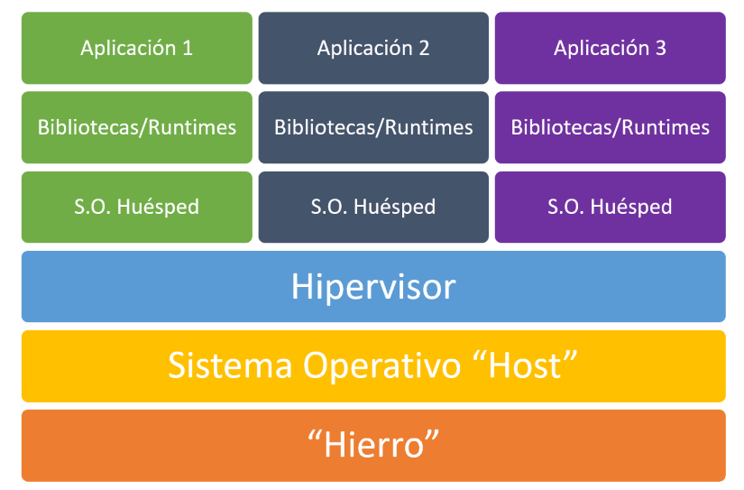
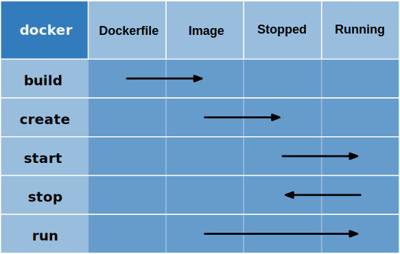

# [→ Máster en Big Data y Machine Learning](https://fictizia.com/formacion/master-big-data)
### Big Data, Machine Learning, Tensor Flow, Data Science, Data Analytics, Arquitecturas Big Data, Plataformas Big Data

## Capítulo 2 - Clase 01

Es esta clase vamos a apreder a trabar con contenedor mediante la utilización de Docker. El objetivo de esta clase es aprender 
que es un contenedor, cómo se utiliza, cómo se configura y como utilizar este tipo de tecnología para desplegar cualquier tipo 
de aplicación utilizándolos. 

### La virtualización ###

La virtualización es una tecnología que permite crear servicios de TI útiles mediante recursos que están ligados tradicionalmente al hardware. Además, distribuye sus funcionalidades entre diversos usuarios o entornos, lo que permite utilizar toda la capacidad de una máquina física. 

**Inconvenientes**

- Menos rendimiento ya que todo es virtualizado
- Es necesario conocer las diferentes herramientas de virtualización

**Ventajas**

- Menos costes ya que tienes menos servidores físicos
- Menos costes porque se reduce el tiempo de inactividad de las máquinas
- Es más facil recuperar los sistemas
- Es más sencillo desplegar los sistemas
- Es posible desplegar nuevas máquinas si disponemos de los recursos necesarios

#### ¿Cómo funciona la virtualización? ####

Los sistemas para el despligue de entornos virtuales se basan en la utilización un software específico denominado hipervisor. Los hipervisores actuan como un middleware que separa los diferentes recursos físicos de los entornos virtuales. Los hipervisores pueden conformarse como elementos principales de un sistema operativo (como una computadora portátil) o se pueden instalar directamente en el hardware (como un servidor), que es la forma en que la mayoría de las empresas virtualizan. Los hipervisores toman los recursos físicos y los dividen de manera tal que las máquinas virtuales puedan utilizarse.


Es decir, los sistemas de virtualización nos permiten desplegar máquinas simuladas. Es decir podemos desplegar diferentes 
tipos de servidores virtuales en un mismo servidores físicos siempre y cuando sus recursos nos los permitan. 

#### Máquina Virtual 

Una máquina virtual (VM como se la suele conocer por sus siglas en inglés: Virtual Machine) puede definirse como un sistema operativo completo funcionando de manera aislada sobre otro sistema operativo completo desplegado en un máquina física donde los recursos hardware que utiliza la máquina virtual se corresponde con los parte de los recursos hardware de la segunda máquina siendo administrados por el hypervisor. 



De forma que las tecnología de virtualización permite compartir el hardware de modo que lo puedan utilizar diferentes VMs utilizando los recursos que se les han asignado de manera transparente para ella.

#### El concepto del hipervisor

Para que las máquinas virtuales puedan ejecutarse en el entorno de virtualización es obligatorios desplegar un componente de gestión sobre el SSOO, denominado __hipervisor__. El hipervisor es un software especializado en la gestión y exposición de recursos hardware (CPUs, RAM, GPUs, TPUs, HDD, SDD, etc) que tiene disponible el sistema operativo primario, de modo que puedan ser utilizados por otros sistemas operativos que serán los que estén desplegados en las diferentes VMs. De este modo se pueden crear máquinas virtuales que utilizan de manera parcial el hardware físico. Este software permite crear una infraestructura que  "engañan" a un sistema operativo convencional para que crea que se está ejecutando sobre una máquina física. Los hipervisores están incluidos en software de virtualización Hyper-V (incluido gratuitamente con Windows), VirtualBox, VMWare o Vagrant.

#### Vagrant


**Recursos**
- [vagrantup.com](https://www.vagrantup.com/)
- [Vagrant | Intro](https://www.vagrantup.com/intro/index.html)
- [Vagrant | Docs](https://www.vagrantup.com/docs/index.html)
- [Wikipedia | Vagrant](https://es.wikipedia.org/wiki/Vagrant_(software))
- [Vagrant in 5 minutes](https://www.youtube.com/watch?v=cx79jOpZVE8)
- [Introducción a Vagrant](https://guiadev.com/vagrant/)
- [What is Vagrant?](https://opensource.com/resources/vagrant)
- [Github | hashicorp/vagrant](https://github.com/hashicorp/vagrant)
- [Docker vs Vagrant](https://guiadev.com/docker-vs-vagrant/)


#### VMWare


**Recursos**
- [Wikipedia | VMware](https://es.wikipedia.org/wiki/VMware)
- [vmware.com](https://www.vmware.com/es.html#)
- [¿Qué es Vmware vSphere?](https://virtualizadesdezero.com/que-es-vmware-vsphere/)
- [VMware Cloud on AWS](https://aws.amazon.com/es/vmware/)
- [Soluciones IBM Cloud for VMware](https://www.ibm.com/es-es/cloud/vmware)

#### Oracle VM VirtualBox


**Recursos**
- [Wikipedia | Virtualbox](https://es.wikipedia.org/wiki/VirtualBox)
- [VirtualBox.org](https://www.virtualbox.org/)
- [VirtualBox.org | End-user documentation](https://www.virtualbox.org/wiki/End-user_documentation)
- [VirtualBox.org | Technical documentation](https://www.virtualbox.org/wiki/Technical_documentation)
- [VirtualBox.org | Community](https://www.virtualbox.org/wiki/Community)
- [Oracle | Desarrollo mediante VM Virtual Box, despliegue en cualquier parte](https://www.oracle.com/es/virtualization/virtualbox/)

#### Contenedores: Dockers ####


Docker es un proyecto de software que permite crear, implementar y deplegar aplicaciones software de forma rápica y sencilla mediante virtualización basada en contenedores. Docker empaqueta el software en unidades estandarizadas llamadas contenedores que incluyen todo lo necesario para que el software se ejecute, incluyendo bibliotecas, herramientas de sistema, código y tiempo de ejecución. Con Docker, se puede implementar y ajustar la escala de aplicaciones rápidamente en cualquier entorno con la certeza de saber que su código se ejecutará. Ya que el contenedor es autocontenido desde el punto de vista del SSOO y las aplicaciones que se ejecutan dentro. 

#### Componentes básicos ###

Los elementos básicos de docker son el motor Docker (Docker engine) que permite ejecutar las diferentes imágenes que pueden ser creadas por el usuario u obtenerse en el repositorio general Docker Hub.

**Imágenes**

Este es el elemento más importe de docker y es una plantilla de solo **lectura** con todas las instrucciones que necesita el motor de Docker para crear un contenedor. Los imagenes Docker se describen mediante un archivo de texto (Dockerfile).

**Docker Hub**
El Docker Hub es un registro para repositorios de software basado en la nube, es decir, una especie de biblioteca para las imágenes Docker. Este servicio online está formado por repositorios públicos y privados. Los repositorios públicos ofrecen a los usuarios la posibilidad de subir sus propias imágenes y compartirlas con la comunidad. En cambio, los repositorios privados son repositorios específico para una empresa o entidad. Docker Hub está disponible a través de hub.docker.com.

**Motor de Docker (Docker Engine)**

Es una aplicación cliente-servidor de código abierto disponible para todos los usuarios en la versión actual en todas las plataformas establecidas. Está formado por tres componentes: (1) un daemon que actua como servidor, (2) una interfaz de programación (API) basada en REST; y (3) un terminal del sistema operativo (Command-Line Interface, CLI) como interfaz de usuario.

* Daemon: Se encarga de crear y administrar todas las imágenes, contenedores o redes.
* API REST: Ofrece una serie de interfaces que permite a otros programas interactuar con el daemon y darle instrucciones.
* Terminal: Docker utiliza la terminal del sistema operativo como programa cliente, el cual interacciona con el daemon a través de la API REST y permite a los usuarios controlarlo a través de scripts o comandos.


#### Ciclo de vida de un contenedor

El ciclo de vida de un contenedor es el conjunto de estados por los que puede pasar un contenedor.



* Definción (DockerFile): Es el estado en el cual se están definiendo los elementos básicos del contenedor que se corresponden con la configuración del propio contenedor (SSOO), las diferentes libreras que serán instaladas, el código fuente que será desplegado y la forma en la que se ejecutará el código fuente. 
* Imagen: Es un imagen construida, es decir, todos los componentes han sido instalados y desplegados para su ejecución. 
* Stopped: Es un contenedor en que encuentra en estado de reposo, es decir la imagen está congelada.  
* Running: Es un contenedor en ejecución, es decir la imagen está en ejecución.   

#### Recursos ####

**Recursos**
- [Página oficial | Docker](https://docs.docker.com/)
- [Página oficial | Referencias](https://docs.docker.com/reference/)
- [Guía de instalación | Inglés](https://docs.docker.com/install/)

#### Comando básicos de docker ####

versión
```
docker --version
```

descarga de imágenes 
```
docker pull nombre[:tag|@digest]
```

Despliegue de un contenedor (básico)
```
docker run --name=id_contenedor imagen
```

Despliegue de un contenedor en segundo plano (básico)
```
docker run --name=id_contenedor -d imagen
```

Listar/visualizar todas la imágenes finales
```
docker images
```

Listar/visualizar todas la imágenes (incluyenod las imágenes ocultas)
```
docker images -a 
```

Eliminar una imagen
```
docker images rm <id_imagen>
```

Acceder al contenedor 
```
docker exec -it <id_contenedor> <programa>
```

Listar/visualizar todos los contenedores en ejecución
```
docker container ps
```

Listar/visualizar todos los contenedores
```
docker container ps -a
```

Parar un contenedor
```
docker container stop <id_contenedor>
```

Arrancar de un contenedor (Debe encontrarse en el estado de parada (Stop))
```
docker container start <id_contenedor>
```

Borrar de un contenedor (Debe encontrarse en el estado de parada (Stop))
```
docker container rm <id_contenedor>
```

Borrar de un contenedor
```
docker container rm -f <id_contenedor>
```

visualizar información del contenedor
```
docker inspect <id_contenedor>
```

Crear un volumen 
```
docker volume create --name <nombre_volumen>
```

eliminar un volumen 
```
docker volume rm <nombre_volumen>
```

#### Desplegando un base de datos en 3 minutos

Docker nos permite desplegar de forma sencilla contenedores utilizando imágenes previamente creadas, para aprender como reutilizar estas imágenes vamos a desplegar un servidor de bases de datos MySQL. 

**Paso 1: Descargando la imagen**

En primer lugar vamos a descarga la imagen que queremos instalar, para comprobar que imágenes tenemos disponibles podemos ir acceder al listado de imágenes del servidor [MySQL](https://hub.docker.com/r/mysql/mysql-server/) disponibles en docker. 

```
docker pull mysql/mysql-server:latest
```

En este caso vamos a descargar la última imagen para ellos utilizamos el tag "latest" que indica que queremos descarga la última opción disponible. Si quisieramos descargar una opción específico podría utilizar el comando pull cambiando el valor del tag. 

```
docker pull mysql/mysql-server:5.6
```

A continuación comprobaremos si la imagen se ha descargado correctamente y está disponible en nuestro repositorio local de imágenes, mediante el siguiente comando:

```
docker images 
```

Obteniendo la siguiente salida que nos indica que hemos descargado la imagen mysql en su versión (tag) 5.7 hace 6 semanas. 

```
REPOSITORY                TAG                 IMAGE ID            CREATED             SIZE
mysql                     5.7                 383867b75fd2        6 weeks ago         373MB
```

A continuación se muestran la opciones del comando images:

```
Usage:	docker images [OPTIONS] [REPOSITORY[:TAG]]

List images

Options:
  -a, --all             Show all images (default hides intermediate images)
      --digests         Show digests
  -f, --filter filter   Filter output based on conditions provided
      --format string   Pretty-print images using a Go template
      --no-trunc        Don't truncate output
  -q, --quiet           Only show numeric IDs
```

**Paso 2: Descargando la imagen**

A continuación desplegamos el contenedor mediante la utilización del comando run indicando el nombre que le queremos dar al contenedor, que en este caso será mysql1 y la imagen que queremos desplegar. 

```
docker run --name mysql1 mysql/mysql-server:latest
```

Tras la ejecución de este comando observamos que nuestro terminal se ha bloqueado y vemos la actividad del contenedor mediante log en tiempo real 

```
[Entrypoint] MySQL Docker Image 8.0.18-1.1.13
[Entrypoint] No password option specified for new database.
[Entrypoint]   A random onetime password will be generated.
[Entrypoint] Initializing database
2019-10-29T08:59:41.201658Z 0 [System] [MY-013169] [Server] /usr/sbin/mysqld (mysqld 8.0.18) initializing of server in progress as process 21
2019-10-29T08:59:44.851538Z 5 [Warning] [MY-010453] [Server] root@localhost is created with an empty password ! Please consider switching off the --initialize-insecure option.
```

Para evitar esto debemos utilizar la opción (Deatached Mode) __-d__ que nos permite ejecutar el contenedor en segundo plano (background). 

```
docker run --name mysql1 -d mysql/mysql-server:latest
```

**Paso 3: Identificando la contraseña**

Los servidores MySQL obligan a crear una contraseña durante su intalación, en este caso no hemos indicando ningún tipo de constraseña para nuestro servidor, por lo que deberemos identificar cual es la constraseña del usuario root. Para identificar la contraseña debemos visualizar el log mediante el siguiente comando:


```
docker logs mysql1
```

Tras la ejecución del comando obteneremos algo como esto 

```
[Entrypoint] MySQL Docker Image 8.0.18-1.1.13
[Entrypoint] No password option specified for new database.
[Entrypoint]   A random onetime password will be generated.
[Entrypoint] Initializing database
2019-10-29T08:36:20.190954Z 0 [System] [MY-013169] [Server] /usr/sbin/mysqld (mysqld 8.0.18) initializing of server in progress as process 20
2019-10-29T08:36:23.461129Z 5 [Warning] [MY-010453] [Server] root@localhost is created with an empty password ! Please consider switching off the --initialize-insecure option.
[Entrypoint] Database initialized
2019-10-29T08:36:27.121122Z 0 [System] [MY-010116] [Server] /usr/sbin/mysqld (mysqld 8.0.18) starting as process 67
```

Esto indica que mi servidor se ha creado sin ningún tipo de password para el usuario root por lo que será muy recomdable cambiarlo. 

**Paso 4: Accediendo al contenedor**

Para modificar el password del usuario root es necesario acceder al contenedor mediante la utilización del siguiente comando:

```
docker exec -it mysql1 /bin/bash
```

Aunque en el caso de mysql podemos acceder directamente al servidor MySQL utilizando el comando de acceso de MySQL

```
docker exec -it mysql1 mysql -u root -p
```

Al intentar ejecutar este comando por primer vez el contenedor nos solicitará un password que no conocremos, por lo que se generá de manera automática y podrá visualizarse de nuevo en el log obteniendose la siguiente salida:

```
[Entrypoint] MySQL Docker Image 8.0.18-1.1.13
[Entrypoint] No password option specified for new database.
[Entrypoint]   A random onetime password will be generated.
[Entrypoint] Initializing database
2019-10-29T08:36:20.190954Z 0 [System] [MY-013169] [Server] /usr/sbin/mysqld (mysqld 8.0.18) initializing of server in progress as process 20
2019-10-29T08:36:23.461129Z 5 [Warning] [MY-010453] [Server] root@localhost is created with an empty password ! Please consider switching off the --initialize-insecure option.
[Entrypoint] Database initialized
2019-10-29T08:36:27.121122Z 0 [System] [MY-010116] [Server] /usr/sbin/mysqld (mysqld 8.0.18) starting as process 67
2019-10-29T08:36:27.782666Z 0 [Warning] [MY-010068] [Server] CA certificate ca.pem is self signed.
2019-10-29T08:36:27.803181Z 0 [System] [MY-010931] [Server] /usr/sbin/mysqld: ready for connections. Version: '8.0.18'  socket: '/var/lib/mysql/mysql.sock'  port: 0  MySQL Community Server - GPL.
2019-10-29T08:36:27.939200Z 0 [System] [MY-011323] [Server] X Plugin ready for connections. Socket: '/var/run/mysqld/mysqlx.sock'
Warning: Unable to load '/usr/share/zoneinfo/iso3166.tab' as time zone. Skipping it.
Warning: Unable to load '/usr/share/zoneinfo/leapseconds' as time zone. Skipping it.
Warning: Unable to load '/usr/share/zoneinfo/tzdata.zi' as time zone. Skipping it.
Warning: Unable to load '/usr/share/zoneinfo/zone.tab' as time zone. Skipping it.
Warning: Unable to load '/usr/share/zoneinfo/zone1970.tab' as time zone. Skipping it.
[Entrypoint] GENERATED ROOT PASSWORD: ]uRF3PRuRuvmansYM0DGeL*orT
```
Donde el password de acceso es __uRF3PRuRuvmansYM0DGeL*orT__. Ahora ya si que podemos entrar en nuestro servidor MySQL

**Paso 5: Accediendo a nuestro servidor desde el exterior**

Ahora tenemos un servidor MySQL operativo pero sólo podemos utilizar si accedemos directamente al contenedor, para ello tenemos que abrir los puertos necesarios para permitir el acceso a los diferentes servicios que ha desplegado nuestro contenedor. En este caso queremos acceder al servidor a través del puerto __3306__ del servidor MySQL, para ello debemos incluir una nueva opción en nuestro comando de arranque

``` 
docker run -p 3306:3306 --name mysql1 -d mysql/mysql-server:latest
``` 

Para comprobar si mi contenedor se ha levantado correctamente puedo utilizar el siguiente comando 

```
docker ps -a
```

Obteniendo la siguiente salida que nos indica que nuestro contenedor mysql1 está escuchando en nuestro puerto 3306

```
CONTAINER ID        IMAGE                       COMMAND                  CREATED             STATUS                            PORTS                               NAMES
d80d489b03bb        mysql/mysql-server:latest   "/entrypoint.sh mysq…"   5 seconds ago       Up 4 seconds (health: starting)   0.0.0.0:3306->3306/tcp, 33060/tcp   mysql1
```

**Paso 6: Buenas prácticas**

La forma en la que hemos levantado el servidor MySQL es correcta, pero hay ciertos pasos que se pueden simplificar incluyendo variables de sesion, que son utilizadas para la configuración de ciertos elementos del servidor. Por ejemplo, el password del usuario se puede definir durante la ejecución el comando run, utilizando la variable de entorno **MYSQL_ROOT_PASSWORD** 

``` 
docker run --name mysql1 -e MYSQL_ROOT_PASSWORD=fictizia -d mysql/mysql-server:latest 
``` 

Cuando estemos incluyendo variables de entorno, se recomiendo que imagen se encuentre al final del comando, ya que en algunas situaciones da errores. 

#### Creando nuestro primer contenedor

**Paso 1: Creando la estructura de directorios**

Vamos a crear nuestro primer contenedor para montar nuestro propio servidor web. Para ellos vamos a crear una página web muy sencilla. 

``` 
$ mkdir capitulo_2
$ cd capitulo_2 
$ mkdir app
$ cd app
$ mkdir src
``` 

**Paso 2: Creación de nuestra página web**

A continuación crearemos un fichero denominado index.html dentro del directorio src donde incluiremos nuestro código html básico. 

``` 
<!DOCTYPE html>
<html lang="en">
<head>
    <meta charset="UTF-8">
    <title>Nuestra primera aproximación a los contenedores</title>
</head>
<body>
    <h1>Está funcionando, no puede ser!!!!!</h1>
</body>
</html>
``` 

**Paso 3: Creación de nuestro fichero de despliegue**

A continuación crearemos nuestro fichero de configuración o depliegue del contenedor que se denomina DockerFile (Es importante utilizar siempre este nombre porque sino Docker tal vez no lo encuentre). El fichero de despliegue es la configuración básica de nuestro contenedor, en ella se indican todos los pasos necesarios para la construcción de nuestra imagen. 

``` 
FROM ubuntu:18.04
MAINTAINER Moisés <moises@fictizia.com>

RUN apt-get update && apt-get install -y apache2 && apt-get clean && rm -rf /var/lib/apt/lists/*
ENV APACHE_RUN_USER  www-data
ENV APACHE_RUN_GROUP www-data
ENV APACHE_LOG_DIR   /var/log/apache2
ENV APACHE_PID_FILE  /var/run/apache2/apache2.pid
ENV APACHE_RUN_DIR   /var/run/apache2
ENV APACHE_LOCK_DIR  /var/lock/apache2
ENV APACHE_LOG_DIR   /var/log/apache2
RUN mkdir -p $APACHE_RUN_DIR
RUN mkdir -p $APACHE_LOCK_DIR
RUN mkdir -p $APACHE_LOG_DIR
COPY ./src/index.html /var/www/html
EXPOSE 80
CMD ["/usr/sbin/apache2", "-D", "FOREGROUND"]
``` 
El contenido del fichero de despliegue es la parte más importante a la hora de crear nuestros contenedores ya que se difine la configuración del contenedor y como se puede se puede desplegar: 

* FROM: crea la capa de simulación/definición del sistema operativo, en este caso vamos a utilizar la imagen docker de  ubuntu:18.04. La directiva FROM es probablemebte la información más importante en el Dockerfiles ya que define la imagen base que ser utilizada para construir el contenedor. IMPORTANTE: Para este ejemplo hemos utilizado la imagen de ubuntu pero existen distribuciones mucho más ligeras (ALPINE).

* MAINTAINER: Este comando es opcional y se utiliza para definir la autoria.
* COPY: Este comando se utiliza para copiar ficheros desde la máquina anfitriona al contenedor. En este cado lo vamos a utilizar para mover nuestra páginas web de prueba. 
* RUN: Este comando sirve para ejecutar comandos del sistema operativo elegido a la hora de construir la imagen. Es este caso podemos utilizar cualquier comando del terminal de ubuntu. Esto no significa que se puedan utilizar todos los comando de ubuntu, ya que en algunas ocasiones las imagenes contienen menor número de comandos con el fin de minimizar su tamaño o minimizar el tiempo de despliegue. RUN es un comando que se sólo se ejecuta durante el proceso de construcción (Build). 
* CMD: Este es probablemente el segundo comando más importante despues de FROM, ya que definie la aplicación que ejecutará el contenedor al ejecutarse. Es un comando único, es decir que el contenedor sólo ejecutara un comando CMD al producirse el despliegue. CMD es un comando que se sólo se ejecuta durante el procesos de ejecución (Running) 
* EXPOSE: Este comando se ejecuta cuando tenemos que exponer algún tipo de aplicación mediante un puerto. En el ejemplo, estamos exponiendo el puerto 80 de nuestro servidor web.
* ENV: Esto son las diferentes variables de entorno que estamos definiendo de manera que puedan ser utilizadas tanto en tiempo de construcción como en tiempo de ejecución. 

**Paso 4: Construyendo nuestra imagen**

Una vez que hemos definido el fichero de despliegue podemos construir nuestra imagen mediante el comando __build__ desde el directorio donde está 

``` 
docker build -t fictizia-1/0.1 . 
``` 

Para comprobar si nuestra imagen se ha construido correctamente visualizaremos la imagenes y deberíamos obtener la siguiente salida:

``` 
REPOSITORY                TAG                 IMAGE ID            CREATED              SIZE
fictizia-1/0.1          latest              aebd49d31f40        About a minute ago   161MB
``` 

**Paso 5: Desplegando nuestro contenedor**

A continuación desplegamos el contenedor mediante la utilización del comando __run__ de forma similar a como lo realizamos en el ejemplo anterior

```
docker run -p 80:80 --name apache1 -d fictizia-1/0.1:latest
```

#### Volumenes

En algunas situaciones es útil tener un directorio compartido entre la máquina donde se ejecuta el Docker engine y los contendores con el fin de que cierta persista con independencia del estado del contenedor. Existen tres tipos de volúmenes que comunmente se dividen en tres tipos:

* Volumenes de datos anónimos
* Volumenes de datos no anónimos
* Molumenes montamos (Mounted)

** Volúmenes de datos anónimos **

Los volumenes anónimos se crean cuando se lanza el contenedor, donde el nombre del volumen se define con un nombre alfanumérico. Se pueden generar añadiendo la opción __-v__ y la ruta del directorio que se quiere compartir

```
docker run -p 80:80 --name apache1 -v /var/www/html -d fictizia-web/0.1:latest
```
En este caso hemos mapeado el directorio de donde se almacenan las páginas web de manera que podamos modicarlas, para poder encontrar nuestro volumen compartido podemos utilizar el siguiente comando:

```
docker volume ls
```

que muestra el conjunto de volumenes que tenemos disponibles:

```
DRIVER              VOLUME NAME
local               3fdf0a573f504b90cf66afcb03466eec686cb80fc4bf57a33a67a2c2eb5cbee5
```
Este tipo de volumenes se almacenan en la carpeta __/var/lib/docker/volumes/__ (entorno linux), de forma que si utilizamos el comando __tree__ sobre el directorio podemos encontrar nuestro volumen:

```
tree /var/lib/docker/volumes/
```
cuya salida sería la siguiente: 

```
/var/lib/docker/volumes/
├── 3fdf0a573f504b90cf66afcb03466eec686cb80fc4bf57a33a67a2c2eb5cbee5
├── _data
│   └── index.html
└── metadata.db
```

Además es posible asignar el volumen anónimo de un contenedor a otro con el objetivo de compartir los volumenes mediante el siguiente comando:

```
docker run -p 8080:80 --name apache2 --volumes-from apache1 -d fictizia-web/0.1:latest
```

** Volúmenes de datos no anónimos **

Los volumenes no anónimos se crean cuando se lanza el contenedor, son similares a los anteriores con la salvedad que se define el nombre del volumen de manera que no dependan de ninǵun volumen concreto de forma que se pueden reutilizar. Se crean con el comando de creación de volumens

```
docker volume create --name share
```

Se asignan al contenedor añadiendo la opción __-v__, el nombre del volumen y la ruta del directorio que se quiere compartirseparados por dos puntos. 

```
docker run -p 80:80 --name apache1 -v share:/var/www/html -d fictizia-web/0.1:latest
```

si comprobamos el nuevo conjunto de volumenes:

```
DRIVER              VOLUME NAME
local               3fdf0a573f504b90cf66afcb03466eec686cb80fc4bf57a33a67a2c2eb5cbee5
local               share
```

cuya salida utilizando el comando __tree__ sería la siguiente: 

```
/var/lib/docker/volumes/
├── 3fdf0a573f504b90cf66afcb03466eec686cb80fc4bf57a33a67a2c2eb5cbee5
├── _data
│   └── index.html
├── share
├── _data
│   └── index.html
└── metadata.db
```

**Volúmenes montados**

Los volumenes montados se pueden asociar a carpetas específicas del ordenar host. Este tipo de volumenes se utilizan para mantener la persistencia de los datos, para realizar backups, etc. Para montar un volumen en la misma carpeta donde están los archivos del contenedor deberíamos utilizas el siguiente comando (se asume que el directorio de datos ha sido creado previamente):

```
docker run -p 80:80 --name apache1 -v ./share_1:/var/www/html -d fictizia-web/0.1:latest
```

Si utilizamos el comando __inspect__ podemos comprobar el tipo de montaje que se ha realizado

```
"Mounts": [
    {
        "Type": "bind",
        "Source": "/home/momartin/fictizia/capitulo_2/app/share_1",
        "Destination": "/var/www/html",
        "Mode": "",
        "RW": true,
        "Propagation": "rprivate"
    }
],
```

**Paso 1: Creando las carpetas compartidas**

En primer lugar es necesario crear la carpeta en el servidor/ordenador de origen, es decir donde se vaya a lanzar el contenedor.  

```
mkdir shared

```

**Paso 2: Ejecutando nuestro nuevo contenedor**

A continuación se debe desplegar el comtenedor incluyendo la opción __v__ (volumen) indicando la carpeta de origen (se corresponde con la carpeta que hemos creado previamente) y la carpeta de destino que se corresponde con la carpeta dentro del contenedor. Por ejemplo si quisieran conectar la carpeta creada anteriormente con una similar en el contenedor de destino deberiamos ejecutar el siguiente comando:

```
docker run -p 80:80 --name apache1 -v /home/ficticia/capitulo_2/shared:/shared -d fictizia-web/0.1:latest
```

#### Creando redes de contenedores

Docker nos permite crear redes entre los diferentes contenedores de manera que podamos crear conjuntos de contenedores que interactuan entre si mediante espacios de red diferentes con el fin de crear entornos aislados de trabajo. Se pueden crear tres tipos de redes:

* bridge - Es el caso más general de red y construye automaticamente un red con sus elementos básicos (subnet y gateway)
* host - Es un caso específico donde un contenedor se conecta a una red previamente generada. 
* none - Es un caso específico donde se crea una pila de red especifica de red que carece de un interfaz.  

A continuación se muestran las opiones del comando network:

```
Usage:	docker network COMMAND

Manage networks

Commands:
  connect     Connect a container to a network
  create      Create a network
  disconnect  Disconnect a container from a network
  inspect     Display detailed information on one or more networks
  ls          List networks
  prune       Remove all unused networks
  rm          Remove one or more networks
```

**Paso 1: Creando un red**

El caso mas común consiste en crear un red y conectar los diferentes contenedores a esa red. Docker, por defecto, ya ofrece un interfaz de red al que se conectan los contenedores cuando son lanzados. Es posible consultar los diferentes interfaces de red utilizando el siguiente comando:

```
docker network ls  
```

donde el resultado nos mostrará las tres redes básicas que crea docker por defecto

```
NETWORK ID          NAME                DRIVER              SCOPE
5cffca5f2cff        bridge              bridge              local
453942b4fa3b        host                host                local
b22524d9d769        none                null                local
```
para crear una nueva red deberemos utilizar el siguiente comando, donde el único parámetro obligatorio es el nombre de red, el cual debe ser único. Es posible configurar los diferentes elementos de la red. 

```
docker network create pruebas
```
de forma que si comprobamos de nuevo las diferentes redes disponibles obtendremos el siguiente listado de redes:

```
NETWORK ID          NAME                DRIVER              SCOPE
5cffca5f2cff        bridge              bridge              local
453942b4fa3b        host                host                local
b22524d9d769        none                null                local
a1b2e65f110a        pruebas             bridge              local
``` 
 donde se ha creado una nueva red denominad pruebas de tipo bridge. Es posible configurar diferentes parametros de la red, por ejemplo podemos formar el tipo de driver que queremos utilizar para la creación de la red o definir la máscara de subred que queremos utilizar. Por ejemplo, si quisieramos crear una red de tipo bridge con una máscara de red 172.30.0.0
 
```
docker network create -d bridge --subnet 172.30.0.0/16 prueba2 
```
**Paso 2: Conectando nuestro contenedor a la red**

Una vez que hemos creado nuestra red podemos comenzar a conectar nuestros contenedores. Para ello tenemos que conectar el contener a la red mediante el siguiente comando. 

```
docker network connect prueba2 apache1
```

Una vez que se ha realiza la conexión podremos ver las diferentes redes del contenedor utilizando el comando __inspect__ y buscando la sección de networks:

```
"Networks": {
    "bridge": {
        "IPAMConfig": null,
        "Links": null,
        "Aliases": null,
        "NetworkID": "5cffca5f2cff09d6b67e6fb4e2642e79fc694f10268895044d9a2242290c7290",
        "EndpointID": "d0255553d058bd091f9c10a4e361bf01349b1f486a5a4a2863c574730c0184cb",
        "Gateway": "172.17.0.1",
        "IPAddress": "172.17.0.3",
        "IPPrefixLen": 16,
        "IPv6Gateway": "",
        "GlobalIPv6Address": "",
        "GlobalIPv6PrefixLen": 0,
        "MacAddress": "02:42:ac:11:00:03",
        "DriverOpts": null
    },
    "prueba2": {
        "IPAMConfig": {},
        "Links": null,
        "Aliases": [
            "c97913ba34ff"
        ],
        "NetworkID": "69bac7002f242235eba0ce222d4cd68f1abbd4916e8aeeebc6f04fc6cf39b16b",
        "EndpointID": "cceeac2673e2c3b0d1d796cb81e4b46146e85bd06aca9f0e598300e9c2aad51b",
        "Gateway": "172.30.0.1",
        "IPAddress": "172.30.0.2",
        "IPPrefixLen": 16,
        "IPv6Gateway": "",
        "GlobalIPv6Address": "",
        "GlobalIPv6PrefixLen": 0,
        "MacAddress": "02:42:ac:1e:00:02",
        "DriverOpts": {}
    }
}
```

Ahora nuestro contenedor esta conectado a dos redes: (1) la red __bridge__ que es la red genérica creada por Docker y (2) la red __prueba2__ que es la red que hemos creado y conectado al contenedor. 

#### Desplegando multiples contenedores con Compose

La gestión de contenedores es muy sencilla pero que ocurre cuanto tenemos que desplegar diferentes tipo de contenedores, para ello existen un sistema de despliegue denominado __compose__. 

**Recursos**
- [Página oficial | Compose](https://docs.docker.com/compose)
- [Guía de instalación](https://docs.docker.com/compose/install/)
- [Referencia de compose](https://docs.docker.com/compose/compose-file/)

**El fichero de servicio**

Los diferentes componentes de nuestra infraestructura (contenedores) pueden ser ejecutados de forma conjunta con el fin de construir una infraestructura aislada facilmente replicable. Para ello es necesario crear un fichero despligue denominado __docker-compose.yml__. En este fichero se describen los diferentes componentes de la infraestructura (redes, contenedores, volumenes, etc) que son identificados como servicios. 

Un fichero docker-compose.yml tiene la siguiente estructura

```
version: '3.4'
services:
  mongo:
    restart: always
    image: mongo:3.6
    container_name: mongo_db  
    ports:
      - "27017:27017"
    volumes:
      - ./data:/data/db
```

En esta caso estamos desplegando un imagen denominada __mongo.3.6__, que se reinicia en caso de que esté desplegada previamente, la cual mapea el puerto 27017 con el puerto de la máquina host y crea un volumen de datos compartido en la carperta data. Este volumen se utiliza como almacenamiento persistente de la base de datos. Para obtener más información sobre las diferentes opciones que se pueden configurar en un fichero de compose, puedes ir a la siguiente [página web](https://docs.docker.com/compose/compose-file/)

Para poder desplegar el contenedor que tenemos en nuestro fichero de compose debemos utilizar el siguiente comando con la opción __up__ para levantar nuestro contenedores (Nunca olvide el -d o tu terminal se bloqueará!!!) :

```
docker-compose up -d
```

En este caso no es necesario especificar la localización del fichero docker compose, siempre y cuando ejecutemos este comando en la carpeta que contiene al fichero __docker-compose.yml__. Pero si quisiera utilizar otro fichero localizar en otra carperta tendríamos que incluir la opción -f de la siguiente manera. 

```
docker-compose -f ./docker-compose.yml up -d
```

**Paso 1: Construyendo mi red de contenedores**

Cómo explicamos anteriormente es posible crear redes de contenedores de manera manual utilizando docker, pero es posible hacerlo también mediante compose. Para ello incluiremos la configuración de nuestra red en el fichero de compose de la siguiente manera:

```
version: '3.4'
services:
  mongo:
    restart: always
    image: mongo:3.6
    container_name: mongo_db  
    ports:
      - "27017:27017"
    volumes:
      - ./data:/data/db

networks:
  fictizia:
    driver: bridge
    driver_opts:
      com.docker.network.enable_ipv6: "true"
    ipam:
      driver: default
      config:
        - subnet: 172.18.10.0/24

```

Esto generará una red en docker añadiendo al nombre de la red el nombre de carpeta que contiene el fichero de compose. 

```
NETWORK ID          NAME                    DRIVER              SCOPE
7f7619778d4b        bridge                  bridge              local
453942b4fa3b        host                    host                local
b22524d9d769        none                    null                local
69bac7002f24        capitulo_2_fictizia     bridge              local

```

**Paso 2: Añadiendo mis contenedores a la red**

Una vez construida nuestra red, vamos a añadir nuestro contenedor a la red que hemos creado. 

```
version: '3.4'
services:
  mongo:
    restart: always
    image: mongo:3.6
    container_name: mongo_db  
    ports:
      - "27017:27017"
    volumes:
      - ./data:/data/db
    networks:
      fictizia:
        ipv4_address: 172.18.10.2

networks:
  fictizia:
    driver: bridge
    driver_opts:
      com.docker.network.enable_ipv6: "true"
    ipam:
      driver: default
      config:
        - subnet: 172.18.10.0/24

```

Recuerda que no puedes asignar a ningún contenedor la dirección 172.18.10.1 ya que el gateway de la red. Aunque puedes configurar la web y cambiar la dirección de gateway y así tus contenedores podrían comenzar sus direcciones ip a partir de la 1. Es posible no asignarle ip al contenedor y dejar que el servicio de docker le asigne una de manera automática. 

**Paso 3: Desplegando mi red de contenedores**

Los ficheros de compose nos permiten incluir todos los servicios que necesite nuestra red de contenedores, por lo que vamos a incluir nuestro servidor apache. Los ficheros de compose, permiten la inclusión de contenedores cuya imagen ha sido creada previamente como contenedores cuya imagen debe ser creada durante el proceso de despliegue. Este es el caso de nuestro servidor apache, cuyo imagen se construye a partir del Dockerfile que hemos definido anteriormente. Para incluir servicios, cuya imagen debe construir previo al despligue debemos hacerlo de la siguiente manera:

```
version: '3.4'
services:
  mongo:
    restart: always
    image: mongo:3.6
    container_name: mongo_db  
    ports:
      - "27017:27017"
    volumes:
      - ./data:/data/db
    networks:
      fictizia:
        ipv4_address: 172.18.10.2

  apache:
    restart: always
    container_name: apache_web
    build: ./app
    expose: 
      - "80"
    ports:
      - "80:80"
    volumes:
      - ./web:/var/www/html
    networks:
      fictizia:
        ipv4_address: 172.18.10.3

networks:
  fictizia:
    driver: bridge
    driver_opts:
      com.docker.network.enable_ipv6: "true"
    ipam:
      driver: default
      config:
        - subnet: 172.18.10.0/24

```

Ahora para desplegar nuestra red de contenedores tendríamos que añadir la opción __--build__ a nuestro comando con el objetivo de que el contenedor apache_web se genere y pueda ser desplegado. 

```
docker-compose -f ./docker-compose.yml up --build -d
```

Al igual que el caso anterior podemos incluir variables de entorno con el fin de facilitar la configuración de nuestros contenedores mediante la opción __enviroment__. 

```
version: '3.4'
services:
  mongo:
    restart: always
    image: mongo:3.6
    container_name: mongo_db  
    ports:
      - "27017:27017"
    volumes:
      - ./data:/data/db
    networks:
      fictizia:
        ipv4_address: 172.18.10.2

  mysql-db: 
    restart: always
    image: mysql:5.7
    container_name: mysql_1
    expose:
      - "3306"
    ports:
      - "3306:3306"
    environment:
      - MYSQL_ROOT_PASSWORD_FILE=/run/secrets/my_secret_data
    networks:
      fictizia:
        ipv4_address: 172.18.10.3
    volumes:
      - ./mysql-data:/var/lib/mysql
    secrets:
      - my_secret_data

  apache:
    restart: always
    container_name: apache_web
    build: ./app
    expose: 
      - "80"
    ports:
      - "80:80"
    volumes:
      - ./web:/var/www/html
    networks:
      fictizia:
        ipv4_address: 172.18.10.3
      
networks:
  fictizia:
    driver: bridge
    driver_opts:
      com.docker.network.enable_ipv6: "true"
    ipam:
      driver: default
      config:
        - subnet: 172.18.10.0/24

```

En este caso hemos añadido una variable de entorno para definir el password del archivo root y para no dejarlo en claro en nuestro fichero denominado __my_secret_data__ para incluir nuestro password. 

**Paso 4: Desarrollando entornos**

Uno de los grandes problemas que suele producirse en nuestros despliegues es que existen diferencias significativas en nuestros entornos de produccción, preproducción y desarrollo y crearse los entornos de manera independiente puede ser un problema por lo que una forma sencilla de construir entorno es separar la configuración que puede variar en diferentes ficheros de dispose. Por ejemplo las variables de entorno y la configuración de la red. De esta manera tendremos un un fichero de compose global:

```
version: '3.4'
services:
  mongo:
    restart: always
    image: mongo:3.6
    container_name: mongo_db  
    ports:
      - "27017:27017"
    volumes:
      - ./data:/data/db
      
  mysql-db: 
    restart: always
    image: mysql:5.7
    container_name: mysql_1
    expose:
      - "3306"
    ports:
      - "3306:3306"
    volumes:
      - ./mysql-data:/var/lib/mysql

  apache:
    restart: always
    container_name: apache_web
    build: ./app
    expose: 
      - "80"
    ports:
      - "80:80"
    volumes:
      - ./web:/var/www/html

```

y además tendremos un conjunto de ficheros de composición especificos para cada entorno, en este caso uno para nuestro entorno de desarrollo:

```
version: '3.4'
services:
  mongo:
    networks:
      fictizia:
        ipv4_address: 172.18.10.2

  mysql-db: 
    environment:
      - MYSQL_ROOT_PASSWORD_FILE=/run/secrets/my_secret_data
    networks:
      fictizia:
        ipv4_address: 172.18.10.3
    secrets:
      - ./dev/my_secret_data

  apache:
    networks:
      fictizia:
        ipv4_address: 172.18.10.3
      
networks:
  fictizia:
    driver: bridge
    driver_opts:
      com.docker.network.enable_ipv6: "true"
    ipam:
      driver: default
      config:
        - subnet: 172.18.10.0/24

```

Para desplegar ambos ficheros tendramos que utilizar el siguiente comando:

```
docker-compose [-p nombre_proyecto] -f ./docker-compose.yml -f ./dev/docker-compose.yml up --build -d
```
