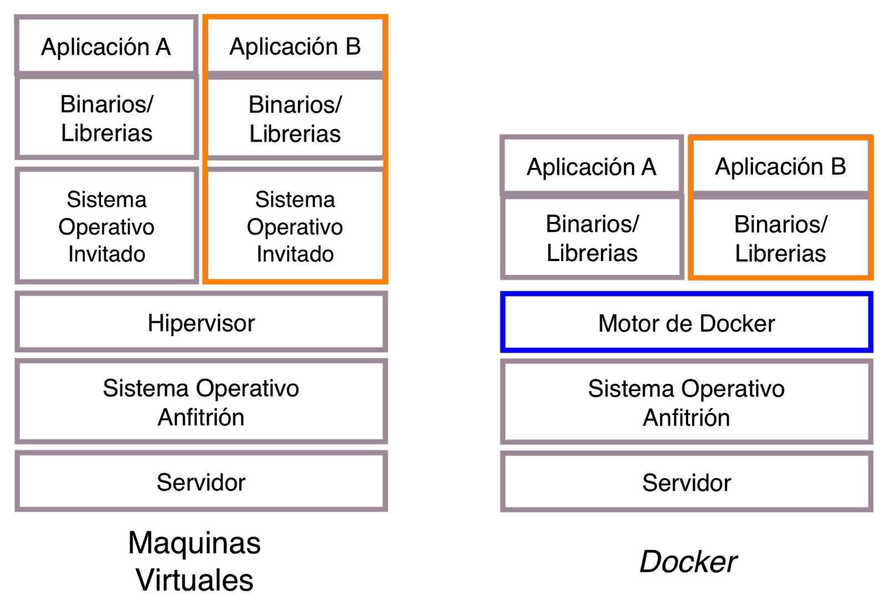

# [→ Máster en Big Data y Machine Learning](https://fictizia.com/formacion/master-big-data)
### Big Data, Machine Learning, Tensor Flow, Data Science, Data Analytics, Arquitecturas Big Data, Plataformas Big Data

## Capítulo 2 - Clase 01

Es esta clase vamos a apreder a trabar con contenedor mediante la utilización de Docker. El objetivo de esta clase es aprender 
que es un contenedor, cómo se utiliza, cómo se configura y como utilizar este tipo de tecnología para desplegar cualquier tipo 
de aplicación utilizándolos. 

### La virtualización ###

La virtualización es una tecnología que permite crear servicios de TI útiles mediante recursos que están ligados tradicionalmente al hardware. Además, distribuye sus funcionalidades entre diversos usuarios o entornos, lo que permite utilizar toda la capacidad de una máquina física. 

**Inconvenientes**

- Menos rendimiento ya que todo es virtualizado
- Es necesario conocer las diferentes herramientas de virtualización

**Ventajas**

- Menos costes ya que tienes menos servidores físicos
- Menos costes porque se reduce el tiempo de inactividad de las máquinas
- Es más facil recuperar los sistemas
- Es más sencillo desplegar los sistemas
- Es posible desplegar nuevas máquinas si disponemos de los recursos necesarios

#### ¿Cómo funciona la virtualización? ####

Los sistemas para el despligue de entornos virtuales se basan en la utilización un software específico denominado hipervisor. Los hipervisores actuan como un middleware que separa los diferentes recursos físicos de los entornos virtuales. Los hipervisores pueden conformarse como elementos principales de un sistema operativo (como una computadora portátil) o se pueden instalar directamente en el hardware (como un servidor), que es la forma en que la mayoría de las empresas virtualizan. Los hipervisores toman los recursos físicos y los dividen de manera tal que las máquinas virtuales puedan utilizarse.


Es decir, los sistemas de virtualización nos permiten desplegar máquinas simuladas. Es decir podemos desplegar diferentes 
tipos de servidores virtuales en un mismo servidores físicos siempre y cuando sus recursos nos los permitan. 

#### Máquina Virtual 

Una máquina virtual (VM como se la suele conocer por sus siglas en inglés: Virtual Machine) puede definirse como un sistema operativo completo funcionando de manera aislada sobre otro sistema operativo completo desplegado en un máquina física donde los recursos hardware que utiliza la máquina virtual se corresponde con los parte de los recursos hardware de la segunda máquina siendo administrados por el hypervisor. 


De forma que las tecnología de virtualización permite compartir el hardware de modo que lo puedan utilizar diferentes VMs utilizando los recursos que se les han asignado de manera transparente para ella.

#### El concepto del hipervisor

Para que las máquinas virtuales puedan ejecutarse en el entorno de virtualización es obligatorios desplegar un componente de gestión sobre el SSOO, denominado __hipervisor__. El hipervisor es un software especializado en la gestión y exposición de recursos hardware (CPUs, RAM, GPUs, TPUs, HDD, SDD, etc) que tiene disponible el sistema operativo primario, de modo que puedan ser utilizados por otros sistemas operativos que serán los que estén desplegados en las diferentes VMs. De este modo se pueden crear máquinas virtuales que utilizan de manera parcial el hardware físico. Este software permite crear una infraestructura que  "engañan" a un sistema operativo convencional para que crea que se está ejecutando sobre una máquina física. Los hipervisores están incluidos en software de virtualización Hyper-V (incluido gratuitamente con Windows), VirtualBox, VMWare o Vagrant.

#### Vagrant


**Recursos**
- [vagrantup.com](https://www.vagrantup.com/)
- [Vagrant | Intro](https://www.vagrantup.com/intro/index.html)
- [Vagrant | Docs](https://www.vagrantup.com/docs/index.html)
- [Wikipedia | Vagrant](https://es.wikipedia.org/wiki/Vagrant_(software))
- [Vagrant in 5 minutes](https://www.youtube.com/watch?v=cx79jOpZVE8)
- [Introducción a Vagrant](https://guiadev.com/vagrant/)
- [What is Vagrant?](https://opensource.com/resources/vagrant)
- [Github | hashicorp/vagrant](https://github.com/hashicorp/vagrant)
- [Docker vs Vagrant](https://guiadev.com/docker-vs-vagrant/)


#### VMWare


**Recursos**
- [Wikipedia | VMware](https://es.wikipedia.org/wiki/VMware)
- [vmware.com](https://www.vmware.com/es.html#)
- [¿Qué es Vmware vSphere?](https://virtualizadesdezero.com/que-es-vmware-vsphere/)
- [VMware Cloud on AWS](https://aws.amazon.com/es/vmware/)
- [Soluciones IBM Cloud for VMware](https://www.ibm.com/es-es/cloud/vmware)

#### Oracle VM VirtualBox


**Recursos**
- [Wikipedia | Virtualbox](https://es.wikipedia.org/wiki/VirtualBox)
- [VirtualBox.org](https://www.virtualbox.org/)
- [VirtualBox.org | End-user documentation](https://www.virtualbox.org/wiki/End-user_documentation)
- [VirtualBox.org | Technical documentation](https://www.virtualbox.org/wiki/Technical_documentation)
- [VirtualBox.org | Community](https://www.virtualbox.org/wiki/Community)
- [Oracle | Desarrollo mediante VM Virtual Box, despliegue en cualquier parte](https://www.oracle.com/es/virtualization/virtualbox/)

#### Contenedores: Dockers ####


Docker es una plataforma de software que permite crear, implementar y deplegar aplicaciones software de forma rápica y sencilla. Docker empaqueta el software en unidades estandarizadas llamadas contenedores que incluyen todo lo necesario para que el software se ejecute, incluyendo bibliotecas, herramientas de sistema, código y tiempo de ejecución. Con Docker, se puede implementar y ajustar la escala de aplicaciones rápidamente en cualquier entorno con la certeza de saber que su código se ejecutará. Ya que el contenedor es autocontenido desde el punto de vista del SSOO y las aplicaciones que se ejecutan dentro. 



#### Ciclo de vida de un contenedor

El ciclo de vida de un contenedor es el conjunto de estados por los que puede pasar un contenedor.


* Definción (DockerFile): Es el estado en el cual se están definiendo los elementos básicos del contenedor que se corresponden con la configuración del propio contenedor (SSOO), las diferentes libreras que serán instaladas, el código fuente que será desplegado y la forma en la que se ejecutará el código fuente. 
* Imagen: Es un imagen construida, es decir, todos los componentes han sido instalados y desplegados para su ejecución. 
* Stopped: Es un contenedor en que encuentra en estado de reposo, es decir la imagen está congelada.  
* Running: Es un contenedor en ejecución, es decir la imagen está en ejecución.   


#### Comando básicos de docker

versión
```
docker --version
```

descarga de imágenes 
```
docker pull nombre[:tag|@digest]
```

Despliegue de un contenedor (básico)
```
docker run --name=nombre imagen
```

Despliegue de un contenedor en segundo plano (básico)
```
docker run --name=nombre -d imagen
```

Listar todas la imágenes finales
```
docker images
```

Listar todas la imágenes (incluyenod las imágenes ocultas)
```
docker images -a 
```

Acceder al contenedor 
```
docker exec -it nombre_contenedor comando
```

Parada de un contenedor
```
docker stop nombre_contenedor
```

Arranque de un contenedor (Debe encontrarse en el estado de parada (Stop))
```
docker start nombre_contenedor
```

Borrado de un contenedor (Debe encontrarse en el estado de parada (Stop))
```
docker rm nombre_contenedor
```

Borrado de un contenedor
```
docker rm -f nombre_contenedor
```

Listar/visualizar todos los contenedores en ejecución
```
docker container ps
```

Listar/visualizar todos los contenedores
```
docker container ps -a
```


#### Desplegando un base de datos en 3 minutos

Docker nos permite desplegar de forma sencilla contenedores utilizando imágenes previamente creadas, para aprender como reutilizar estas imágenes vamos a desplegar un servidor de bases de datos MySQL. 

** Paso 1: Descargando la imagen **

En primer lugar vamos a descarga la imagen que queremos instalar, para comprobar que imágenes tenemos disponibles podemos ir acceder al listado de imágenes del servidor [MySQL](https://hub.docker.com/r/mysql/mysql-server/) disponibles en docker. 

```
docker pull mysql/mysql-server:latest
```

En este caso vamos a descargar la última imagen para ellos utilizamos el tag "latest" que indica que queremos descarga la última opción disponible. Si quisieramos descargar una opción específico podría utilizar el comando pull cambiando el valor del tag. 

```
docker pull mysql/mysql-server:5.6
```

A continuación comprobaremos si la imagen se ha descargado correctamente y está disponible en nuestro repositorio local de imágenes, mediante el siguiente comando:

```
docker images 
```

Obteniendo la siguiente salida que nos indica que hemos descargado la imagen mysql en su versión (tag) 5.7 hace 6 semanas. 

```
REPOSITORY                TAG                 IMAGE ID            CREATED             SIZE
mysql                     5.7                 383867b75fd2        6 weeks ago         373MB
```


** Paso 2: Descargando la imagen **

A continuación desplegamos el contenedor mediante la utilización del comando run indicando el nombre que le queremos dar al contenedor, que en este caso será mysql1 y la imagen que queremos desplegar. 

```
docker run --name=mysql1 mysql/mysql-server:latest
```

Tras la ejecución de este comando observamos que nuestro terminal se ha bloqueado y vemos la actividad del contenedor mediante log en tiempo real 

```
[Entrypoint] MySQL Docker Image 8.0.18-1.1.13
[Entrypoint] No password option specified for new database.
[Entrypoint]   A random onetime password will be generated.
[Entrypoint] Initializing database
2019-10-29T08:59:41.201658Z 0 [System] [MY-013169] [Server] /usr/sbin/mysqld (mysqld 8.0.18) initializing of server in progress as process 21
2019-10-29T08:59:44.851538Z 5 [Warning] [MY-010453] [Server] root@localhost is created with an empty password ! Please consider switching off the --initialize-insecure option.
```

Para evitar esto debemos utilizar la opción __-d__ que nos permite ejecutar el contenedor en segundo plano. 

```
docker run --name=mysql1 -d mysql/mysql-server:latest
```

** Paso 3: Identificando la contraseña **

Los servidores MySQL obligan a crear una contraseña durante su intalación, en este caso no hemos indicando ningún tipo de constraseña para nuestro servidor, por lo que deberemos identificar cual es la constraseña del usuario root. Para identificar la contraseña debemos visualizar el log mediante el siguiente comando:


```
docker logs mysql1
```

Tras la ejecución del comando obteneremos algo como esto 

```
[Entrypoint] MySQL Docker Image 8.0.18-1.1.13
[Entrypoint] No password option specified for new database.
[Entrypoint]   A random onetime password will be generated.
[Entrypoint] Initializing database
2019-10-29T08:36:20.190954Z 0 [System] [MY-013169] [Server] /usr/sbin/mysqld (mysqld 8.0.18) initializing of server in progress as process 20
2019-10-29T08:36:23.461129Z 5 [Warning] [MY-010453] [Server] root@localhost is created with an empty password ! Please consider switching off the --initialize-insecure option.
[Entrypoint] Database initialized
2019-10-29T08:36:27.121122Z 0 [System] [MY-010116] [Server] /usr/sbin/mysqld (mysqld 8.0.18) starting as process 67
```

Esto indica que mi servidor se ha creado sin ningún tipo de password para el usuario root por lo que será muy recomdable cambiarlo. 

** Paso 4: Accediendo al contenedor **

Para modificar el password del usuario root es necesario acceder al contenedor mediante la utilización del siguiente comando:

```
docker exec -it mysql1 /bin/bash
```

Aunque en el caso de mysql podemos acceder directamente al servidor MySQL utilizando el comando de acceso de MySQL

```
docker exec -it mysql1 mysql -u root -p
```

Al intentar ejecutar este comando por primer vez el contenedor nos solicitará un password que no conocremos, por lo que se generá de manera automática y podrá visualizarse de nuevo en el log obteniendose la siguiente salida:

```
[Entrypoint] MySQL Docker Image 8.0.18-1.1.13
[Entrypoint] No password option specified for new database.
[Entrypoint]   A random onetime password will be generated.
[Entrypoint] Initializing database
2019-10-29T08:36:20.190954Z 0 [System] [MY-013169] [Server] /usr/sbin/mysqld (mysqld 8.0.18) initializing of server in progress as process 20
2019-10-29T08:36:23.461129Z 5 [Warning] [MY-010453] [Server] root@localhost is created with an empty password ! Please consider switching off the --initialize-insecure option.
[Entrypoint] Database initialized
2019-10-29T08:36:27.121122Z 0 [System] [MY-010116] [Server] /usr/sbin/mysqld (mysqld 8.0.18) starting as process 67
2019-10-29T08:36:27.782666Z 0 [Warning] [MY-010068] [Server] CA certificate ca.pem is self signed.
2019-10-29T08:36:27.803181Z 0 [System] [MY-010931] [Server] /usr/sbin/mysqld: ready for connections. Version: '8.0.18'  socket: '/var/lib/mysql/mysql.sock'  port: 0  MySQL Community Server - GPL.
2019-10-29T08:36:27.939200Z 0 [System] [MY-011323] [Server] X Plugin ready for connections. Socket: '/var/run/mysqld/mysqlx.sock'
Warning: Unable to load '/usr/share/zoneinfo/iso3166.tab' as time zone. Skipping it.
Warning: Unable to load '/usr/share/zoneinfo/leapseconds' as time zone. Skipping it.
Warning: Unable to load '/usr/share/zoneinfo/tzdata.zi' as time zone. Skipping it.
Warning: Unable to load '/usr/share/zoneinfo/zone.tab' as time zone. Skipping it.
Warning: Unable to load '/usr/share/zoneinfo/zone1970.tab' as time zone. Skipping it.
[Entrypoint] GENERATED ROOT PASSWORD: ]uRF3PRuRuvmansYM0DGeL*orT
```
Donde el password de acceso es __uRF3PRuRuvmansYM0DGeL*orT__. Ahora ya si que podemos entrar en nuestro servidor MySQL

** Paso 5: Accediendo a nuestro servidor desde el exterior **

Ahora tenemos un servidor MySQL operativo pero sólo podemos utilizar si accedemos directamente al contenedor, para ello tenemos que abrir los puertos necesarios para permitir el acceso a los diferentes servicios que ha desplegado nuestro contenedor. En este caso queremos acceder al servidor a través del puerto __3306__ del servidor MySQL, para ello debemos incluir una nueva opción en nuestro comando de arranque

``` 
docker run -p 3306:3306 --name=mysql1 -d mysql/mysql-server:latest
``` 

Para comprobar si mi contenedor se ha levantado correctamente puedo utilizar el siguiente comando 

```
docker ps -a
```

Obteniendo la siguiente salida que nos indica que nuestro contenedor mysql1 está escuchando en nuestro puerto 3306

```
CONTAINER ID        IMAGE                       COMMAND                  CREATED             STATUS                            PORTS                               NAMES
d80d489b03bb        mysql/mysql-server:latest   "/entrypoint.sh mysq…"   5 seconds ago       Up 4 seconds (health: starting)   0.0.0.0:3306->3306/tcp, 33060/tcp   mysql1
```

** Paso 6: Buenas prácticas **

La forma en la que hemos levantado el servidor MySQL es correcta, pero hay ciertos pasos que se pueden simplificar incluyendo variables de sesion, que son utilizadas para la configuración de ciertos elementos del servidor. Por ejemplo, el password del usuario se puede definir durante la ejecución el comando run, utilizando la variable de entorno **MYSQL_ROOT_PASSWORD** 

``` 
docker run --name=mysql1 -d mysql/mysql-server:latest -e MYSQL_ROOT_PASSWORD=fictizia
``` 


#### Creando nuestro primer contenedor

Vamos a crear nuestro primer contenedor para montar nuestro propio servidor web. Para ellos vamos a crear una página web muy sencilla. 

``` 
$ mkdir capitulo_2
$ cd capitulo_2 
$ mkdir app
$ cd app
$ mkdir src
``` 

A continuación crearemos un fichero denominado index.html dentro del directorio src donde incluiremos nuestro código html básico. 

``` 
<!DOCTYPE html>
<html lang="en">
<head>
    <meta charset="UTF-8">
    <title>Nuestra primera aproximación a los contenedores</title>
</head>
<body>
    <h1>Está funcionando, no puede ser!!!!!</h1>
</body>
</html>
``` 

A continuación crearemos nuestro fichero de configuración o depliegue del contenedor que se denomina DockerFile (Es importante utilizar siempre este nombre porque sino Docker tal vez no lo encuentre). 

``` 
FROM ubuntu:18.04
MAINTAINER Moisés <moises@fictizia.com>

RUN apt-get update && apt-get install -y apache2 && apt-get clean && rm -rf /var/lib/apt/lists/*
ENV APACHE_RUN_USER  www-data
ENV APACHE_RUN_GROUP www-data
ENV APACHE_LOG_DIR   /var/log/apache2
ENV APACHE_PID_FILE  /var/run/apache2/apache2.pid
ENV APACHE_RUN_DIR   /var/run/apache2
ENV APACHE_LOCK_DIR  /var/lock/apache2
ENV APACHE_LOG_DIR   /var/log/apache2
RUN mkdir -p $APACHE_RUN_DIR
RUN mkdir -p $APACHE_LOCK_DIR
RUN mkdir -p $APACHE_LOG_DIR
COPY ./src/index.html /var/www/html
EXPOSE 80
CMD ["/usr/sbin/apache2", "-D", "FOREGROUND"]
``` 
El contenido del fichero de despliegue es la parte más importante a la hora de crear nuestros contenedores ya que se difine la configuración del contenedor y como se puede se puede desplegar: 

* FROM: crea la capa de simulación/definición del sistema operativo, en este caso vamos a utilizar la imagen docker de  ubuntu:18.04. La directiva FROM es probablemebte la información más importante en el Dockerfiles ya que define la imagen base que ser utilizada para construir el contenedor. IMPORTANTE: Para este ejemplo hemos utilizado la imagen de ubuntu pero existen distribuciones mucho más ligeras (ALPINE).

* MAINTAINER: Este comando es opcional y se utiliza para definir la autoria.
* COPY: Este comando se utiliza para copiar ficheros desde la máquina anfitriona al contenedor. En este cado lo vamos a utilizar para mover nuestra páginas web de prueba. 
* RUN: Este comando sirve para ejecutar comandos del sistema operativo elegido a la hora de construir la imagen. Es este caso podemos utilizar cualquier comando del terminal de ubuntu. Esto no significa que se puedan utilizar todos los comando de ubuntu, ya que en algunas ocasiones las imagenes contienen menor número de comandos con el fin de minimizar su tamaño o minimizar el tiempo de despliegue. RUN es un comando que se sólo se ejecuta durante el proceso de construcción (Build). 
* CMD: Este es probablemente el segundo comando más importante despues de FROM, ya que definie la aplicación que ejecutará el contenedor al ejecutarse. Es un comando único, es decir que el contenedor sólo ejecutara un comando CMD al producirse el despliegue. CMD es un comando que se sólo se ejecuta durante el procesos de ejecución (Running) 
* EXPOSE: Este comando se ejecuta cuando tenemos que exponer algún tipo de aplicación mediante un puerto. En el ejemplo, estamos exponiendo el puerto 80 de nuestro servidor web.
* ENV: Esto son las diferentes variables de entorno que estamos definiendo de manera que puedan ser utilizadas tanto en tiempo de construcción como en tiempo de ejecución. 

