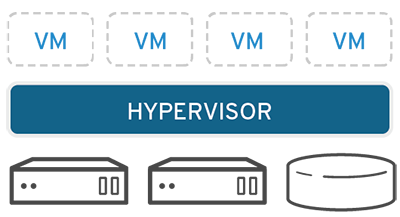

# [→ Máster en Big Data y Machine Learning](https://fictizia.com/formacion/master-big-data)
### Big Data, Machine Learning, Tensor Flow, Data Science, Data Analytics, Arquitecturas Big Data, Plataformas Big Data

## Capítulo 2 - Clase 01

Es esta clase vamos a apreder a trabar con contenedor mediante la utilización de Docker. El objetivo de esta clase es aprender 
que es un contenedor, cómo se utiliza, cómo se configura y como utilizar este tipo de tecnología para desplegar cualquier tipo 
de aplicación utilizándolos. 

### La virtualización ###

La virtualización es una tecnología que permite crear servicios de TI útiles mediante recursos que están ligados tradicionalmente al hardware. Además, distribuye sus funcionalidades entre diversos usuarios o entornos, lo que permite utilizar toda la capacidad de una máquina física. 

**Inconvenientes**

- Menos rendimiento ya que todo es virtualizado
- Es necesario conocer las diferentes herramientas de virtualización

**Ventajas**

- Menos costes ya que tienes menos servidores físicos
- Menos costes porque se reduce el tiempo de inactividad de las máquinas
- Es más facil recuperar los sistemas
- Es más sencillo desplegar los sistemas
- Es posible desplegar nuevas máquinas si disponemos de los recursos necesarios

#### ¿Cómo funciona la virtualización? ####

Los sistemas para el despligue de entornos virtuales se basan en la utilización un software específico denominado hipervisor. Los 
hipervisores actuan como un middleware que separa los diferentes recursos físicos de los entornos virtuales. Los hipervisores pueden 
conformarse como elementos principales de un sistema operativo (como una computadora portátil) o se pueden instalar directamente 
en el hardware (como un servidor), que es la forma en que la mayoría de las empresas virtualizan. Los hipervisores toman los 
recursos físicos y los dividen de manera tal que los entornos virtuales puedan usarlos.

Es decir, los sistemas de virtualización nos permiten desplegar máquinas simuladas. Es decir podemos desplegar diferentes 
tipos de servidores virtuales en un mismo servidores físicos siempre y cuando sus recursos nos los permitan. 

#### Vagrant

**Recursos**
- [vagrantup.com](https://www.vagrantup.com/)
- [Vagrant | Intro](https://www.vagrantup.com/intro/index.html)
- [Vagrant | Docs](https://www.vagrantup.com/docs/index.html)
- [Wikipedia | Vagrant](https://es.wikipedia.org/wiki/Vagrant_(software))
- [Vagrant in 5 minutes](https://www.youtube.com/watch?v=cx79jOpZVE8)
- [Introducción a Vagrant](https://guiadev.com/vagrant/)
- [What is Vagrant?](https://opensource.com/resources/vagrant)
- [Github | hashicorp/vagrant](https://github.com/hashicorp/vagrant)
- [Docker vs Vagrant](https://guiadev.com/docker-vs-vagrant/)

#### VMWare

**Recursos**
- [Wikipedia | VMware](https://es.wikipedia.org/wiki/VMware)
- [vmware.com](https://www.vmware.com/es.html#)
- [¿Qué es Vmware vSphere?](https://virtualizadesdezero.com/que-es-vmware-vsphere/)
- [VMware Cloud on AWS](https://aws.amazon.com/es/vmware/)
- [Soluciones IBM Cloud for VMware](https://www.ibm.com/es-es/cloud/vmware)

#### Oracle VM VirtualBox

**Recursos**
- [Wikipedia | Virtualbox](https://es.wikipedia.org/wiki/VirtualBox)
- [VirtualBox.org](https://www.virtualbox.org/)
- [VirtualBox.org | End-user documentation](https://www.virtualbox.org/wiki/End-user_documentation)
- [VirtualBox.org | Technical documentation](https://www.virtualbox.org/wiki/Technical_documentation)
- [VirtualBox.org | Community](https://www.virtualbox.org/wiki/Community)
- [Oracle | Desarrollo mediante VM Virtual Box, despliegue en cualquier parte](https://www.oracle.com/es/virtualization/virtualbox/)

