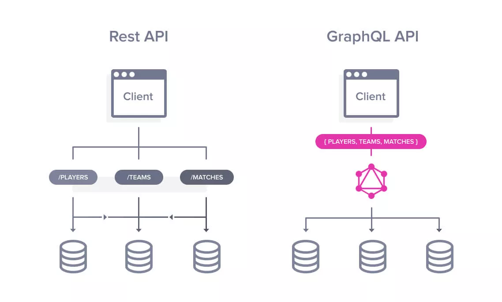

# [→ Máster en Big Data y Machine Learning](https://fictizia.com/formacion/master-big-data)
### Big Data, Machine Learning, Tensor Flow, Data Science, Data Analytics, Arquitecturas Big Data, Plataformas Big Data

## Capítulo 2 - Clase 02


Es esta clase vamos a apreder a trabajar con APIs. De hecho, API es el acrónimo para Application Programming Interface o interfaz de programación de aplicationes. Es decir que una interfaz es algo así como un conjunto de métodos que son expuestos para poder ser utilizados. Actualmente existen dos corrientes para la creación de APIs

* REST
* GraphQL



### REST (REpresentational State Transfer) ###

El término REST (REpresentational State Transfer) se definió en el año 2000 y fue descrito en la tesis doctoral de [Roy Fielding](https://roy.gbiv.com/), uno de los creadores de la especificación HTTP. Un servicio REST no es una arquitectura software sino que es un conjunto de reglas o restricciones con las que podemos crear un estilo de arquitectura software, la cual podremos usar para crear aplicaciones web respetando la reglas de funcionamiento del protocolo HTTP. Las principales restricciones o reglas que definen a un sistema REST son:

* Acoplamiento de cliente-servidor: Esta es la restricción más importante y define el bajo acoplamiento entre los cliente y el servidor. Es decir, el cliente no necesita conocer los detalles de implementación del servidor y el servidor no tiene en cuenta como es utilizada la información del cliente.
* Sin estado: Cualquier petición que recibe el servidor debe ser independiente, es decir, no es necesario mantener ningún tipo de sesión con respecto a la petición. Aunque es posible definir un sesión para controlar el acceso a los diferentes recursos. 
* Cacheable: Los recursos expuestos deben permitir un sistema de almacenamiento en caché. La infraestructura de red debe soportar una caché de varios niveles. Este almacenamiento evitará repetir varias conexiones entre el servidor y el cliente para recuperar un mismo recurso.
* Interfaz uniforme: Se deb definir una interfaz genérica para administrar cada interacción que se produzca entre el cliente y el servidor de manera uniforme, lo cual simplifica y separa la arquitectura. Esta restricción indica que cada recurso del servicio REST debe tener una única dirección mediante una "URI".
* División en capas: El servidor debería disponer de varias capas para su implementación con el objetivo de mejorar la escalabilidad, el rendimiento y la seguridad.

Aunque normalmente no se cumples!!!!!!

REST modela la información en base a servicios basados en acceso a recursos de información. Es decir, si queremos crear un API para la obtención de información referente a peliculas, modelará la información para peliculas en bloque, pero no tendrá en cuenta las peculiaridades de cada una, es decir no podremos obtener las peliculas de terror a no se que creemos un punto de acceso dentro del API para las películas de terror. 

#### El concepto de REST ####

REST es el acrónimo de REpresentational State Transfer. Esta es un tipo de arquitectura de desarrollo web que se apoya totalmente en el estándar HTTP. REST nos permite crear servicios y aplicaciones que pueden ser utilizadas por cualquier dispositivo o cliente que entienda HTTP, por lo que es increíblemente más simple y convencional que otras alternativas que se han usado en los últimos años como por ejemplo SOAP y XML-RPC.


Existen tres reglas o __niveles de calidad__ que deberían cumplirse a la hora de construir una aplicación web y más concretamente una API de tipo REST que son definidas en modelo [Richardson Maturity Model]() en honor a Leonard Richardson que fue el creador de las arquitecturas orientada a recursos

**Defición de URIs (Nombrado)**

[Descripción de URI (Wikipedia)](https://es.wikipedia.org/wiki/Identificador_de_recursos_uniforme)

Las URIs (Uniform Resource Identifier) son cadenas de caracteres que identifican los recursos de una red de forma unívoca. Su diferencia con respecto a las famosas URL (Uniform Resource Locator) es que los recursos identificador por las URL pueden cambiar con el tiempo, como por ejemplo los archivos a los que enlazan. Una URL se estructura de la siguiente forma:

```
{protocolo}://{dominio o hostname}[:puerto (opcional)]/{ruta del recurso}?{consulta de filtrado}
```

Existen un conjunto de reglas básicas para definir el nombrado a la URI de un recurso:

* Los nombres de URI no deben implicar una acción, por lo tanto debe evitarse usar verbos en ellos.
* Deben ser únicas, no debemos tener más de una URI para identificar un mismo recurso.
* Deben ser independiente de formato.
* Deben mantener una jerarquía lógica.
* Los filtrados de información de un recurso no se hacen en la URI.
* Las URIs no deben implicar acciones y deben ser únicas

En base a este conjunto de reglas la URI, la URI del ejemplo, no sería correcta ya que incluye el verbo editar en la propia URI y la acción a aplicar sobre el recurso debería definirse en base al método del protocolo a utilizar, en este caso HTTP. 

```
http://myapi.com:8080/recurso/1/editar URI incorrecta
```

En cambio, la siguiente URI, si que sería correcta ya que cumple la estructura de URI, es independiente del formato y no se especifica la acción. De forma que la acción dependará el protocolo de comunicación: editarla (POST), borrarla (DELETE), consultarla (GET).

independientemente de que vayamos a editarla, borrarla, consultarla o leer sólo uno de de sus concepto

```
http://myapi.com:8080/recursos/1 URI correcta
```

**Protocolo de comunicaciones (Métodos)**

El protocolo HTTP soporta el funcionamiento de las API RESTs. Para las diferentes funcionalidades que puede ofrecer un recurso se basa en los métodos disponibles del protocolo HTTP:

* GET: Para consultar y obtener información de los usuarios.
* POST: Para crear un nuevo usuario.
* PUT: Para editar o actualizar usuarios. 
* DELETE: Para eliminar usuarios.
* PATCH: Para editar partes de un recurso, como por ejemplo un conjunto de atributos. 

Por ejemplo para crear un recurso basado en el ejemplo anterior tendramos las siguientes acciones:

* GET /users Nos permite obtener al listado de usuarios. 
* POST /recursos Nos permite crear un nuevo usuario.
* GET /recursos/1 Nos permite obtener la información del usuario con identificador 1. 
* POST /recursos/?id=1 Nos permite crear un nuevo usuario con identificador (id) 1. 
* DELETE /recursos/1 Nos permite eliminar el usuario con identificador (id) 1. 

Uno de los principales errores que se producen a la hora de construir API RESTs viene de la utilización de manera masiva de los métodos GET Y POST para realizar todas las acciones. Si estamos construyendo una API REST, la utilización masiva de los métodos GET y POST para las acciones de eliminación, actualización global y local es un problema ya que da lugar a que surjan problemas de nombrado que supone la inclusión de verbos en la definición de los nombres.

**Gestión de errores (Definición)**

Existen diferentes maneras de definir los errores en una sistema REST. El sistema de errores se basa en los errores que genera el protocolo HTTP. Donde el listado de errores para peticiones correctas:

* 200 OK: Respuesta estándar para peticiones correctas.
* 201 Created: La petición ha sido completada y ha resultado en la creación de un nuevo recurso.
* 202 Accepted: La petición ha sido aceptada para procesamiento, pero este no ha sido completado. La petición eventualmente pudiere no ser satisfecha, ya que podría ser no permitida o prohibida cuando el procesamiento tenga lugar.
* 203 Non-Authoritative Information (desde HTTP/1.1): La petición se ha completado con éxito, pero su contenido no se ha obtenido de la fuente originalmente solicitada sino de otro servidor.
* 204 No Content: La petición se ha completado con éxito pero su respuesta no tiene ningún contenido (la respuesta puede incluir información en sus cabeceras HTTP).
* 205 Reset Content: La petición se ha completado con éxito, pero su respuesta no tiene contenidos y además, el navegador tiene que inicializar la página desde la que se realizó la petición (este código es útil por ejemplo para páginas con formularios cuyo contenido debe borrarse después de que el usuario lo envíe).
* 206 Partial Content: La petición servirá parcialmente el contenido solicitado. Esta característica es utilizada por herramientas de descarga como wget para continuar la transferencia de descargas anteriormente interrumpidas, o para dividir una descarga y procesar las partes simultáneamente.
* 207 Multi-Status (Multi-Status, WebDAV): El cuerpo del mensaje que sigue es un mensaje XML y puede contener algún número de códigos de respuesta separados, dependiendo de cuántas sub-peticiones sean hechas.
* 208 Already Reported (WebDAV): El listado de elementos DAV ya se notificó previamente, por lo que no se van a volver a listar.

Para más información sobre los códigos de error, se puede consultar el siguiente enlace: [Códigos de error](https://es.wikipedia.org/wiki/Anexo:C%C3%B3digos_de_estado_HTTP)

Un error muy común es el siguiente:

```
Petición
========
GET /recursos/1

Respuesta
=========
Status Code 200
Content:
{
  success: false,
  code:    102,
  error:   "recurso inexistente"
}
```

Este es un error común que tiene algunos inconvenientes:
* El error generado no cumple con el funcionamiento de REST y no es estándar en base al protocolo HTTP.
* El cliente que utilice esta API debe conocer su funcionamiento y cómo tratar los errores, por lo implica un funcionamiento 
* Es necesario definir nuestros sistema de códigos o mensajes de error, con todo lo que eso supone.

Lo ideal sería utilizar los diferentes error que ofrece el protocolo HTTP, de la siguiente manera:

```
Petición
========
GET /recursos/1

Respuesta
=========
Status Code 404
Content:
{
  description: "No se ha encontrado el recursos seleccionado"
}
```

**Construyendo APIs basadas en REST**

Para entender el correcto funcionamiento de las APIs basadas en REST vamos a realizar dos ejercicios con el fin de construir APIs y empaquetarlas en contenedores y poder reutilizarlas. 

* [Desarrollo de un API REST para la gestión de información de cancer de Mama](./recursos/ejercicio_1.md)
* [Desarrollo de un API REST para la interacción de personas de StarWars](./recursos/ejercicio_2.md)

**Recursos**

[Seguridad en REST]()
[Escalabilidad en REST]()

### GraphQL (Graph Query Languages) ###

GraphQL es una lenguaje de consultas (Query Language) similar a PL-SQL, que es un lenguaje de consultas que se enfoca en las consultas a una base de datos. Aunque parezcan los mismo no tiene muchas similitudes, ya que PL-SQL es una lenguaje definido para manipular bases de datos relacionales y GrapjQL es una lenguaje para crear comunicaciones entre clientes y servidores.  De manera que GraphQL es un tipo de tecnologías alternativa a REST. 


