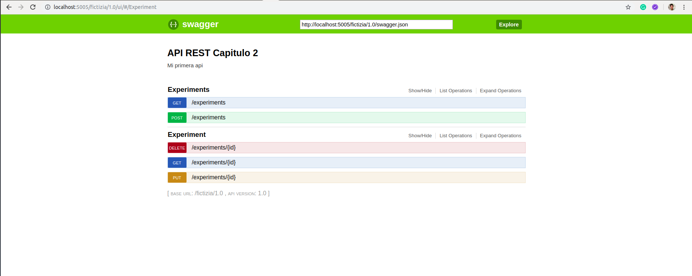

 


# [→ Máster en Big Data y Machine Learning](https://fictizia.com/formacion/master-big-data)
### Big Data, Machine Learning, Tensor Flow, Data Science, Data Analytics, Arquitecturas Big Data, Plataformas Big Data

## Capítulo 2 - Ejercicio 01: Creación de un API basada en REST de análisis clínicos ##

El objetivo de este ejercicio es crear una API basada en REST para acceder a los datos referentes al cancer de mama recogidos por la universidad de Wisconsin. Para ellos vamos a utilizar su data set de datos y vamos a construir un conjunto de métodos que nos permitan acceder, crear, actualizar y eliminar esta información. Siendo el objetivo conseguir un API con 5 recursos.



IMPORTANTE: A la hora de crear una API REST para una entorno real es necesario analizar el número de peticiones y el grado extress que sufrirá nuestro sistema con el fin de utilizar el sistema de servicio que más se adapte a sus necesidades. Este es sólo un ejercicio para comprender los fundamentos básicos de construcción de una API REST.  

### Recursos ###

Para el desarrollo de este ejercicios vamos a utilizar las diferentes tecnologas y recursos.

[Python]() como lenguaje de programación para el desarrollo de nuestra API. 
[Flask]() como servidor de aplicaciones para desplegar nuestar API.
[Docker]() para construir el contenedor donde se desplegará nuestro servidor. 
[Dataset de información]() para incluir la estructura y los datos principales. 

**Paso 1: Creación del proyecto**

Para la creación del proyecto se recomienda crear una nueva carpeta denominado __ejercicio_1__ que deberá contener los siguientes archivos y directorios. 

```
drwxr-xr-x 7 momartin momartin 4096 nov  1 11:55 .
drwxr-xr-x 8 momartin momartin 4096 nov  1 11:55 ..
drwxrwxr-x 2 momartin momartin 4096 nov  1 11:54 bin
-rw-r--r-- 1 momartin momartin  288 oct 31 21:30 Dockerfile
drwxrwxr-x 2 momartin momartin 4096 nov  1 11:53 include
drwxrwxr-x 3 momartin momartin 4096 nov  1 11:53 lib
drwxrwxr-x 2 momartin momartin 4096 nov  1 11:53 local
-rw-r--r-- 1 momartin momartin  612 oct 31 21:11 requirements.txt
drwxr-xr-x 4 momartin momartin 4096 nov  1 12:56 src
```

Donde se deberán encontrar el fichero de requistos del proyecto (requirements.txt), la carpeta con el código fuente (src), el fichero de creación del contenedor (Dockerfile) y los diferentes directorios del entorno virtual. Dentro de la carperta src deberemos crear los siguientes ficheros:

```
drwxr-xr-x 4 momartin momartin 4096 nov  1 12:56 .
drwxr-xr-x 7 momartin momartin 4096 nov  1 11:55 ..
-rw-r--r-- 1 momartin momartin 8576 nov  1 12:38 api.json
drwxrwxr-x 2 momartin momartin 4096 nov  1 11:55 data
-rw-r--r-- 1 momartin momartin 2910 nov  1 12:56 functions.py
-rw-r--r-- 1 momartin momartin  924 nov  1 12:56 server.py
```

Los ficheros del la carpeta src se corresponde con el servidor (server.py), las funciones con la lógica de los diferentes recursos, la configuración de la API REST y los datos (data) que utilizaremos para realizar la carga inicial. Los datos pueden descargarse [aquí](https://archive.ics.uci.edu/ml/machine-learning-databases/breast-cancer-wisconsin/breast-cancer-wisconsin.data). Cada una de las instación de ese fichero va a ser considerada como el resultado de un análisis clínico. 

**Paso 2: Configuración del servidor**

El primer paso consiste en desarrollar el código de nuestro servidor para ellos vamos a utilizar [Flask](https://flask.palletsprojects.com/en/1.1.x/) que es un paquete de python que nos permite desplegar servidor web de forma sencilla y rápido. Para ellos deberemos instalar algunos paquetes utilizando pip3. 

```
pip3 install Flask connexion connexion[swagger-ui]
```

Una vez instalados estos paquetes podemos comenzar con la configuración de nuestro servidor en el fichero server.py. Si no los creastes en el paso anterior, es momento de crear este archivo y seguir los siguientes pasos:

```
import connexion

server = connexion.App(__name__, options= {"swagger_ui": True})
server.add_api('api.json', base_path='/fictizia/1.0')

if __name__ == "__main__":
    server.run(port=5005)
    exit(0)
```

1. Para construir nuestra API REST utilizaremos el paquete connexion, para ello tendremos que importar el paquete y a continuación crear un objeto para nuestra aplicación (server) indicando que se debe activar el interfaz de usuario mediante la opción swagger_ui. 
2. A continuación deberemos definir nuestra API, para ello utilizaremos el archivo __api.json__ donde describiremos los diferentes recursos de nuestra API y además indicaremos cual será la estructura de las URI de acceso a nuestra API indicando el nombre del servicio __fictizia__ y la versión __1.0__. 
3. Para finalizar debemos arrancar nuestra aplicación mediante el método run de nuestro de nuestro objeto server indicando el puesto a través del cual se desplegará nuestra aplicación. En este caso hemos elegido el puerto 5005. 

**Paso 3: Visualización de los resultados**

Una vez construido los elementos básicos de nuestro servidor vamos a comenzar con la construcción de la API REST. Para ellos vamos a construir el recursos analisis, cuya URI será la siguiente:

```
http://localhost:5005/fictizia/1.0/analisis
```

Para construir el recurso, primero debemos crear la descripción del recursos en fichero api.json mediante el siguiente framento de código:

```
{
    "swagger": "2.0",
    "info": {
        "description": "Mi primera api",
        "version": "1.0",
        "title": "API REST Capitulo 2"
    },
    "paths":{
        "/experiments": {
            "get": {
                "operationId": "functions.experiments",
                "tags": ["Experiments"], 
                "responses": {
                    "200": {
                        "description": "Se ha procesado la petición correctamente",
                        "schema": {
                            "type": "object"
                        }
                    },
                } 
            }
        }
    }
}
```

Este fragmento de json define la estructura básica de la API (descripción, versión, title) y la estructura de los diferentes recursos como elementos de path. En ese caso hemos creado un recurso al que se accede a través de __experiments__ en la URI mediante una operación get y utilizando para generar el contenido de la respuesta el método experiments del fichero functions.py. Siendo el código de este fichero el siguiente:

```
def experiments():
    return DATA, 200
```

Esta función devuelve el contenido de la variable DATA con un código 200. 

**Paso 4: Visualización del resultado de un análisis**

A continuación vamos a construir el recursos que nos permitirá obtener la información de un determinado análisis utilizando su Id, donde la URI será la siguiente:

```
http://localhost:5005/fictizia/1.0/experiments/1002025
```

Para construir el recurso, primero debemos crear la descripción del recursos en fichero api.json mediante el siguiente framento de código:

```
"/analisis/{id}": {
    "get": {
        "operationId": "functions.get_experiment",
        "tags": ["Análisis"], 
        "parameters":[
            {   
                "name": "id",
                "in": "path",
                "required": true,
                "type": "integer",
                "default": 23456
            }
        ],
        "responses": {
            "200": {
                "description": "Se ha procesado la petición correctamente",
                "schema": {
                    "type": "object"
                }
            },
            "404": {
                "description": "Error",
                "schema": {
                    "type": "object"
                }
            }
        } 
    }
}
```

En este caso hemos construido un nuevo recursos incluyendo un parametros que se incluye el la URI que se corresponde con el id, para ello hemos incluio las características del parámetro en el array de parámetros indicando sus caractersticas donde las más importantes son la forma de entrada del parametro que ocurre a partir de la URI indicandolo mediante la opción __in__ con el valor __patch__ y que es obligatorio mediante la opción __required__. Además en este caso hemos definido dos posible respuesta: (1) 200 cuando existe el anlisis; y (2) 404 cuando no exista el análisis. En este caso el código desarrollado para la generación de las diferentes respuesta sera el siguiente:

```
def get_experiment(id):
    if id in DATA.keys():
        return DATA[id], 200
    else:
        return {'No existe ningún registro con id' + str(id)}, 404
```

**Paso 5: Creación de un nuevo análisis**

A continuación vamos a crear un recursos para la insercción de nuestros análisis, para ello hemos creado un recurso mediante la operación POST, siendo la URI a utilizar la siguiente:

```
http://localhost:5005/fictizia/1.0/experiment?id=123&clump_thickness=1&unif_cell_size=2&unif_cell_shape=3&marg_adhesion=4&single_epith_cell_size=5&bare_nuclei=4&bland_chrom=3&norm_nucleoli=4&mitoses=2&class_value=4
```

En este caso es necesario incluir todos los campos que deben ser incluidos en el análisis. Puesto que estamos utilizando una operación POST, lo ideal sera que todos estos campos se incluyeran como parámetros de tipo form y no como parámetros de tipo path. 

```
"/análisis": {
    "post": {
        "operationId": "functions.add_experiment",
        "tags": ["Experiment"],
        "parameters": [
            {
                "name": "id",
                "in": "query",
                "required": true,
                "type": "integer"
            },
            {
                "name": "clump_thickness",
                "in": "query",
                "required": true,
                "type": "integer"
            },
            {
                "name": "unif_cell_size",
                "in": "query",
                "required": true,
                "type": "integer"
            },
            {
                "name": "unif_cell_shape",
                "in": "query",
                "required": true,
                "type": "integer"
            },
            {
                "name": "marg_adhesion",
                "in": "query",
                "required": true,
                "type": "integer"
            },
            {
                "name": "single_epith_cell_size",
                "in": "query",
                "required": true,
                "type": "integer"
            },
            {
                "name": "bare_nuclei",
                "in": "query",
                "required": true,
                "type": "integer"
            },
            {
                "name": "bland_chrom",
                "in": "query",
                "required": true,
                "type": "integer"
            },
            {
                "name": "norm_nucleoli",
                "in": "query",
                "required": true,
                "type": "integer"
            },
            {
                "name": "mitoses",
                "in": "query",
                "required": true,
                "type": "integer"
            },
            {
                "name": "class_value",
                "in": "query",
                "required": true,
                "type": "integer"
            }

        ],
        "responses": {
            "200": {
                "description": "Se ha procesado la petición correctamente",
                "schema": {
                    "type": "object"
                }
            }
        }
    }
}
```

**Paso 6: Actualización de un análisis**

El proceso de actualización de un nuev

**Paso 7: Eliminación de un análisis**

**Paso 8: Creación del contenedor**
