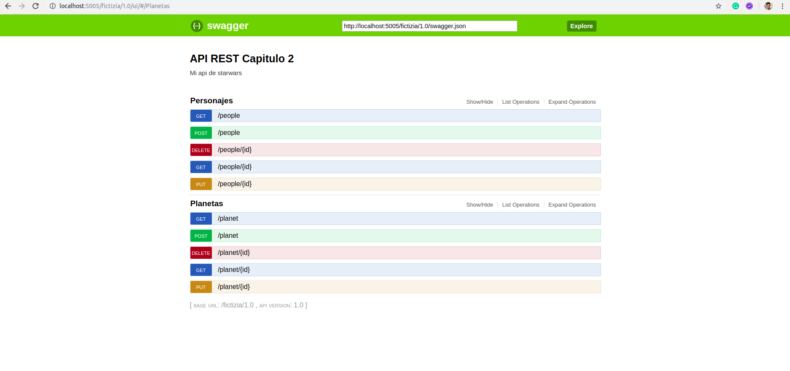

 


# [→ Máster en Big Data y Machine Learning](https://fictizia.com/formacion/master-big-data)
### Big Data, Machine Learning, Tensor Flow, Data Science, Data Analytics, Arquitecturas Big Data, Plataformas Big Data

## Capítulo 2 - Ejercicio 02: Creación de un API basada en REST de planetas y personajes ##

El objetivo de este ejercicio es crear una API basada en REST para acceder a los datos referentes a personas y planetas de la saga de StarWars. Para ellos vamos a utilizar su data set de datos y vamos a construir un conjunto de métodos que nos permitan acceder, crear, actualizar y eliminar la información de los dos conjuntos de datos. 



IMPORTANTE: A la hora de crear una API REST para una entorno real es necesario analizar el número de peticiones y el grado extress que sufrirá nuestro sistema con el fin de utilizar el sistema de servicio que más se adapte a sus necesidades. Este es sólo un ejercicio para comprender los fundamentos básicos de construcción de una API REST.  

### Recursos ###

Para el desarrollo de este ejercicio vamos a utilizar las diferentes tecnologías y recursos. En este caso en vez de utilizar un diccionario para el almacenamiento de los datos vamos a utilizar un entorno similar a una Bases de Datos mediante la utilización de sql Alchemy, que nos permite crear un interfaz de acceso a diferente tipos de Bases de Datos. 

- [Python](https://www.python.org/) como lenguaje de programación para el desarrollo de nuestra API. 
- [Flask](https://flask.palletsprojects.com/en/1.1.x/) como servidor de aplicaciones para desplegar nuestra API.
- [Docker](https://docs.docker.com/) para construir el contenedor donde se desplegará nuestro servidor. 
- [SQL Alchemy](https://www.sqlalchemy.org/) para el almacenamiento y manipulación de la información. 
- [Datasets de información](./ejercicio_2/src/data) donde se encuentra la información que utilizaremos para cargar la información inicial. 

### Solución paso a paso ###

**Paso 1: Creación del proyecto**

Para la creación del proyecto se recomienda crear una nueva carpeta denominado ejercicio_1 que deberá contener los siguientes archivos y directorios.

```
drwxr-xr-x 7 momartin momartin 4096 nov  1 11:55 .
drwxr-xr-x 8 momartin momartin 4096 nov  1 11:55 ..
drwxrwxr-x 2 momartin momartin 4096 nov  1 11:54 bin
-rw-r--r-- 1 momartin momartin  288 oct 31 21:30 Dockerfile
drwxrwxr-x 2 momartin momartin 4096 nov  1 11:53 include
drwxrwxr-x 3 momartin momartin 4096 nov  1 11:53 lib
drwxrwxr-x 2 momartin momartin 4096 nov  1 11:53 local
-rw-r--r-- 1 momartin momartin  612 oct 31 21:11 requirements.txt
drwxr-xr-x 4 momartin momartin 4096 nov  1 12:56 src
```

Donde se deberán encontrar el fichero de requistos del proyecto (requirements.txt), la carpeta con el código fuente (src), el fichero de creación del contenedor (Dockerfile) y los diferentes directorios del entorno virtual. Dentro de la carperta src deberemos crear los siguientes ficheros:

```
drwxrwxr-x 5 momartin momartin 4096 nov  6 08:14 .
drwxrwxr-x 6 momartin momartin 4096 nov  4 00:27 ..
-rw-r--r-- 1 momartin momartin 7548 nov  6 08:14 api_people.json
-rw-rw-r-- 1 momartin momartin 7756 nov  6 08:13 api_planet.json
drwxrwxr-x 2 momartin momartin 4096 nov  3 12:24 data
drwxrwxr-x 3 momartin momartin 4096 nov  6 08:14 database
-rw-r--r-- 1 momartin momartin 4349 nov  6 08:11 people.py
-rw-r--r-- 1 momartin momartin 3829 nov  6 07:51 planet.py
-rw-r--r-- 1 momartin momartin 1911 nov  6 07:54 server.py
```

Los ficheros del la carpeta src se corresponden con el servidor (server.py), las funciones con la lógica de los diferentes recursos (people.py y planet.py), la configuración de los diferentes puntos de acceso (api_planet para los recursos relacionados con planetas y api_people para los recursos relacionados con personajes) y los datos (data) que utilizaremos para realizar la carga inicial. La carpeta database contiene el interfaz de configuración de la "Base de datos" y los fichero de definición de las diferentes tablas. Los diferentes ficheros que se utilizarn para insertar los datos inicial se encuentra en la carpeta data. 

**Paso 2: Configuración del servidor I**

El primer paso consiste en desarrollar el código de nuestro servidor para ellos vamos a utilizar [Flask](https://flask.palletsprojects.com/en/1.1.x/) que es un paquete de python que nos permite desplegar servidor web de forma sencilla y rápida. 

__Documentación y recursos__

- [Projecto Flask](https://flask.palletsprojects.com/en/1.1.x/)
- [Documentación Flask](https://flask.palletsprojects.com/en/1.1.x/api/)
- [Projecto Swagger](https://swagger.io/)
- [Documentación Swagger](https://swagger.io/solutions/api-documentation/)
- [Construcción de APIs](https://swagger.io/solutions/api-development/)
- [Documentación SQL Alchemy](https://docs.sqlalchemy.org/en/13/)
- [Consultas con SQL Alchemy](https://docs.sqlalchemy.org/en/13/orm/query.html)

Para ellos deberemos instalar algunos paquetes utilizando pip3. 

```
pip3 install Flask connexion[swagger-ui] SQLAlchemy
```

Una vez instalados estos paquetes podemos comenzar con la configuración de los diferentes elementos de nuestro servidor. 

**Paso 3: Inicializando nuestra "Base de datos"**

Para la creación de nuestra "Base de datos" tenemos que crear un fichero denominado __connector.py__ en la cual se define el formato y el nombre del fichero que almacenará la información. 

```
from sqlalchemy import create_engine
from sqlalchemy.ext.declarative import declarative_base
from sqlalchemy.orm import scoped_session, sessionmaker
import os

DB_NAME = 'fictizia_ejercicio_2.db'
DB_PATH = os.path.join(os.path.dirname(__file__), DB_NAME)
DB_URI = 'sqlite:///{}'.format(DB_PATH)

engine = create_engine(DB_URI, convert_unicode=True)

Base = declarative_base()
Base.metadata.bind = engine 

db_session = scoped_session(sessionmaker(bind=engine, expire_on_commit=False))
Base.query = db_session.query_property() 
```

**Paso 4: Creación de tablas**

Una vez que hemos definido la base da datos debemos definir la estructura de las diferentes tablas. Para ello vamos a construir un archivo python por cada una de las tablas que vamos a utilizar, comenzaremos por la tabla planeta (planet), creando el archivo __planet.py__ utilizando el siguiente código:

```
from sqlalchemy import Column, Integer, String
from .connector import Base


class Planet(Base):

    __tablename__ = 'planet'

    id = Column('id', Integer, primary_key=True, doc="Id del planeta")
    name = Column('name', String, doc="Nombre")
    rotation_period = Column('rotation_period', String, doc="Periodo de rotación")
    orbital_period = Column('orbital_period', String, doc="Periodo orbital")
    diameter = Column('diameter', String, doc="Diametro")
    climate = Column('climate', String, doc="Clima")
    gravity = Column('gravity', String, doc="Gravedad")
    terrain = Column('terrain', String, doc="Tipo de terreno")
    surface_water = Column('surface_water', String, doc="Superficie de agua")
    population = Column('population', String, doc="Población")
    created = Column('created', String, doc="Fecha de creación")
    edited = Column('edited', String, doc="Fecha de actualización")
    
    @staticmethod
    def get_json(data):

        tmp = dict()

        tmp['id'] = data.id
        tmp['name'] = data.name
        tmp['rotation_period'] = data.rotation_period
        tmp['orbital_period'] = data.orbital_period
        tmp['diameter'] = data.diameter
        tmp['climate'] = data.climate
        tmp['gravity'] = data.gravity
        tmp['terrain'] = data.terrain
        tmp['surface_water'] = data.surface_water
        tmp['population'] = data.population
        tmp['created'] = data.created
        tmp['edited'] = data.edited

        return tmp
    
    
```

Para la creación de una tabla mediante SQL Alchemy debemos extender la clase Base e incluir la variable ____tablename____ indicando el nombre en SQL de la tabla, a continuación es necesario crear cada uno de los atributos como columnas (Column) indicando su nombre y tipo. Además, vamos a crear un método de tipo estático que nos permita transformar los datos de la tabla en un json que pueda ser serializado como resultado del recurso.  

**Paso 5: Configuración del servidor II **

Una vez que hemos definido todos los elementos del sistema de almacenamiento, es decir de nuestra base de datos. Pasamos a la definición del método principal del servidor, para ello hemos desarrollado el siguiente código:

```
import connexion
from ast import literal_eval
from sqlalchemy.sql import text
from database.people_table import People
from database.planet_table import Planet
from database import connector
from sqlalchemy import inspect
import sys
import os


def load_database():
    connector.Base.metadata.create_all(connector.engine)
    if os.path.exists(connector.DB_PATH):
        with open('./data/planets.json', 'r') as file:
            data = literal_eval(file.read())
            for record in data:
                planet = Planet(**record)
                connector.db_session.add(planet)
            connector.db_session.commit()
        with open('./data/people.json', 'r') as file:
            data = literal_eval(file.read())
            for record in data:
                person = People(**record)
                connector.db_session.add(person)
            connector.db_session.commit()

if __name__ == "__main__":
    load_database()
    server = connexion.App(__name__, options= {"swagger_ui": True})
    server.add_api('api_planet.json', base_path='/fictizia/1.0/planet')
    server.run(port=5005)
    exit(0)
```

1. Para construir nuestra API REST utilizaremos el paquete connexion, para ello tendremos que importar el paquete y a continuación crear un objeto para nuestra aplicación (server) indicando que se debe activar el interfaz de usuario mediante la opción swagger_ui. 
2. A continuación debemos crear una función de carga para cargar los datos de los diferentes ficheros json que almacenan la información en la base de datos. Para ello insertaremos cada uno de los elementos del fichero como objetos de tipo Planer o People en su respectiva tabla.
2. A continuación deberemos definir los recursos de nuestra API, para ello utilizaremos el archivo __api_planet.json__ donde describiremos los diferentes recursos que ofrecerá API para planetas y además indicaremos cual será la estructura de las URI de acceso a nuestra API indicando el nombre del servicio __fictizia__, la versión __1.0__ y el recurso en este caso será planeta. Si deseamos añadir más recursos, habría que incluir una nueva linea del método add_api indicando el fichero de definción del recursos y la estructura de la URI. 
3. Para finalizar debemos arrancar nuestra aplicación mediante el método run de nuestro de nuestro objeto server indicando el puesto a través del cual se desplegará nuestra aplicación. En este caso hemos elegido el puerto 5005. 

**Paso 6: Visualización de los planetas**

Una vez construido los elementos básicos de nuestro servidor vamos a comenzar con la construcción de la API REST. Para ellos vamos a construir el recursos analisis, cuya URI será la siguiente:

```
http://localhost:5005/fictizia/1.0/planet
```

Para construir el recurso, primero debemos crear la descripción del recurso en el fichero __api_planet.json__ mediante el siguiente framento de código:

```
{
    "swagger": "2.0",
    "info": {
        "description": "Mi api de starwars",
        "version": "1.0",
        "title": "API REST Capitulo 2"
    },
    "paths":{
        "/": {
            "get": {
                "operationId": "planet.get_all",
                "tags": ["Planetas"],
                "responses": {
                    "200": {
                        "description": "Se ha procesado la petición correctamente",
                        "schema": {
                            "type": "object"
                        }
                    },
                    "404": {
                        "description": "error",
                        "schema": {
                            "type": "object"
                        }
                    }
                }
            },
        }
    }
}
```
 
Este fragmento de información en formato json define la estructura básica de los recursos que estarn disponibles para planet (descripción, versión, title) y la estructura de los diferentes recursos como elementos de la URI. En ese caso hemos creado un recurso al que se accede a través de / en la URI mediante una operación GET utilizando para generar el contenido de la respuesta el método get_all del fichero planet.py. Siendo el código de este fichero el siguiente:
```

def get_all():
    planets = Planet.query.all()

    if len(planets) == 0:
        return {'message': 'No existe información referente a planetas.'}, 404
    else:
        result = dict()
        for planet in planets:
            result[planet.id] = Planet.get_json(planet)

        return result, 200
```

Esta función realizar una query a la tabla planet, definida en la clase Planet, obteniendo un lista de resultados (rows), cada una de las cuales son transformadas en diccionarios mediante la función get_json de la clase Planet.  

**Paso 7: Visualización de la información de un planeta**

A continuación vamos a construir el recursos que nos permitirá obtener la información de un determinado planeta utilizando su ID, donde la URI será la siguiente:

```
http://localhost:5005/fictizia/1.0/planets/1
```

Para construir el recurso, primero debemos crear la descripción del recursos en fichero __api_planet.json__ mediante el siguiente framento de código:

```
"/{id}": {
   "get": {
       "operationId": "planet.get_planet",
       "tags": ["Planetas"],
       "parameters":[
           {
               "name": "id",
               "in": "path",
               "required": true,
               "type": "integer",
               "default": 23456
           }
       ],
       "responses": {
           "200": {
               "description": "Se ha procesado la petición correctamente",
               "schema": {
                   "type": "object"
               }
           },
           "404": {
               "description": "Error",
               "schema": {
                   "type": "object"
               }
           }
       }
   }
}
```

En este caso hemos construido un nuevo recurso incluyendo un parametro en la URI. Este parámetro se corresponde con el ID del planeta. Para ello hemos añadido la descripción del parámetro en el array de parámetros de la definición, indicando sus caractersticas básicas, siendo las más importantes la forma de entrada del parámetro a partir de la URI, definiéndolo mediante la opción __in__ con el valor __patch__ y la obligatoriedad del parámetro mediante la opción __required__ (El valor por defecto de la opción required es False, por lo que sólo es necesario incluir si esl parámtro es obligatorio). Además en este caso hemos definido dos posible respuestas: (1) 200 cuando existe el resultado; y (2) 404 cuando no exista el resultado con el id indicado como parámetro. En este caso el código desarrollado para la generación de las diferentes respuestas es el siguiente:

```
def get_planet(id):
    planet = Planet.query.filter(Planet.id == id).first()

    if planet is None:
        return {'message': 'No existe ningún planeta con id ' + str(id)}, 404
    else:
        return Planet.get_json(planet), 200
```

**Paso 8: Creación de un nuevo planeta**

A continuación vamos a crear un recurso para la insercción de nuevos planetas, para ello vamos utilizar la operación POST, siendo la URI (los datos utilizados en la URI sin ejemplos) a utilizar la siguiente:

```
http://localhost:5005/fictizia/1.0/planet?name=1&rotation_period=2&orbital_period=2&diameter=2&climate=2&gravity=2&terrain=2&surface_water=2&population=2

```

En este caso es necesario incluir todos los campos que deben ser añadidos para la creación de un planeta. Puesto que estamos utilizando una operación POST, lo ideal sera que todos estos campos se incluyeran como parámetros de tipo form y no como parámetros de tipo path, pero para la realización del ejercicio vamos a utilizar parámetros de tipo path. 

```
"post": {
   "operationId": "planet.add_planet",
   "tags": ["Planetas"],
   "parameters": [
       {
           "name": "name",
           "in": "query",
           "required": true,
           "type": "string"
       },
       {
           "name": "rotation_period",
           "in": "query",
           "required": true,
           "type": "string"
       },
       {
           "name": "orbital_period",
           "in": "query",
           "required": true,
           "type": "string"
       },
       {
           "name": "diameter",
           "in": "query",
           "required": true,
           "type": "string"
       },
       {
           "name": "climate",
           "in": "query",
           "required": true,
           "type": "string"
       },
       {
           "name": "gravity",
           "in": "query",
           "required": true,
           "type": "string"
       },
       {
           "name": "terrain",
           "in": "query",
           "required": true,
           "type": "string"
       },
       {
           "name": "surface_water",
           "in": "query",
           "required": true,
           "type": "string"
       },
       {
           "name": "population",
           "in": "query",
           "required": true,
           "type": "string"
       }
   ],
   "responses": {
       "200": {
           "description": "Se ha procesado la petición correctamente",
           "schema": {
               "type": "object"
           }
       },
       "404": {
           "description": "Error",
           "schema": {
               "type": "object"
           }
       }
   } 
}
```

A continuación es necesario crear una nueva función para la creación del planeta de la siguiente forma:

```
def add_planet(name,
               rotation_period,
               orbital_period,
               diameter,
               climate,
               gravity,
               terrain,
               surface_water,
               population):

    planet = Planet()

    planet.name = name
    planet.rotation_period = rotation_period
    planet.orbital_period = orbital_period
    planet.diameter = diameter
    planet.climate = climate
    planet.gravity = gravity
    planet.terrain = terrain
    planet.surface_water = surface_water
    planet.population = population
    planet.created = datetime.utcnow()

    connector.db_session.add(planet)
    result = connector.db_session.commit()

    if result is None:
        return Planet.get_json(planet), 200
    else:
        return {'message': 'No se ha podido crear el nuevo planeta ' + str(name)}, 404
```

**Paso 10: Actualización de un planeta**

La generación del recursos de actualización es muy similar al de creación con la salvedad que los parámetros son opcionales, es decir sólo se actualizarán aquellos parámetros de nuestro planeta que seán incluidos en la URI, y que la operación que utilizaremos será PUT. En este caso la configuración de la estructura del recurso de actualización es parecida a la del recurso de creación con la diferencia de la obligatoriedad de los campos a actualizar y la existencia del identificador del planeta.  

```
"put": {
    "operationId": "planet.update_planet",
    "tags": ["Planetas"],
    "parameters":[
        {
            "name": "id",
            "in": "path",
            "required": true,
            "type": "integer"
        },
        {
            "name": "name",
            "in": "query",
            "type": "string"
        },
        {
            "name": "rotation_period",
            "in": "query",
            "type": "string"
        },
        {
            "name": "orbital_period",
            "in": "query",
            "type": "string"
        },
        {
            "name": "diameter",
            "in": "query",
            "type": "string"
        },
        {
            "name": "climate",
            "in": "query",
            "type": "string"
        },
        {
            "name": "gravity",
            "in": "query",
            "type": "string"
        },
        {
            "name": "terrain",
            "in": "query",
            "type": "string"
        },
        {
            "name": "surface_water",
            "in": "query",
            "type": "string"
        },
        {
            "name": "population",
            "in": "query",
            "type": "string"
        }
    ],
    "responses": {
        "200": {
            "description": "Se ha procesado la petición correctamente",
            "schema": {
                "type": "object"
            }
        },
        "404": {
            "description": "Error",
            "schema": {
                "type": "object"
            }
        }
    }
}
```

Donde el código para la actualización de los planetas podría ser el siguiente:

```
def update_planet(id,
                  name=None,
                  rotation_period=None,
                  orbital_period=None,
                  diameter=None,
                  climate=None,
                  gravity=None,
                  terrain=None,
                  surface_water=None,
                  population=None):

    planet = Planet.query.filter(Planet.id == id).first()

    if planet is not None:

        if name is not None:
            planet.name = name
        if rotation_period is not None:
            planet.rotation_period = rotation_period
        if orbital_period is not None:
            planet.orbital_period = orbital_period
        if diameter is not None:
            planet.diameter = diameter
        if climate is not None:
            planet.climate = climate
        if gravity is not None:
            planet.gravity = gravity
        if terrain is not None:
            planet.terrain = terrain
        if surface_water is not None:
            planet.surface_water = surface_water
        if population is not None:
            planet.population = population

        planet.updated = datetime.utcnow()

        connector.db_session.commit()

        return Planet.get_json(planet), 200
    else:
        return {'message': 'No existe ningún planeta con id ' + str(id)}, 404

    return {'No existe ningún planeta con id' + str(id)}, 404
```

**Paso 11: Eliminación de un planeta**

Para finalizar es necesario crear el método de eliminación de un planeta usando la operación DELETE. Para ello, añadimos un nuevo elemento en nuestro archivo __api_planet.json__ del siguiente tipo:

```
"delete": {
    "operationId": "planet.delete_planet",
    "tags": ["Planetas"],
    "parameters":[
        {
            "name": "id",
            "in": "path",
            "required": true,
            "type": "integer",
            "default": 23456
        }
    ],
    "responses": {
        "204": {
            "description": "Se ha procesado la petición correctamente",
            "schema": {
                "type": "object"
            }
        },
        "404": {
            "description": "Error",
            "schema": {
                "type": "object"
            }
        }
    }
}
```

Además es necesario incluir un nuevo metodo para la eliminación de los elementos de nuestra tabla planeta. 

```
def delete_planet(id):

    Planet.query.filter(Planet.id == id).delete()
    result = connector.db_session.commit()

    if result is None:
        return {'message': 'Se ha eliminado el planeta con id ' + str(id)}, 200
    else:
        return {'message': 'No existe ningún planeta con id ' + str(id)}, 404
```

Tras todo esto ya podríamos lanzar nuestra API REST y comprobar si funciona mediante la utilización del siguiente comando:

```
python3 server.py
```

**Paso 11: Creación de los recursos para los personakjes**

El proceso de creación de los diferentes recursos para la tabla personas sera similar al realizado para la tabla planeta. La forma de realizarlo es muy sencilla, por lo que para terminarlo puedes apoyarte en los 6 pasos anteriores y en la solución del ejercicio que se encuentra en el siguiente [enlace](https://github.com/Fictizia/Master-en-Big-Data-y-Machine-Learning_ed1/edit/master/capitulo_2/recursos/ejercicio_2/)

**Paso 12: Creación del contenedor**

Una vez que hemos creado nuestra API REST, es necesario preparla para poder ser desplegada en un contenedor, para ellos tenemos que crear el archivo de creación de la imagen mediante un Dockerfile, aunque antes es necesario congelar el estado de nuestras librerias en python con el fin de poder instalarlas correctamente en nuestro contenedor. Para ellos es necesario ejecutar el siguiente comando:

```
pip3 freeze > instructions.txt
```

A continuación debemos crear el fichero __Dockerfile__ con los siguientes comandos:

```
FROM ubuntu:18.04
MAINTAINER Moisés <moises@fictizia.com>

RUN apt-get update && apt-get install -y python3 python3-pip && apt-get clean && rm -rf /var/lib/apt/lists/*
RUN mkdir /src
COPY src /src
WORKDIR /src
RUN pip3 install -r requirements.txt
EXPOSE 5005
CMD ["python3", "server.py"]
```

Ahora es momento de construir nuestro contenedor y ejecutarlo. Una vez seguidos estos pasos, hemos creado una sencilla API REST que se despliega en un contenedor docker. 

El código fuente de todo el ejercicio se encuentra en el siguiente [enlace](https://github.com/Fictizia/Master-en-Big-Data-y-Machine-Learning_ed1/edit/master/capitulo_2/recursos/ejercicio_2/)


