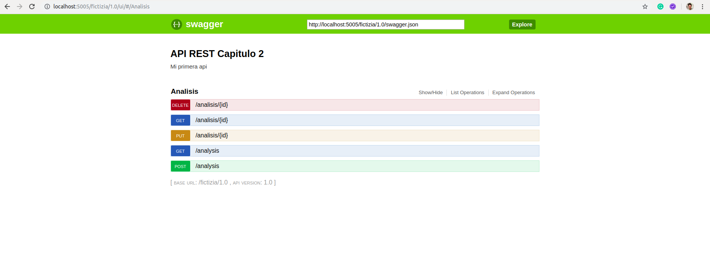

 


# [→ Máster en Big Data y Machine Learning](https://fictizia.com/formacion/master-big-data)
### Big Data, Machine Learning, Tensor Flow, Data Science, Data Analytics, Arquitecturas Big Data, Plataformas Big Data

## Capítulo 2 - Ejercicio 02: Creación de un API basada en REST de planetas y personas ##

El objetivo de este ejercicio es crear una API basada en REST para acceder a los datos referentes a personas y planetas de la saga de StarWars. Para ellos vamos a utilizar su data set de datos y vamos a construir un conjunto de métodos que nos permitan acceder, crear, actualizar y eliminar la información de los dos conjuntos de datos. 



IMPORTANTE: A la hora de crear una API REST para una entorno real es necesario analizar el número de peticiones y el grado extress que sufrirá nuestro sistema con el fin de utilizar el sistema de servicio que más se adapte a sus necesidades. Este es sólo un ejercicio para comprender los fundamentos básicos de construcción de una API REST.  

### Recursos ###

Para el desarrollo de este ejercicio vamos a utilizar las diferentes tecnologías y recursos. En este caso en vez de utilizar un diccionario para el almacenamiento de los datos vamos a utilizar un entorno similar a una Bases de Datos mediante la utilización de sql Alchemy, que nos permite crear un interfaz de acceso a diferente tipos de Bases de Datos. 

- [Python](https://www.python.org/) como lenguaje de programación para el desarrollo de nuestra API. 
- [Flask](https://flask.palletsprojects.com/en/1.1.x/) como servidor de aplicaciones para desplegar nuestra API.
- [Docker](https://docs.docker.com/) para construir el contenedor donde se desplegará nuestro servidor. 
- [SQL Alchemy](https://www.sqlalchemy.org/) para el almacenamiento y manipulación de la información. 
- [Datasets de información](./ejercicio_2/src/data) donde se encuentra la información que utilizaremos para cargar la información inicial. 

### Solución paso a paso ###

**Paso 1: Creación del proyecto**

Para la creación del proyecto se recomienda crear una nueva carpeta denominado ejercicio_1 que deberá contener los siguientes archivos y directorios.

drwxr-xr-x 7 momartin momartin 4096 nov  1 11:55 .
drwxr-xr-x 8 momartin momartin 4096 nov  1 11:55 ..
drwxrwxr-x 2 momartin momartin 4096 nov  1 11:54 bin
-rw-r--r-- 1 momartin momartin  288 oct 31 21:30 Dockerfile
drwxrwxr-x 2 momartin momartin 4096 nov  1 11:53 include
drwxrwxr-x 3 momartin momartin 4096 nov  1 11:53 lib
drwxrwxr-x 2 momartin momartin 4096 nov  1 11:53 local
-rw-r--r-- 1 momartin momartin  612 oct 31 21:11 requirements.txt
drwxr-xr-x 4 momartin momartin 4096 nov  1 12:56 src

Donde se deberán encontrar el fichero de requistos del proyecto (requirements.txt), la carpeta con el código fuente (src), el fichero de creación del contenedor (Dockerfile) y los diferentes directorios del entorno virtual. Dentro de la carperta src deberemos crear los siguientes ficheros:

drwxrwxr-x 5 momartin momartin  4096 nov  4 00:25 .
drwxrwxr-x 6 momartin momartin  4096 nov  4 00:27 ..
-rw-r--r-- 1 momartin momartin 15857 nov  3 18:53 api.json
drwxrwxr-x 2 momartin momartin  4096 nov  3 12:24 data
drwxrwxr-x 3 momartin momartin  4096 nov  4 00:24 database
-rw-r--r-- 1 momartin momartin  4134 nov  4 00:24 people.py
-rw-r--r-- 1 momartin momartin  4352 nov  4 00:25 planet.py
-rw-r--r-- 1 momartin momartin  1831 nov  3 14:43 server.py

Los ficheros del la carpeta src se corresponden con el servidor (server.py), las funciones con la lógica de los diferentes recursos (people.py y planet.py), la configuración de la API REST (api.json) y los datos (data) que utilizaremos para realizar la carga inicial. La carpeta database contiene el interfaz de configuración de la "Base de datos" y los fichero de definición de las diferentes tablas. Los diferentes ficheros que se utilizarn para insertar los datos inicial se encuentra en la carpeta data. 

**Paso 2: Configuración del servidor I**

El primer paso consiste en desarrollar el código de nuestro servidor para ellos vamos a utilizar [Flask](https://flask.palletsprojects.com/en/1.1.x/) que es un paquete de python que nos permite desplegar servidor web de forma sencilla y rápido. 

__Documentación y recursos__

- [Projecto Flask](https://flask.palletsprojects.com/en/1.1.x/)
- [Documentación Flask](https://flask.palletsprojects.com/en/1.1.x/api/)
- [Projecto Swagger](https://swagger.io/)
- [Documentación Swagger](https://swagger.io/solutions/api-documentation/)
- [Construcción de APIs](https://swagger.io/solutions/api-development/)
- [Documentación SQL Alchemy](https://docs.sqlalchemy.org/en/13/)
- [Consultas con SQL Alchemy](https://docs.sqlalchemy.org/en/13/orm/query.html)

Para ellos deberemos instalar algunos paquetes utilizando pip3. 

```
pip3 install Flask connexion[swagger-ui] SQLAlchemy
```

Una vez instalados estos paquetes podemos comenzar con la configuración de los diferentes elementos de nuestro servidor. 

**Paso 3: Inicializando nuestra "Base de datos"**

Para la creación de nuestra "Base de datos" tenemos que crear un fichero denominado __connector.py__ en la cual se define el formato y el nombre del fichero que almacenará la información. 

```
from sqlalchemy import create_engine
from sqlalchemy.ext.declarative import declarative_base
from sqlalchemy.orm import scoped_session, sessionmaker
import os

DB_NAME = 'fictizia_ejercicio_2.db'
DB_PATH = os.path.join(os.path.dirname(__file__), DB_NAME)
DB_URI = 'sqlite:///{}'.format(DB_PATH)

if os.path.exists(DB_PATH):
    os.remove(DB_PATH)

engine = create_engine(DB_URI, convert_unicode=True)

Base = declarative_base()
Base.metadata.bind = engine 

db_session = scoped_session(sessionmaker(bind=engine, expire_on_commit=False))
Base.query = db_session.query_property() 
```

**Paso 4: Creación de tablas**

Una vez que hemos definido la base da datos debemos definir la estructura de las diferentes tablas. Para ello vamos a construir un archivo python por cada una de las tablas que vamos a utilizar, comenzaremos por la tabla planeta (planet), creando el archivo __planet.py__ utilizando el siguiente código:

```
from sqlalchemy import Column, Integer, String
from sqlalchemy.orm import relationship
from .connector import Base
from .people_table import People


class Planet(Base):

    __tablename__ = 'planet'

    id = Column('id', Integer, primary_key=True, doc="Id del planeta")
    name = Column('name', String, doc="Nombre")
    rotation_period = Column('rotation_period', String, doc="Periodo de rotación")
    orbital_period = Column('orbital_period', String, doc="Periodo orbital")
    diameter = Column('diameter', String, doc="Diametro")
    climate = Column('climate', String, doc="Clima")
    gravity = Column('gravity', String, doc="Gravedad")
    terrain = Column('terrain', String, doc="Tipo de terreno")
    surface_water = Column('surface_water', String, doc="Superficie de agua")
    population = Column('population', String, doc="Población")
    created = Column('created', String, doc="Fecha de creación")
    edited = Column('edited', String, doc="Fecha de actualización")

    peopleList = relationship(People, backref='planet')
```

Para la creación de una tabla mediante SQL Alchemy debemos extender la clase Base e incluir la variable ____tablename____ indicando el nombre en SQL de la tabla, a continuación es necesario crear cada uno de los atributos como columnas (Column) indicando su nombre y tipo; y las diferentes relaciones que existen con otras tablas. En este caso la tabla planeta tiene una relación con la tabla personas, ya que una persona debe habitar en un planeta. 

**Paso 5: Configuración del servidor II **

Una vez que hemos definido todos los elementos del sistema de almacenamiento, es decir de nuestra base de datos. Pasamos a la definición del método principal del servidor, para ello hemos desarrollado el siguiente código:

```
import connexion
from ast import literal_eval
from sqlalchemy.sql import text
from database.people_table import People
from database.planet_table import Planet
from database import connector
from sqlalchemy import inspect
import sys
import os


def load_database():
    connector.Base.metadata.create_all(connector.engine)
    if os.path.exists(connector.DB_PATH):
        with open('./data/planets.json', 'r') as file:
            data = literal_eval(file.read())
            for record in data:
                planet = Planet(**record)
                connector.db_session.add(planet)
            connector.db_session.commit()
        with open('./data/people.json', 'r') as file:
            data = literal_eval(file.read())
            for record in data:
                person = People(**record)
                connector.db_session.add(person)
            connector.db_session.commit()

server = connexion.App(__name__,
    options= {"swagger_ui": True})

server.add_api('api.json', 
    base_path='/fictizia/1.0')

if __name__ == "__main__":
    db = load_database()
    server.run(port=5005)
    exit(0)
```

1. Para construir nuestra API REST utilizaremos el paquete connexion, para ello tendremos que importar el paquete y a continuación crear un objeto para nuestra aplicación (server) indicando que se debe activar el interfaz de usuario mediante la opción swagger_ui. 
2. A continuación debemos crear una función de carga para cargar los datos de los diferentes ficheros json que almacenan la información en la base de datos. Para ello insertaremos cada uno de los elementos del fichero como objetos de tipo Planer o People en su respectiva tabla.
2. A continuación deberemos definir nuestra API, para ello utilizaremos el archivo __api.json__ donde describiremos los diferentes recursos de nuestra API y además indicaremos cual será la estructura de las URI de acceso a nuestra API indicando el nombre del servicio __fictizia__ y la versión __1.0__. 
3. Para finalizar debemos arrancar nuestra aplicación mediante el método run de nuestro de nuestro objeto server indicando el puesto a través del cual se desplegará nuestra aplicación. En este caso hemos elegido el puerto 5005. 


