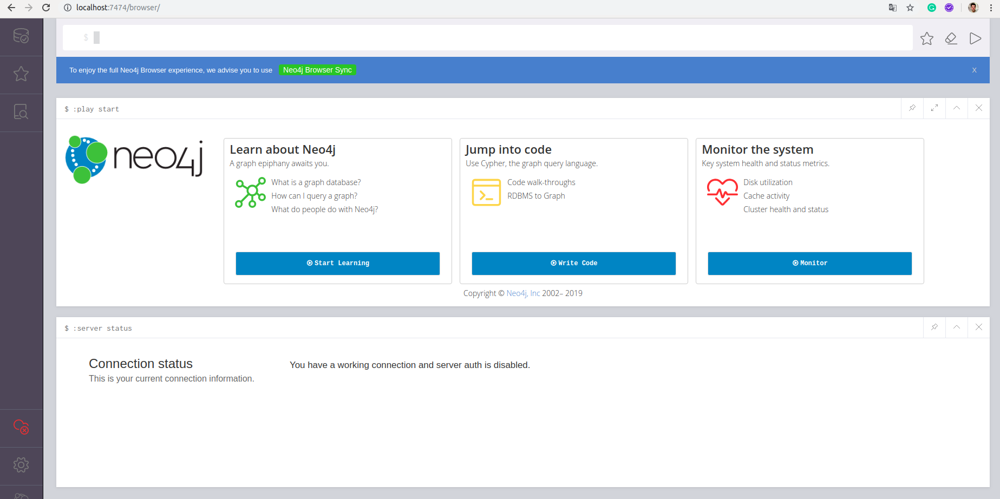

# [→ Máster en Big Data y Machine Learning](https://fictizia.com/formacion/master-big-data)
### Big Data, Machine Learning, Tensor Flow, Data Science, Data Analytics, Arquitecturas Big Data, Plataformas Big Data

## Capítulo 3 - Ejercicio 02: Manipulación de bases de datos en grafo ##

El objetivo de este ejercicio es crear un contenedor que contenga una base de datos no sólo relacion con el fin de explotar el funcionamiento de este tipo de bases de datos. En este ejercicio vamos a explorar el funcionamiento de las bases de datos en grafo. 


### Desplegando nuestro contenedor MongoDb

Docker nos permite desplegar de forma sencilla contenedores utilizando imágenes previamente creadas, para aprender como reutilizar estas imágenes vamos a desplegar un servidor de bases de datos Neo4j. Existen diferentes formas de construir nuestro contenedor Neo4J, (1) mediante la utilización de la imagen; o (2) mediante la generación de un fichero de despliegue (docker-compose.yml)

**Paso 1.1: Descargando la imagen**

En primer lugar vamos a descarga la imagen que queremos instalar, para comprobar que imágenes tenemos disponibles podemos ir acceder al listado de imágenes del servidor [Neo4J](https://hub.docker.com/_/neo4j) disponibles en dockerhub o en [Neo4J](https://neo4j.com/developer/docker-run-neo4j/) la página de Neo4J.

```
$ docker pull neo4j:latest
```

En este caso vamos a descargar la última imagen que se corresponde con la versión 3.5.12 para ello utilizamos el tag "latest". Si no nos necesitamos una versión específica podemos utilizar el tag neo4j y descargar la última versión del servidor. 

```
$ docker pull neo4j
```

A continuación comprobaremos si la imagen se ha descargado correctamente y está disponible en nuestro repositorio local de imágenes, mediante el siguiente comando:

```
$ docker images 
```


Obteniendo la siguiente salida que nos indica que hemos descargado la imagen mongo en su versión (tag) 3.4.21-xenial hace 6 semanas. 

```
REPOSITORY                TAG                 IMAGE ID            CREATED             SIZE
neo4j                     latest              8aa3aaffd180        3 days ago          363MB
```
**Paso 1.2: Desplegandando la imagen **

Una vez que hemos descargado la imagen podemos deplegarla para levantarnuestro servidor Neo4J mediante el siguiente comando:

```
$ docker run --name=neo4j_db -p 7474:7474 -p 7687:7687 -v $(pwd)/data:/data -d neo4j
```
En este caso vamos a publicar dos servicios diferentes. El puerto 7474 se correspe con el servicio http y el puerto 7687 se corresponde con la API de acceso a Neo4J. Una vez que accedamos a la base de datos por primera vez será necesario cambiar el password, por lo que es posible desactivar la autenticación mediante la variable de sesión __NEO4J_AUTH__ en el comando de arranque:

```
$ docker run --name=neo4j_db -p 7474:7474 -p 7687:7687 -v $(pwd)/data:/data --env=NEO4J_AUTH=none -d neo4j 
```
__IMPORTANTE:__ Sólo se recomienda desactivar la autenticación mediante para trabajar en entornos de desarrollo. 

**Paso 2: Desplegandando la imagen mediante compose**

La otra alternativa a la creación de nuestro contenedor por linea de comando, es crear nuestro contenedor mediante un fichero de despliegue, para ello tenemos que crear nuestro fichero docker-compose.yml. Además incluiremos la configuración de red necesario para desplegar nuestro contenedor dentro de una futura red de contenedores. 

```
version: '3.4'
services:
  
  mongo:
    restart: always
    image: neo4j:latest
    container_name: neo4j_db
    ports:
      - "7474:7474"
      - "7687:7687"
    volumes:
      - ./data:/data
    networks:
      fictizia:
        ipv4_address: 172.18.1.10

networks:
  fictizia:
    driver: bridge
    driver_opts:
      com.docker.network.enable_ipv6: "true"
    ipam:
      driver: default
      config:
        - subnet: 172.18.1.0/24
```

Una vez construido nuestro fichero de despliegue podemos lanzar nuestro fichero de despliegue mediante el siguiente comando:

```
$ docker-compose -f docker_compose.yml up --build -d 
```

**Paso 3: Creando nuestro grafo con Neo4J **

Una vez que hemos realizado la instalación de Neo4J podemos acceder mediante la utilización del página web que provee el propio servicio. Para ellos debemos acceder mediante la siguiente url __http://localhost:7474/browser/__ donde encontraremos la siguiente página web:



Una vez que hemos accedido a nuestra sistema de bases de datos en grafo, vamos a crear nuestra primera base de datos. Para ello utilizaremos el ejemplo que nos ofrece el propio Neo4J que nos permite crear una base de datos en grafo de películas y actores. 

Cómo describimos anteriormente, las bases de datos en grafo se basa en conceptos diferentes a los otros tipos de bases de datos. En la siguiente tabla se muestran las correspondencias entre una base de datos de tipo SQL y una base de datos en grafo. 

=================
SQL | Graph 
------------ | ------------ 
Tables |	Graphs
Rows |	Nodes
Columns and Data | Properties and its values
Constraints |	Relationships
Joins |	Traversal
------------ | ------------ 

En este caso para crear un nodo (tabla) debemos utilizar el comando __CREATE__ incluyendo entre paréntesis el nombre del nodo  y su tipo __TheMatrix:Movie__ y sus diferente propiedades mediante un archivo JSON. 

```
CREATE (TheMatrix:Movie {title:'The Matrix', released:1999, tagline:'Welcome to the Real World'})
CREATE (Keanu:Person {name:'Keanu Reeves', born:1964})
```

En el caso de las bases de datos en grafo, no es necesario crear una estructura de tipo tabla y continuación insertar las diferentes columnas, aquí basta con crear un nodo de tipo __Movie__ en este caso y se creará un nodo con un conjunto de propiedades variables. Es decir, cada nodo puede tener diferente propiedades. 

Una vez que hemos creado nuestros nodos podemos crear relaciones entre ellos mediante el siguiente comando:

```
CREATE (Keanu)-[:ACTED_IN {roles:['Neo']}]->(TheMatrix)
```
en este caso hemos creado una relación entre el nodo __Keanu__ y el nodo __TheMatrix__ donde la relación se denomina __ACTED_IN__ e incluye un conjunto de propiedades. En este caso sólo una que se denominado roles. 

**Paso 4: Accediendo a nuestro grafo **

Una vez que nuestro grafo ha sido ejecutado, podemos realizar diferentes tipos de consultas sobre el. Por ejemplo si quisieramos visualizar todos los nodos entre los que al menos existe una relación __DIRECTED__ con un límite de 25 nodos, tendramos que utilizar el siguiente comando.  

```
MATCH p=()-[r:DIRECTED]->() RETURN p LIMIT 25
```

Obteniéndose un grafo como el siguiente:


