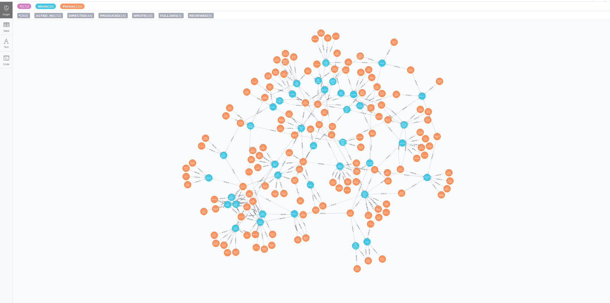
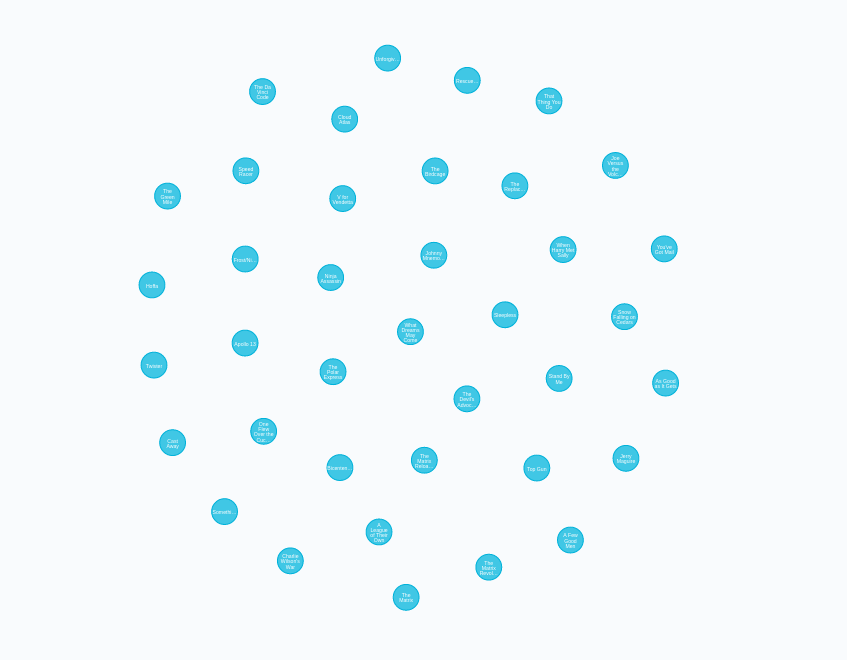

# [→ Máster en Big Data y Machine Learning](https://fictizia.com/formacion/master-big-data)
### Big Data, Machine Learning, Tensor Flow, Data Science, Data Analytics, Arquitecturas Big Data, Plataformas Big Data

## Capítulo 3 - Ejercicio 05: Trabajando con ficheros y bases de datos ##

El objetivo de este ejercicio es crear un contenedor que contenga una base de datos no sólo relacion con el fin de explotar el funcionamiento de este tipo de bases de datos. En este ejercicio vamos a explorar el funcionamiento de las bases de datos en grafo. 


### Desplegando nuestro contenedor Neo4J (Bases de datos en Grafo)

Docker nos permite desplegar de forma sencilla contenedores utilizando imágenes previamente creadas, para aprender como reutilizar estas imágenes vamos a desplegar un servidor de bases de datos Neo4j. Existen diferentes formas de construir nuestro contenedor Neo4J, (1) mediante la utilización de la imagen; o (2) mediante la generación de un fichero de despliegue (docker-compose.yml)

**Paso 1.1: Descargando la imagen**

En primer lugar vamos a descarga la imagen que queremos instalar, para comprobar que imágenes tenemos disponibles podemos ir acceder al listado de imágenes del servidor [Neo4J](https://hub.docker.com/_/neo4j) disponibles en dockerhub o en [Neo4J](https://neo4j.com/developer/docker-run-neo4j/) la página de Neo4J.

```
$ docker pull neo4j:latest
```

En este caso vamos a descargar la última imagen que se corresponde con la versión 3.5.12 para ello utilizamos el tag "latest". Si no nos necesitamos una versión específica podemos utilizar el tag neo4j y descargar la última versión del servidor. 

```
$ docker pull neo4j
```

A continuación comprobaremos si la imagen se ha descargado correctamente y está disponible en nuestro repositorio local de imágenes, mediante el siguiente comando:

```
$ docker images 
```


Obteniendo la siguiente salida que nos indica que hemos descargado la imagen mongo en su versión (tag) 3.4.21-xenial hace 6 semanas. 

```
REPOSITORY                TAG                 IMAGE ID            CREATED             SIZE
neo4j                     latest              8aa3aaffd180        3 days ago          363MB
```
**Paso 1.2: Desplegandando la imagen **

Una vez que hemos descargado la imagen podemos deplegarla para levantarnuestro servidor Neo4J mediante el siguiente comando:

```
$ docker run --name=neo4j_db -p 7474:7474 -p 7687:7687 -v $(pwd)/data:/data -d neo4j
```
En este caso vamos a publicar dos servicios diferentes. El puerto 7474 se correspe con el servicio http y el puerto 7687 se corresponde con la API de acceso a Neo4J. Una vez que accedamos a la base de datos por primera vez será necesario cambiar el password, por lo que es posible desactivar la autenticación mediante la variable de sesión __NEO4J_AUTH__ en el comando de arranque:

```
$ docker run --name=neo4j_db -p 7474:7474 -p 7687:7687 -v $(pwd)/data:/data --env=NEO4J_AUTH=none -d neo4j 
```
__IMPORTANTE:__ Sólo se recomienda desactivar la autenticación mediante para trabajar en entornos de desarrollo. 

**Paso 2: Desplegandando la imagen mediante compose**

La otra alternativa a la creación de nuestro contenedor por linea de comando, es crear nuestro contenedor mediante un fichero de despliegue, para ello tenemos que crear nuestro fichero docker-compose.yml. Además incluiremos la configuración de red necesario para desplegar nuestro contenedor dentro de una futura red de contenedores. 

```
version: '3.4'
services:
  
  neo4j:
    restart: always
    image: neo4j:latest
    container_name: neo4j_db
    ports:
      - "7474:7474"
      - "7687:7687"
    volumes:
      - ./data:/data
    networks:
      fictizia:
        ipv4_address: 172.18.1.10

networks:
  fictizia:
    driver: bridge
    driver_opts:
      com.docker.network.enable_ipv6: "true"
    ipam:
      driver: default
      config:
        - subnet: 172.18.1.0/24
```

Una vez construido nuestro fichero de despliegue podemos lanzar nuestro fichero de despliegue mediante el siguiente comando:

```
$ docker-compose -f docker_compose.yml up --build -d 
```

**Paso 3: Creando nuestro grafo con Neo4J **

Una vez que hemos realizado la instalación de Neo4J podemos acceder mediante la utilización del página web que provee el propio servicio. Para ellos debemos acceder mediante la siguiente url __http://localhost:7474/browser/__ donde encontraremos la siguiente página web:


Una vez que hemos accedido a nuestra sistema de bases de datos en grafo, vamos a crear nuestra primera base de datos. Para ello utilizaremos el ejemplo que nos ofrece el propio Neo4J que nos permite crear una base de datos en grafo de películas y actores. 

Cómo describimos anteriormente, las bases de datos en grafo se basa en conceptos diferentes a los otros tipos de bases de datos. En la siguiente tabla se muestran las correspondencias entre una base de datos de tipo SQL y una base de datos en grafo. 

=================
SQL | Graph 
------------ | ------------ 
Tables |	Graphs
Rows |	Nodes
Columns and Data | Properties and its values
Constraints |	Relationships
Joins |	Traversal
------------ | ------------ 

En este caso para crear un nodo (tabla) debemos utilizar el comando __CREATE__ incluyendo entre paréntesis el nombre del nodo  y su tipo __TheMatrix:Movie__ y sus diferente propiedades mediante un archivo JSON. 

```
CREATE (TheMatrix:Movie {title:'The Matrix', released:1999, tagline:'Welcome to the Real World'})
CREATE (Keanu:Person {name:'Keanu Reeves', born:1964})
```

En el caso de las bases de datos en grafo, no es necesario crear una estructura de tipo tabla y continuación insertar las diferentes columnas, aquí basta con crear un nodo de tipo __Movie__ en este caso y se creará un nodo con un conjunto de propiedades variables. Es decir, cada nodo puede tener diferente propiedades. 

Una vez que hemos creado nuestros nodos podemos crear relaciones entre ellos mediante el siguiente comando:

```
CREATE (Keanu)-[:ACTED_IN {roles:['Neo']}]->(TheMatrix)
```
en este caso hemos creado una relación entre el nodo __Keanu__ y el nodo __TheMatrix__ donde la relación se denomina __ACTED_IN__ e incluye un conjunto de propiedades. En este caso sólo una que se denominado roles. 

**Paso 4: Accediendo a nuestro grafo de manera visual **

Una vez que nuestro grafo ha sido ejecutado, podemos realizar diferentes tipos de consultas sobre el. Por ejemplo si quisieramos visualizar todos los nodos entre los que al menos existe una relación __DIRECTED__ con un límite de 25 nodos, tendramos que utilizar el siguiente comando.  

```
MATCH p=()-[r:DIRECTED]->() RETURN p LIMIT 25
```

Obteniéndose un grafo como el siguiente:



**Paso 5: Accediendo a nuestros datos mediante un API REST**

Una vez que hemos definido nuestros contenedores de carga, vamos a construir una API REST para acceder a los datos de nuestra base de datos mongo, construyendo una API REST con dos métodos de acceso. Para ello es necesario crear un nuevo proyecto la creación del proyecto se recomienda crear una nueva carpeta denominado __api__ que deberá contener los siguientes archivos y directorios. 

```
drwxr-xr-x 7 momartin momartin 4096 nov  1 11:55 .
drwxr-xr-x 8 momartin momartin 4096 nov  1 11:55 ..
drwxrwxr-x 2 momartin momartin 4096 nov  1 11:54 bin
-rw-r--r-- 1 momartin momartin  288 oct 31 21:30 Dockerfile
drwxrwxr-x 2 momartin momartin 4096 nov  1 11:53 include
drwxrwxr-x 3 momartin momartin 4096 nov  1 11:53 lib
drwxrwxr-x 2 momartin momartin 4096 nov  1 11:53 local
-rw-r--r-- 1 momartin momartin  612 oct 31 21:11 requirements.txt
drwxr-xr-x 4 momartin momartin 4096 nov  1 12:56 src
```

Donde se deberán encontrar el fichero de requistos del proyecto (requirements.txt), la carpeta con el código fuente (src), el fichero de creación del contenedor (Dockerfile) y los diferentes directorios del entorno virtual. Dentro de la carperta src deberemos crear los siguientes ficheros:

```
drwxr-xr-x 4 momartin momartin 4096 nov  1 12:56 .
drwxr-xr-x 7 momartin momartin 4096 nov  1 11:55 ..
-rw-r--r-- 1 momartin momartin 8576 nov  1 12:38 api.json
-rw-r--r-- 1 momartin momartin 2910 nov  1 12:56 functions.py
-rw-r--r-- 1 momartin momartin  924 nov  1 12:56 server.py
```

Los ficheros del la carpeta src se corresponde con el servidor (server.py), las funciones con la lógica de los diferentes recursos, la configuración de la API REST.

**Paso 6: Configuración del servidor**

El primer paso consiste en desarrollar el código de nuestro servidor para ellos vamos a utilizar [Flask](https://flask.palletsprojects.com/en/1.1.x/) que es un paquete de python que nos permite desplegar servidor web de forma sencilla y rápido. 

__Documentación y recursos__

- [Projecto Flask](https://flask.palletsprojects.com/en/1.1.x/)
- [Documentación Flask](https://flask.palletsprojects.com/en/1.1.x/api/)
- [Projecto Swagger](https://swagger.io/)
- [Documentación Swagger](https://swagger.io/solutions/api-documentation/)
- [Construcción de APIs](https://swagger.io/solutions/api-development/)

Para ellos deberemos instalar algunos paquetes utilizando pip3. 

```
pip3 install Flask connexion connexion[swagger-ui] neo4j
```

Una vez instalados estos paquetes podemos comenzar con la configuración de nuestro servidor en el fichero server.py. Si no los creastes en el paso anterior, es momento de crear este archivo y seguir los siguientes pasos:

```
import connexion

server = connexion.App(__name__, options= {"swagger_ui": True})
server.add_api('api.json', base_path='/fictizia/1.0')

if __name__ == "__main__":
    server.run(port=5005)
    exit(0)
```

1. Para construir nuestra API REST utilizaremos el paquete connexion, para ello tendremos que importar el paquete y a continuación crear un objeto para nuestra aplicación (server) indicando que se debe activar el interfaz de usuario mediante la opción swagger_ui. 
2. A continuación deberemos definir nuestra API, para ello utilizaremos el archivo __api.json__ donde describiremos los diferentes recursos de nuestra API y además indicaremos cual será la estructura de las URI de acceso a nuestra API indicando el nombre del servicio __fictizia__ y la versión __1.0__. 
3. Para finalizar debemos arrancar nuestra aplicación mediante el método run de nuestro de nuestro objeto server indicando el puesto a través del cual se desplegará nuestra aplicación. En este caso hemos elegido el puerto 5005. 

**Paso 7: Visualización de las películas**

Una vez construido los elementos básicos de nuestro servidor vamos a comenzar con la construcción de la API REST. Para ello, vamos a construir el recursos analisis, cuya URI será la siguiente:

```
http://localhost:5005/fictizia/1.0/peliculas
```

Para construir el recurso, primero debemos crear la descripción del recursos en fichero api.json mediante el siguiente framento de código:

```
{
  "swagger": "2.0",
  "info": {
    "description": "Mi tercera api",
    "version": "1.0",
    "title": "API REST Capitulo 2"
  },
  "paths": {
    "/movies": {
      "get": {
        "operationId": "functions.movies",
        "tags": [
          "peliculas"
        ],
        "responses": {
          "200": {
            "description": "Se ha procesado la petición correctamente",
            "schema": {
              "type": "object"
            }
          },
          "300": {
            "description": "error",
            "schema": {
              "type": "object"
            }
          }
        }
      }
    }
  }
}
```

Este fragmento de json define la estructura básica de la API (descripción, versión, title) y la estructura de los diferentes recursos como elementos de path. En ese caso hemos creado un recurso al que se accede a través de __peliculas__ en la URI mediante una operación get y utilizando para generar el contenido de la respuesta el método movies del fichero functions.py. Siendo el código de este fichero el siguiente:

```
from neo4j import GraphDatabase

import json

HOST = 'localhost' #IP del servidor NEO4J
PORT = 7687
URI = 'bolt://' + HOST + ':' + str(PORT)
USER = ''
PASSWORD = ''

client = GraphDatabase.driver(URI)

def get_all_movies(tx):

    data = list()
    query = "MATCH (m:Movie) RETURN m.title as title, m.released as released, m.tagline as tagline"

    for record in tx.run(query):

        r = dict()
        r['title'] = record['title']
        r['tagline'] = record['tagline']
        r['released'] = record['released']
        data.append(r)

    return data


def movies():

    with client.session() as session:
        json_data = session.read_transaction(get_all_movies)

    return json_data, 200
```

Esta función devuelve el contenido de la variable json_data con un código 200. Siendo la estructura del contenido un array de elementos de tipo json de la siguiente forma:

```
[
  {
    "released": 1999,
    "tagline": "Welcome to the Real World",
    "title": "The Matrix"
  },
  {
    "released": 2003,
    "tagline": "Free your mind",
    "title": "The Matrix Reloaded"
  },
  ...
]
```

En el caso de que quisieramos visualizar esta información mediante la interfaz gráfica que ofrece Neo4J obtendríamos la siguiente visualización:



**Paso 7: Visualización de una película**

A continuación vamos a construir el recursos que nos permitirá obtener la información de un determinado análisis utilizando su Id, donde la URI será la siguiente:

```
http://localhost:5005/fictizia/1.0/pelicula/The%20Matrix
```

Para construir el recurso, primero debemos crear la descripción del recursos en fichero api.json mediante el siguiente framento de código:

```
"/pelicula/{id}": {
  "get": {
    "operationId": "functions.get_movie",
    "tags": [
      "peliculas"
    ],
    "parameters": [
      {
        "name": "id",
        "in": "path",
        "required": true,
        "type": "string",
        "default": "The Matrix"
      }
    ],
    "responses": {
      "200": {
        "description": "Se ha procesado la petición correctamente",
        "schema": {
          "type": "object"
        }
      },
      "404": {
        "description": "Error",
        "schema": {
          "type": "object"
        }
      }
    }
  }
}
```

En este caso hemos construido un nuevo recursos incluyendo un parametro que se incluye el la URI. Este parámetro se corresponde con el id, para ello hemos incluio la descripción del parámetro en el array de parámetros indicando sus caractersticas básicas, siendo las más importantes la forma de entrada del parámetro a partir de la URI definiéndolo mediante la opción __in__ con el valor __patch__ y la obligatoriedad del parámetro mediante la opción __required__. Además en este caso hemos definido dos posible respuestas: (1) 200 cuando existe el resultado; y (2) 404 cuando no exista el resultado con el id indicado como parámetro. En este caso el código desarrollado para la generación de las diferentes respuestas es el siguiente:

```
def get_movie_by_title(tx, title):
    data = list()
    query = "MATCH (m:Movie) WHERE m.title = '" + title + "' RETURN m.title as title, m.released as released, m.tagline as tagline"

    for record in tx.run(query):
        r = dict()
        r['title'] = record['title']
        r['tagline'] = record['tagline']
        r['released'] = record['released']
        data.append(r)

    return data

def get_movie(id):
    if id is not None:
        with client.session() as session:
            json_data = session.read_transaction(get_movie_by_title, id)
        return json_data, 200
    else:
        return {'Se debe indicar un nombre de película'}, 404
```

**Paso 8: Visualización los actores de una película**

una de las grandes ventajas de las bases de datos en grafo, es su versatilidad para generar consultas relacionadas con su esructura. En es caso vamos a realizar una consulta más compleja que nos permite realizar consultas en base a la relaciones que existen entre los nodos del grafo. Para ello vamos a octener los actores de una película y el rol que tenían en ella. Para ello vamos a construir la siguiente URI

```
http://localhost:5005/fictizia/1.0/pelicula/The%20Matrix/actors
```

Para construir el recurso, primero debemos crear la descripción del recursos en fichero api.json mediante el siguiente framento de código:

```
"/pelicula/{id}/actors": {
  "get": {
    "operationId": "functions.get_actors",
    "tags": [
      "peliculas"
    ],
    "parameters": [
      {
        "name": "id",
        "in": "path",
        "required": true,
        "type": "string",
        "default": "The Matrix"
      }
    ],
    "responses": {
      "200": {
        "description": "Se ha procesado la petición correctamente",
        "schema": {
          "type": "object"
        }
      },
      "300": {
        "description": "error",
        "schema": {
          "type": "object"
        }
      }
    }
  }
}
```

En este caso hemos construido un nuevo recursos incluyendo un parametro que se incluye el la URI. Este parámetro se corresponde con el id, para ello hemos incluio la descripción del parámetro en el array de parámetros indicando sus caractersticas básicas, siendo las más importantes la forma de entrada del parámetro a partir de la URI definiéndolo mediante la opción __in__ con el valor __patch__ y la obligatoriedad del parámetro mediante la opción __required__. Además en este caso hemos definido dos posible respuestas: (1) 200 cuando existe el resultado; y (2) 404 cuando no exista el resultado con el id indicado como parámetro. En este caso el código desarrollado para la generación de las diferentes respuestas es el siguiente:

```
def get_actors(id):
    if id is not None:
        with client.session() as session:
            json_data = session.read_transaction(get_actors_by_movie, id)
        return json_data, 200
    else:
        return {'Se debe indicar un nombre de película'}, 404


def get_actors_by_movie(tx, title):

    data = list()

    query = "MATCH (m:Movie)<-[a:ACTED_IN]-(p:Person) WHERE (m.title='" + title + "') RETURN p.name as name, a.roles as roles"

    for record in tx.run(query):
        r = dict()
        r['name'] = record['name']
        r['roles'] = record['roles']
        data.append(r)

    return data
```

Como se puede observar en este caso la consulta es más compleja y está formada por los elementos de la relación:

```
MATCH (m:Movie)<-[a:ACTED_IN]-(p:Person) WHERE (m.title='the Matrix') RETURN p.name as name, a.roles as roles
```
