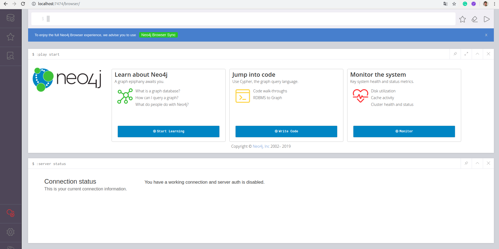
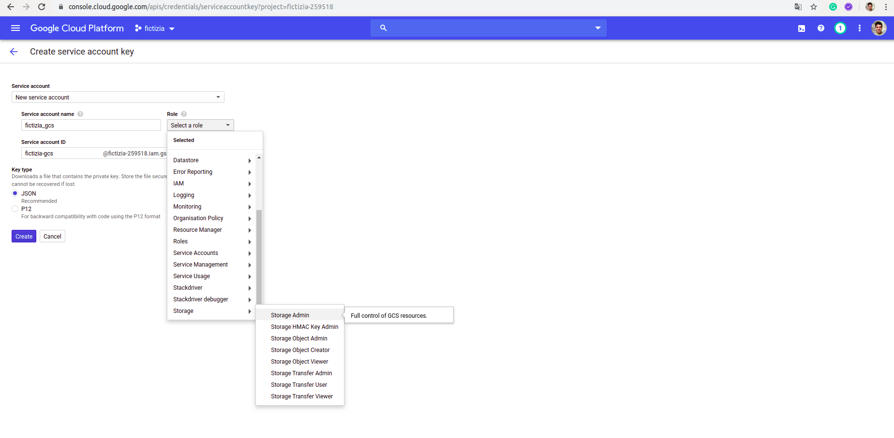
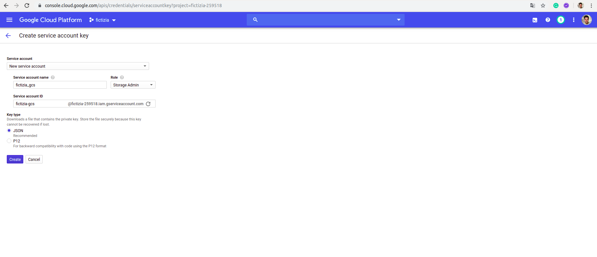
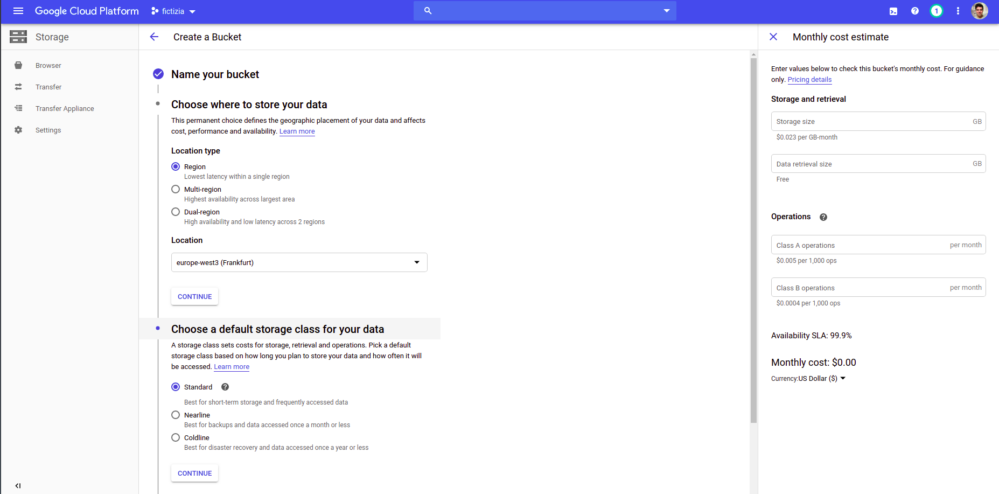
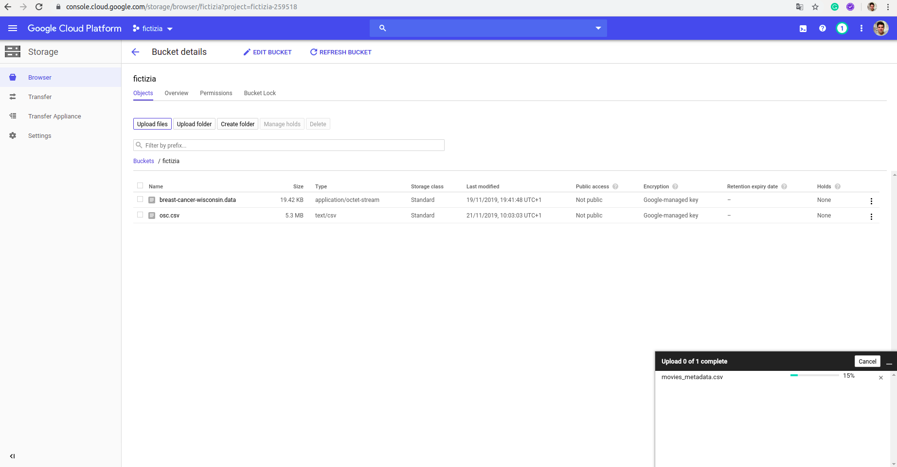

# [→ Máster en Big Data y Machine Learning](https://fictizia.com/formacion/master-big-data)
### Big Data, Machine Learning, Tensor Flow, Data Science, Data Analytics, Arquitecturas Big Data, Plataformas Big Data

## Capítulo 3 - Ejercicio 05: Trabajando con ficheros y bases de datos ##

El objetivo de este ejercicio es crear una aplicación que almacene información almacenada en ficheroe en Google Cloud Storage, procesandola y almacenándola en una base de datos en grafo mediante la utilización de una API REST. En este ejercicio vamos a utilizar las bases de datos con las que trabajamos en el anterior ejercicio y con Google Cloud Storage. 


### Desplegando nuestro contenedor Neo4J (Bases de datos en Grafo)

Docker nos permite desplegar de forma sencilla contenedores utilizando imágenes previamente creadas, para aprender como reutilizar estas imágenes vamos a desplegar un servidor de bases de datos Neo4j. Existen diferentes formas de construir nuestro contenedor Neo4J, (1) mediante la utilización de la imagen; o (2) mediante la generación de un fichero de despliegue (docker-compose.yml)

**Paso 1.1: Descargando la imagen**

En primer lugar vamos a descarga la imagen que queremos instalar, para comprobar que imágenes tenemos disponibles podemos ir acceder al listado de imágenes del servidor [Neo4J](https://hub.docker.com/_/neo4j) disponibles en dockerhub o en [Neo4J](https://neo4j.com/developer/docker-run-neo4j/) la página de Neo4J.

```
$ docker pull neo4j:latest
```

En este caso vamos a descargar la última imagen que se corresponde con la versión 3.5.12 para ello utilizamos el tag "latest". Si no nos necesitamos una versión específica podemos utilizar el tag neo4j y descargar la última versión del servidor. 

```
$ docker pull neo4j
```

A continuación comprobaremos si la imagen se ha descargado correctamente y está disponible en nuestro repositorio local de imágenes, mediante el siguiente comando:

```
$ docker images 
```


Obteniendo la siguiente salida que nos indica que hemos descargado la imagen mongo en su versión (tag) 3.4.21-xenial hace 6 semanas. 

```
REPOSITORY                TAG                 IMAGE ID            CREATED             SIZE
neo4j                     latest              8aa3aaffd180        3 days ago          363MB
```
**Paso 1.2: Desplegandando la imagen **

Una vez que hemos descargado la imagen podemos deplegarla para levantarnuestro servidor Neo4J mediante el siguiente comando:

```
$ docker run --name=neo4j_db -p 7474:7474 -p 7687:7687 -v $(pwd)/data:/data -d neo4j
```
En este caso vamos a publicar dos servicios diferentes. El puerto 7474 se correspe con el servicio http y el puerto 7687 se corresponde con la API de acceso a Neo4J. Una vez que accedamos a la base de datos por primera vez será necesario cambiar el password, por lo que es posible desactivar la autenticación mediante la variable de sesión __NEO4J_AUTH__ en el comando de arranque:

```
$ docker run --name=neo4j_db -p 7474:7474 -p 7687:7687 -v $(pwd)/data:/data --env=NEO4J_AUTH=none -d neo4j 
```
__IMPORTANTE:__ Sólo se recomienda desactivar la autenticación mediante para trabajar en entornos de desarrollo. 

**Paso 2: Desplegandando la imagen mediante compose**

La otra alternativa a la creación de nuestro contenedor por linea de comando, es crear nuestro contenedor mediante un fichero de despliegue, para ello tenemos que crear nuestro fichero docker-compose.yml. Además incluiremos la configuración de red necesario para desplegar nuestro contenedor dentro de una futura red de contenedores. 

```
version: '3.4'
services:
  
  neo4j:
    restart: always
    image: neo4j:latest
    container_name: neo4j_db
    ports:
      - "7474:7474"
      - "7687:7687"
    volumes:
      - ./data:/data
    networks:
      fictizia:
        ipv4_address: 172.18.1.10

networks:
  fictizia:
    driver: bridge
    driver_opts:
      com.docker.network.enable_ipv6: "true"
    ipam:
      driver: default
      config:
        - subnet: 172.18.1.0/24
```

Una vez construido nuestro fichero de despliegue podemos lanzar nuestro fichero de despliegue mediante el siguiente comando:

```
$ docker-compose -f docker_compose.yml up --build -d 
```

**Paso 3: Creando nuestro grafo con Neo4J **

Una vez que hemos realizado la instalación de Neo4J podemos acceder mediante la utilización del página web que provee el propio servicio. Para ellos debemos acceder mediante la siguiente url __http://localhost:7474/browser/__ donde encontraremos la siguiente página web:



Una vez que hemos accedido a nuestra sistema de bases de datos en grafo, vamos a crear nuestra primera base de datos. Para ello utilizaremos el ejemplo que nos ofrece el propio Neo4J que nos permite crear una base de datos en grafo de películas y actores. En este caso para crear un nodo (tabla) debemos utilizar el comando __CREATE__ incluyendo entre paréntesis el nombre del nodo  y su tipo __Nombre:Tipo__ y sus diferente propiedades mediante un archivo JSON. Es decir, que si quisieramos crear una pelicula  de tipo __Movie__ denominada The Matrix, deberiamos utilizar la siguiente sintaxis.

```
CREATE (TheMatrix:Movie {title:'The Matrix', released:1999, tagline:'Welcome to the Real World'})
```

Para la creación de un actor de tipo Person deberíamos utilizar la siguiente sistanxis. 

```
CREATE (Keanu:Person {name:'Keanu Reeves', born:1964})
```

En el caso de las bases de datos en grafo, no es necesario crear una estructura de tipo tabla y continuación insertar las diferentes columnas, aquí basta con crear un nodo de tipo __Movie__ en este caso y se creará un nodo con un conjunto de propiedades variables. Es decir, cada nodo puede tener diferente propiedades. 

Una vez que hemos creado nuestros nodos podemos crear relaciones entre ellos mediante el siguiente comando:

```
CREATE (Keanu)-[:ACTED_IN {roles:['Neo']}]->(TheMatrix)
```
en este caso hemos creado una relación entre el nodo __Keanu__ y el nodo __TheMatrix__ donde la relación se denomina __ACTED_IN__ e incluye un conjunto de propiedades. En este caso sólo una que se denominado roles. 

**Paso 5: Construyendo nuestra API REST**

En el ejemplo anterior construimos una API REST para trabajar con bases de datos en grafo, por lo que vamos a utilizarla con el fin de crear procesos de insección de información almacenada en fichero en Google Cloud Storage. 

**Paso 5: Configurando nuestro acceso a Google Cloud Storage**

Para poder acceder a los recursos de Google Coud Storage (GCS) es necesario construir unos credenciales de acceso que serán utilizados por el driver de acceso de para python. Para ellos deberemos entrar en nuestra consola de Google Cloud Platform y acceder a la sección de __APIs & Servicios__ y procesde a crear unas credenciales de tipo __Services account Key__. Una vez hayamos accedido deberemos crear una nueva cuenta de servicio como se muestra en la siguiente imagen. 



Para ellos seleccionaremos como rol para la cuenta de servicio el de __Administrador de Storage__ con el fin de tener permisos para acceder a todos los recursos disponibles. Normalmente, sólo se deben asignar aquellos persimos necesarios, pero al ser un ejemplo vamos a concederle todos los permisos que tenemos disponibles. Una vez debinidos los roles de nuestra cuenta de servicio tenemos que decidir el formato de nuestros credenciales, que en este caso sern de tipo JSON, como se observa en la siguiente imagen.  



**Paso 6: Cargando nuestros datos en google cloud storage**

Una vez que hemos creado nuestros crendenciales vamos a cargar nuestros datos en GCS, para ellos vamos a utilizar la información de películas que nos ofrece el reto de [Kaggle sobre películas](https://www.kaggle.com/cuantico/datos-de-pelculas/version/1) donde utilizaremos el fichero __movies_metadata.csv__. Para ello crearemos un __bucket__ que es el sistema de almancenamiento de información que utiliza GCS, para ello crearemos un bucket en europa __europe-west3___ como se presenta en la siguiente imagen. 



Una vez creado nuestro "repositorio" cargaremos nuestro fichero de datos con el fin de poder trabajar con el, pulsando en la opción __upload__ de manera que nos aparecerá una barra de proceso en la parte inferior derecha de la pantalla. 



**Paso 7: Descargando nuestro datos**

Una vez que hemos definido los diferentes credenciales, vamos a construir nuestro sistema de carga y descarga de datos sobre la API REST que hemos construido en el ejercicio anterior. Para ello es necesario crear un nuevo proyecto. Se recomienda crear una nueva carpeta denominado api que deberá contener los siguientes archivos y directorios.

```
total 32
drwxrwxr-x 7 momartin momartin 4096 nov 28 16:12 .
drwxrwxr-x 8 momartin momartin 4096 nov 28 16:04 ..
drwxrwxr-x 6 momartin momartin 4096 nov 26 06:14 api
drwxrwxr-x 2 momartin momartin 4096 nov 28 16:12 credentials
drwxr-xr-x 2 momartin momartin 4096 nov 28 16:08 data
drwxrwxr-x 2 momartin momartin 4096 nov 28 16:09 file_manipulation
-rw-rw-r-- 1 momartin momartin  763 nov 28 16:05 docker-compose.yml
```

Donde se deberán encontrar las carpetas referentes a la api (ejercicio_4) y el sistema de manipulación de ficheros. Además deberemos crear una carpeta donde almancenaremos los credenciales que creamos anteriormente. Dentro de la carperta file_manipulation deberemos crear los siguientes ficheros:

```
total 16
drwxrwxr-x 3 momartin momartin 4096 nov 28 16:50 .
drwxrwxr-x 7 momartin momartin 4096 nov 28 16:49 ..
-rw-r--r-- 1 momartin momartin  349 nov 28 16:06 Dockerfile
-rw-r--r-- 1 momartin momartin    0 nov 28 16:49 requirements.txt
drwxrwxr-x 2 momartin momartin 4096 nov 28 16:50 src
```

Este nuevo contenedor está formado por el fichero de requirements.txt, el fichero de configuración del contenedor y el cdigo fuente de los sistema de carga y descarga de ficheros.

**Paso 8: Creando nuestro proceso de descarga e insercción*

A continuación vamos a crear nuestro sistema de descarga, procesamiento e insercción de datos. Para ellos vamos a crear un script en la carpeta src denominado __data_extractor.py__ donde nos tendremos que conectar a GCS. Para ello tenemos que instala el paquete de instalación de GCS.

```
pip3 install google-cloud-storage pandas requests
```

A continuación vamos a proceder a descargar el código de nuestro proceso de descarga y procesamiento de datos. Para ello tenemos que utilizar el driver de python y los credenciales que creamos anteriormente:

```
from google.cloud import storage

client = storage.Client.from_service_account_json('../../credentials/gcs.json')
```

A continuación vamos a crear una serie de funciones para la creación y manipulación de nuestros ficheros en GCS. Para ello crearemos tres funciones que nos permitirán manipular buckets (repositorios en GCS), blobs (archivos en GCS) y ficheros. 

```
def get_bucket(name):
    return client.get_bucket(name)


def get_blob(bucket, path):
    return bucket.get_blob(path)


def download_file(path, blob):

    destination = '{}{}'.format(path, blob.name)
    blob.download_to_filename(destination)
    return destination


if __name__ == "__main__":

    my_bucket = get_bucket("fictizia")
    my_blob = get_blob(my_bucket, 'movies_metadata.csv')
    my_file = download_file('./', my_blob)

    data = pd.read_csv(my_file)
```

A continuación vamos a seleccionar aquellas columnas que son útiles para insertar en nuestra base de datos en grafo. Para ellos vamos a realizar un selección de columnas sobre nuestro dataframe en pandas.

```
if __name__ == "__main__":

    my_bucket = get_bucket("fictizia")
    my_blob = get_blob(my_bucket, 'movies_metadata.csv')
    my_file = download_file('./', my_blob)

    data = pd.read_csv(my_file, low_memory=False)
    columns = ['homepage', 'id', 'release_date', 'tagline', 'title']
    useful_data = pd.DataFrame(data, columns=columns)

```

Una vez que hemos generado nuestro conjunto de datos vamos a comenzar el proceso de insercción mediante la utilización de nuestra API REST mediante la utilización de la libreria request. 


```
if __name__ == "__main__":

    my_bucket = get_bucket("fictizia")
    my_blob = get_blob(my_bucket, 'movies_metadata.csv')
    my_file = download_file('./', my_blob)

    data = pd.read_csv(my_file, low_memory=False)
    columns = ['homepage', 'id', 'release_date', 'tagline', 'title']
    useful_data = pd.DataFrame(data, columns=columns)

    for i in range(1, useful_data.shape[0]):

        params = generate_params(useful_data.iloc[i])
        req = requests.put(URL, params=params)
        
        if req.status_code != 200:
            print("error inserting movie " + useful_data.iloc[i]['title'])

    exit(0)
```
