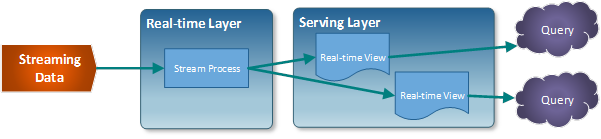

# [→ Máster en Big Data y Machine Learning](https://fictizia.com/formacion/master-big-data)
### Big Data, Machine Learning, Tensor Flow, Data Science, Data Analytics, Arquitecturas Big Data, Plataformas Big Data

## Capítulo 4 - Arquitecturas Big Data

Este capítulo describe el concepto de arquitecturas Big-Data y como se construyen. 

### Arquitectura Lambda ###

La Arquitectura Lambda, definida por [Nathan Marz](https://twitter.com/nathanmarz), surgio en 2012 y es considerada como la primera de las arquitecturas Big Data. La estructura de este tipo de arquitectura fue definida en base al funcionamiento de los sistemas de tratamiento de datos distribuidos durante su etapa como empleado en las empresas Backtype y Twitter, y está inspirada en su artículo [How to beat the CAP theorem]().

El objetivo de esta arquitectura es construir un sistema robusto tolerante a fallos (humanos, hardware y software) que fuera linealmente escalable y que permitiese realizar escrituras y lecturas con baja latencia. Con el fin de ofrecer todas esta características se diseño una arquitectura que distribuia el procesamiento de la información en base al siguiente diagrama. 

La principal característica de esta arquitectura es que divide el procesamiento de la información en dos capas: la primera capa, es la capa de procesamiento de datos en modo batch, mientras que la segunda capa es la capa de procesamiento de datos en modo stream o tiempo (semi)-real. Es decir, la capa de procesamiento batch se encargará de procesar conjuntos de información almacenados o generados mediante periodos largos de tiempo (Por ejemplo cada 15 minutos, cada 12 horas o una vez a día). Mientras que la capa de procesamiento en stream nos permitirá procesar datos almacenados o generados de forma continua casi de manera instantanea (Por ejemplo, cada 100 milisegundos). Como se puede observar en la anterior imagen el funcionamiento genérico de una arquitectura lambsa se basa en la generación de dos flujos de información paralelos:

- La nueva información ingestada en el sistema se envía tanto a la capa de batch como a la capa de streaming.
- La capa batch (Batch Layer) tiene dos funciones: (1) procesar la información en bruto añadiendo la nueva información al  sistema de almacenamiento maestro (Este sistema suele ser un almacenamiento de tipo inmutable que sólo permiten incluir nueva informaciṕon); (2) tratar la información con el fin de generar las denominadas "batch views" que son utilizadas para mostar la información mediante la capa de servicio. 
- La capa stream (speed Layer) procesa la información en tiempo real permitiendo su visualización en la capa de presentación de manera "instantanea" compensando las altas latencias de las escrituras. 
- La capa de presentación (serving Layer) genera la respuesta a las consultas realizadas por el usuario donde la información de respuesta se construye combinando la información almacenada en las "Batch Views" y la información en tiempo real procesada. 

El objetivo de las arquitecturas lambda es implementar sistemas de la información que combinan ambas modalidades de procesamiento de datos: batch y stream. Esto nos da lo mejor de dos mundos, ya que el modo batch nos brinda un alcance completo y confiable mientras que el modo stream nos da los datos en línea para decisiones instantáneas.

**Ventajas**
- Los datos se mantienen sin ningún tipo de tratamiento.
- El almacenamiento de datos sin tratamiento previo permite aplicar diferentes proceso de análisis sobre las diferentes vistas.

**Desventajas**

- Mantener sistema distribuidos de procesamiento diferentes con el objetivo de producir el mismo resultado suele tener un coste muy elevado a nivel de computación y mantenimiento. 
- Normalmente para el desarrollo de este tipo de arquitecture se utilizan tecnologías, como Apache Hadoop (MapReduce) y Apache Spark donde existen grandes diferencias a la hora de desarrollar los diferentes algoritmo. 

[Recursos y ejemplos de Arquitectura Lambda]
=================
Fecha | Solución
------------ | ------------ 
15/04/2017 | [An example of Lambda Architecture to analyse Twitter's tweets with Spark, Spark-streaming, Cassandra, Kafka, Twitter4j, Akka and Akka-http](https://blog.knoldus.com/twitters-tweets-analysis-using-lambda-architecture/)
25/03/2017 | [Applying the Lambda Architecture on Microsoft Azure cloud](https://www.codeproject.com/Articles/1171443/Applying-Lambda-Architecture-on-Azure)
16/07/2016 | [An example Lambda Architecture for analytics of IoT data with spark, cassandra, Kafka and Akka](https://blog.codecentric.de/en/2016/07/iot-analytics-platform/)
27/08/2014 | [A RAD Stack: Kafka, Storm, Hadoop, and Druid](https://metamarkets.com/2014/building-a-data-pipeline-that-handles-billions-of-events-in-real-time/)
24/07/2014 | [Deploop: A Lambda Architecture Provisioning Tool](http://lambda-architecture.net/platforms/2014-07-24-deploop-provisioning-tool)
01/07/2014 | [Nathan Marz's Big Data book](https://www.manning.com/books/big-data)
30/06/2014 | [Speed Components](http://lambda-architecture.net/components/2014-06-30-speed-components)
30/06/2014 | [Serving Components](http://lambda-architecture.net/components/2014-06-30-serving-components)
30/06/2014 | [Batch Components](http://lambda-architecture.net/components/2014-06-30-batch-components)
22/06/2014 | [Buildoop: A Lambda Architecture ecosystem builde](http://lambda-architecture.net/platforms/2014-06-22-buildoop-package-lambda-tool)
20/06/2014 | [Lambda Architecture: A state-of-the-art](http://lambda-architecture.net/architecture/2014-01-20-lambda-state-of-the-art)
19/01/2014 | [An example Lambda Architecture for real-time analysis of hashtags using Trident, Hadoop and Splout SQL](http://lambda-architecture.net/stories/2014-01-19-an-example-lambda-architecture)
25/12/2013 | [Twitter Summingbird](http://lambda-architecture.net/platforms/2013-12-25-twitters-summingbird)
25/12/2013 | [Lambdoop](http://lambda-architecture.net/platforms/2013-12-25-lambdoop)
25/12/2013 | [Issues in Combined Static and Dynamic Data Management](http://lambda-architecture.net/architecture/2013-12-25-issues-in-combined-static-and-dynamic-data-management)
24/12/2013 | [Where Polyglot Persistence meets the Lambda Architecture](http://lambda-architecture.net/architecture/2013-12-24-where-pp-meets-la)
11/12/2013 | [A real-time architecture using Hadoop and Storm](http://lambda-architecture.net/stories/2017-04-15-Twitter-tweets-analysis)
10/12/2013 | [Why are we doing this and why are we doing this now?](http://lambda-architecture.net/stories/2017-04-15-Twitter-tweets-analysis)

### Arquitectura Kappa ###

El término Arquitectura Kappa fue introducido en 2014 por [Jay Kreps]() en su artículo [Questioning the Lambda Architecture]() donde describía los posibles puntos "débiles" que tenía la arquitectura Lambda y podían ser solucionados mediante una serie de cambio. Su propuesta para eliminar estos puntos débiles consistía en la eliminación de la capa batch manteniendo sólo la capa de streaming. 

Esta propuesta se debía a que el procesamiento de la capa batch se puede considerar como un subconjunto de la capa streaming, debido a que un proceso batch se puede entender como un stream acotado temporalmente. Esta propuesta consistía en una simplificación de la Arquitectura Lambda, en la que se eliminaba la capa batch y todo el procesamiento se realiza en una sola capa denominada capa de tiempo real (Real-time Layer), dando soporte a procesamientos tanto batch como en tiempo real mediante un único flujo de datos. 

