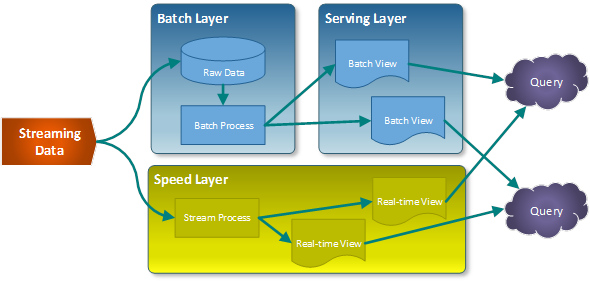

# [→ Máster en Big Data y Machine Learning](https://fictizia.com/formacion/master-big-data)
### Big Data, Machine Learning, Tensor Flow, Data Science, Data Analytics, Arquitecturas Big Data, Plataformas Big Data

## Capítulo 4 - Arquitecturas Big Data

Este capítulo describe el concepto de arquitecturas Big-Data y como se construyen. 

### Arquitectura Lambda ###

La Arquitectura Lambda, definida por [Nathan Marz](), surgio en 2012 y es considerada como la primera de las arquitecturas Big Data. La estructura de este tipo de arquitectura fue definida en base al funcionamiento de los sistemas de tratamiento de datos distribuidos durante su etapa como empleado en las empresas Backtype y Twitter, y está inspirada en su artículo [How to beat the CAP theorem]().

El objetivo de esta arquitectura es construir un sistema robusto tolerante a fallos (humanos, hardware y software) que fuera linealmente escalable y que permitiese realizar escrituras y lecturas con baja latencia. Con el fin de ofrecer todas esta características se diseño una arquitectura que distribuia el procesamiento de la información en base al siguiente diagrama. 

La principal característica de esta arquitectura es que divide el procesamiento de la información en dos capas: la primera capa, es la capa de procesamiento de datos en modo batch, mientras que la segunda capa es la capa de procesamiento de datos en modo stream o tiempo (semi)-real. Es decir, la capa de procesamiento batch se encargará de procesar conjuntos de información almacenados o generados mediante periodos largos de tiempo (Por ejemplo cada 15 minutos, cada 12 horas o una vez a día). Mientras que la capa de procesamiento en stream nos permitirá procesar datos almacenados o generados de forma continua casi de manera instantanea (Por ejemplo, cada 100 milisegundos). Como se puede observar en la anterior imagen el funcionamiento genérico de una arquitectura lambsa se basa en la generación de dos flujos de información paralelos:

- La nueva información ingestada en el sistema se envía tanto a la capa de batch como a la capa de streaming.
- La capa batch (Batch Layer) procesa la información en bruto, añadiendo los nuevos datos en el sistema de almacenamiento seleccionado (escritura). A continuación realiza un tratamiento de los datos con el fin de generar las denominadas "Batch views" que son utilizadas para mostar la información mediante la capa de servicio. 
- La capa stream (Speed Layer) procesa la información en tiempo real permitiendo su visualización en la capa de presentación de manera "instantanea" compensando las altas latencias de las escrituras. 
- La capa de presentación (Serving Layer) genera la respuesta a las consultas realizadas por el usuario donde la información de respuesta se construye combinando la información almacenada en las "Batch Views" y la información en tiempo real procesada. 

El objetivo de las arquitecturas lambda es implementar sistemas de la información que combinan ambas modalidades de procesamiento de datos: batch y stream. Esto nos da lo mejor de dos mundos, ya que el modo batch nos brinda un alcance completo y confiable mientras que el modo stream nos da los datos en línea para decisiones instantáneas.
