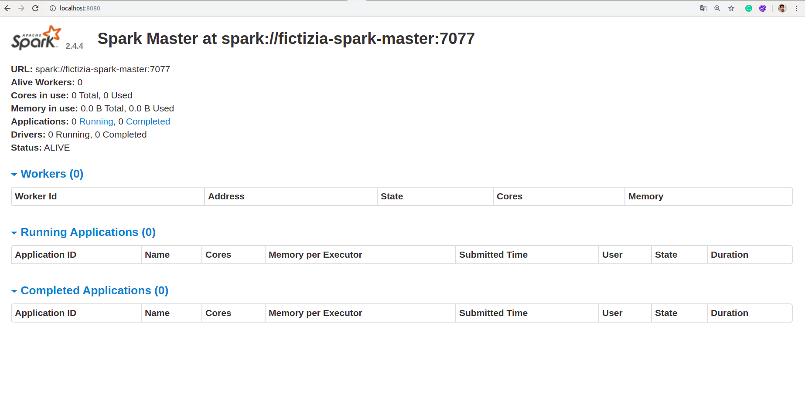
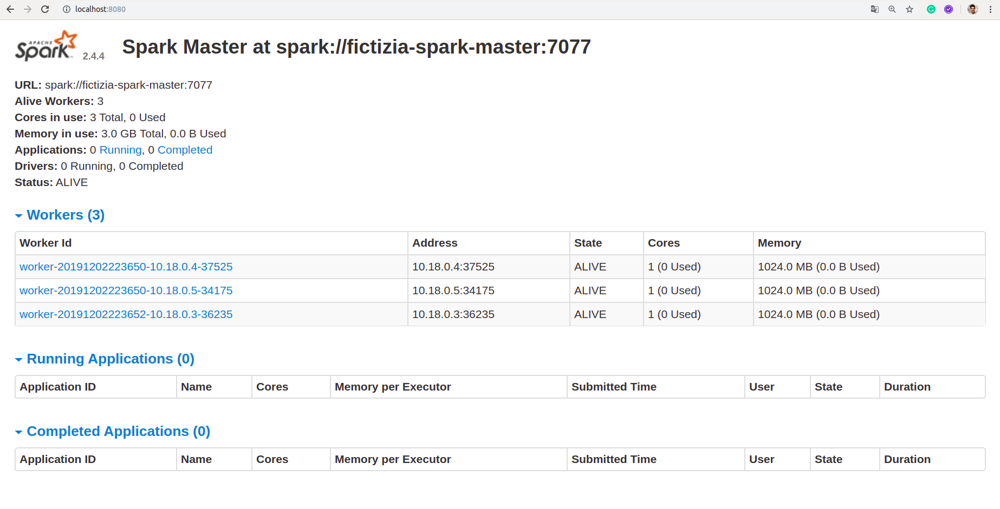
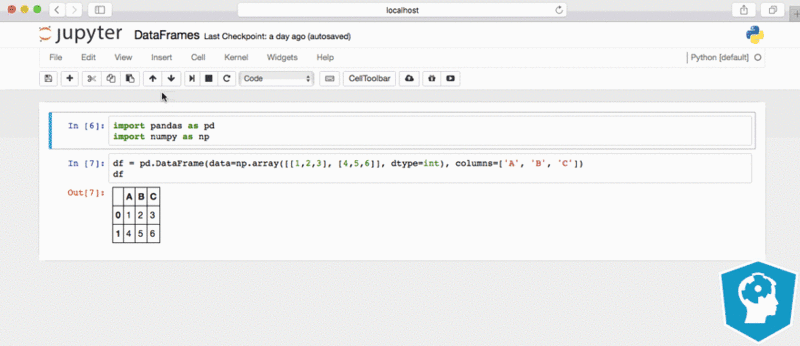

# [→ Máster en Big Data y Machine Learning](https://fictizia.com/formacion/master-big-data)
### Big Data, Machine Learning, Tensor Flow, Data Science, Data Analytics, Arquitecturas Big Data, Plataformas Big Data

## Capítulo 4 - Ejercicio 01: Trabajando con datos en bathc ##

El objetivo de este ejercicio es desplegar un cluster de Apache Spark compuesto por un nodo maestro y tres nodos esclavos (trabajadores) con el fin de ejecutar un proceso de manipulación y acceso a datos recolectados mediante un proceso de tipo batch. 

### Recursos ###

Para el desarrollo de este ejercicio vamos a utilizar las diferentes tecnologías y recursos.

- [Python](https://www.python.org/) como lenguaje de programación para el desarrollo de nuestros procesos. 
- [Apache Spark]() como sistema de procesamiento y acceso a la información.
- [PySpark]() como librería de interacción entre Apache Spark y nuestro nodos del cluster Spark.
- [Docker](https://docs.docker.com/) para construir el contenedor donde se desplegará nuestro servidor. 

### Solución paso a paso ###

**Paso 1: Creación del proyecto**

Para la creación del proyecto se recomienda crear una nueva carpeta denominado ejercicio_1 que deberá contener los siguientes archivos y directorios.

```
drwxr-xr-x 7 momartin momartin 4096 nov  1 11:55 .
drwxr-xr-x 8 momartin momartin 4096 nov  1 11:55 ..
drwxrwxr-x 2 momartin momartin 4096 nov  1 11:54 bin
-rw-r--r-- 1 momartin momartin  288 oct 31 21:30 Dockerfile
drwxrwxr-x 2 momartin momartin 4096 nov  1 11:53 include
drwxrwxr-x 3 momartin momartin 4096 nov  1 11:53 lib
drwxrwxr-x 2 momartin momartin 4096 nov  1 11:53 local
-rw-r--r-- 1 momartin momartin  612 oct 31 21:11 requirements.txt
drwxr-xr-x 4 momartin momartin 4096 nov  1 12:56 src
```

Donde se deberán la carpeta config se corresponde con la configuración de las diferentes variables de entorno de los esclavos (workers) y el maestro. 

**Paso 2: Definión del fichero de configuración de los esclavos**

El segungo paso consiste en definir las diferentes variables de configuración del nodos esclavos. Es objetivo de crear un fichero común para todos los esclavos permite minimizar errores en la configuración utilizando exactamente la misma configuración para todos. Para ellos crearemos un fichero denominado __config_worker.sh__ en en la carpeta __config_spark__ con la siguiente información:

```
#Informacion Maestro

SPARK_MASTER=spark://fictizia-spark-master:7077

#Parametros de configuracion de los workers

SPARK_WORKER_CORES=1
SPARK_WORKER_MEMORY=1G
SPARK_DRIVER_MEMORY=128m
SPARK_EXECUTOR_MEMORY=256m
```

**Paso 3: Generación del fichero de despliegue I**

A continuación es necesario crear nuestro fichero de despliegue del cluster de Apache Spark. Para el despligue de los diferentes nodos vamos a utilizar la versión desplegada por [bde2020](https://hub.docker.com/r/bde2020/spark-master/) cuya versión es la más moderna de las disponibles en docker hub. Con el fin de simplificar la explicación, vamos a dividir el proceso de creación en dos fases. La primera fase consistirá en desplegar el nodo maestro y la red de comunicaiones y la segunda fase consistirá en desplegar los nodos esclavos (workers).

Para la primera fase debemos crear el fichero __docker_compose.yml__ que contendrá la siguiente información:

```
version: "3.4"
services:

  fictizia-spark-master:
    restart: always
    image: bde2020/spark-master:latest
    container_name: fictizia-spark-master
    hostname: fictizia-spark-master
    ports:
      - "8080:8080"
      - "7077:7077"
      - "6066:6066"      
    expose:
      - 8080
      - 7077
      - 6066
    networks: 
      fictizia:
        ipv4_address: 10.18.0.2
    volumes:
       - ./spark-apps:/opt/spark-apps
       - ./spark-data:/opt/spark-data
       - ./spark-conf/master:/conf       
    environment:
      - "SPARK_LOCAL_IP=fictizia-spark-master"
      - "SPARK_MASTER_PORT=7077"
      - "SPARK_MASTER_WEBUI_PORT=8080"
      - "SPARK_MASTER_LOG=/spark/logs"
      - "SPARK_CONF_DIR=/conf"      

networks:
  fictizia:
    driver: bridge
    ipam:
     driver: default
     config:
       - subnet: 10.18.0.0/16
```

Para ello crearemos un red denominada __fictizia__ cuya dirección de subred será 10.18.0.0 y un único nodo denominado __spark-master__ para la cual utilizaremos la imagen spark-master:latest. Además desplegaremos tres puertos:

- Puerto 8080 donde se desplegara la aplicación web de gestión de Apache Spark. 
- Puerto 7077 donde escucha (por defento) el maestro del cluster de spark.
- Puerto 6066 donde se encuentra desplegada la API de servicio del nodo maestro para que se comuniquen los esclavos con el. 

Además, crearemos dos volumenes compartidos para los datos y las diferentes aplicaciones que utilizará nuestro cluster de Spark; y un conjunto de variables de sessión para la configuración del cluster:

- SPARK_LOCAL_IP para la definición de la dirección IP del Maestro.
- SPARK_MASTER_PORT para la definición del puesto del nodo Maestro.
- SPARK_MASTER_WEBUI_PORT para definir el puerto de la aplicación web.
- SPARK_MASTER_LOG para la localización de los archivos de logs.

Una vez construido el fichero de despliegue debemos lanzar nuestro cluster mediante el siguiente comando:

```
docker-compose -f docker-compose.yml up --build -d
```

Una vez desplegado nuestro nodo maestro podremos comprobar el correcto funcionamiento del nodo mediante el comando docker ps obteniéndose la siguiente salida:

```
CONTAINER ID        IMAGE                         COMMAND                  CREATED             STATUS              PORTS                                                      NAMES
7706ecdcee8f        bde2020/spark-master:latest   "/bin/bash /master.sh"   10 minutes ago      Up 10 minutes       0.0.0.0:7077->7077/tcp, 6066/tcp, 0.0.0.0:8080->8080/tcp   fictizia-spark-master

```

Además podremos acceder a la página web donde se puede observar el estado de nuestro cluster spark a través de la url http://localhost:8080




**Paso 4: Generación del fichero de despliegue II**

Una vez que hemos conseguido desplegar nuestro Maestro, pasaremos a desplegar nuestros esclavos (trabajadores). La distribución más común para desplegar un entorno de pruebas de Apache Spark consiste en desplegar tres nodos esclavos, por lo que tendremos que introducir tres nuevos nodos en nuestro fichero de despliegue. Para ello debemos incluir la información de cada uno de nuestros workers en el fichero de configuración, siendo la configuración de cada uno de los nodos la siguiente:

```
fictizia-spark-worker-1:
  restart: always
  image: bde2020/spark-worker:latest
  container_name: fictizia-spark-worker-1
  hostname: fictizia-spark-worker-1
  depends_on:
    - fictizia-spark-master
  ports:
    - "8081:8081"
  env_file: ./config_spark/config_worker.sh
  environment:
    - "SPARK_LOCAL_IP=fictizia-spark-worker-1"        
  networks: 
    fictizia:
      ipv4_address: 10.18.0.3
  volumes:
     - ./spark-apps:/opt/spark-apps
     - ./spark-data:/opt/spark-data
     - ./spark-conf/worker-1:/conf         
     
```

Para cada uno de los trabajadores es necesarios definir una serie de variables exclusivas que son el nombre del contenedor y las siguientes propiedades:

- container_name: fictizia-spark-worker-[id del nodo]
- hostname: fictizia-spark-worker-[id del nodo]
- ports: "8081:8081" donde para cada uno de los nodos es necesario definir un puesto de mapeo diferente, por ejemplo para el primero trabajador mapearemos sobre el puerto 8081, para el segundo en el 8082 y así sucesivamente. 

Una vez incluidos nuestros tres trabajadores en el fichero de despliegue podremos desplegar nuestro cluster completo mediante el siguiente comando:

```
docker-compose -f docker-compose.yml up --build -d
```

Una vez desplegado nuestro nodo maestro podremos comprobar el correcto funcionamiento del nodo mediante el comando docker ps obteniéndose la siguiente salida:

```
CONTAINER ID        IMAGE                         COMMAND                  CREATED              STATUS              PORTS                                                      NAMES
3458f67efc46        bde2020/spark-worker:latest   "/bin/bash /worker.sh"   8 seconds ago        Up 7 seconds        0.0.0.0:8083->8081/tcp                                     fictizia-spark-worker-3
0306c62cd568        bde2020/spark-worker:latest   "/bin/bash /worker.sh"   About a minute ago   Up About a minute   0.0.0.0:8082->8081/tcp                                     fictizia-spark-worker-2
34c90136b7c6        bde2020/spark-worker:latest   "/bin/bash /worker.sh"   9 minutes ago        Up 9 minutes        0.0.0.0:8081->8081/tcp                                     fictizia-spark-worker-1
cd02e44b8fe6        bde2020/spark-master:latest   "/bin/bash /master.sh"   9 minutes ago        Up 9 minutes        0.0.0.0:7077->7077/tcp, 6066/tcp, 0.0.0.0:8080->8080/tcp   fictizia-spark-master

```

Además podremos acceder a la página web donde se puede observar el estado de nuestro cluster spark a través de la url http://localhost:8080




**Paso 4: Desplegando nuestro notebook de desarrollo**

A la hora de construir un proceso que utilice las capacidades del cluster de Spark es necesario realizar una serie de configuraciones en el contenedor. Aunque es posible simplificar de forma sencilla todo esto mediante la utilización de un servidor de notebooks de tipo (jupyter)[https://jupyter.org/]. Jupyter notebooks es un sistema de despliegue de entornos de desarrollo sobre python mediante la utilización de una interfaz web. 



Para poder desplegar nuestro entorno en jupyter vamos a utilizar un contenedor docker que ya ha sido configurado para apache spark. Este contenedor puede encontrarse en el docker hub de (Jupyter)[https://hub.docker.com/r/jupyter/pyspark-notebook/] que ya nos configura todos las variables de entorno necesarias para trabajar con pyspark. Para ellos debemos incluir un nuevo nodo en nuestro ficheros de despliegue:

```

  jupyter-spark:
    image: jupyter/pyspark-notebook:latest
    container_name: notebooks
    ports:
      - "8888:8888"
      - "4041-4080:4041-4080"
    volumes:
      - ./notebooks:/home/jovyan/work/notebooks/
    networks: 
      fictizia:
        ipv4_address: 10.18.0.10
```

Una vez introducido el nuevo contenedor podemos desplegar mediante el comando de despligue

```
docker-compose -f docker-compose.yml up --build -d
```

Una vez desplegado nuestro nodo maestro podremos comprobar el correcto funcionamiento del nodo mediante el comando docker ps obteniéndose la siguiente salida:

```
CONTAINER ID        IMAGE                         COMMAND                  CREATED              STATUS              PORTS                                                      NAMES
3458f67efc46        bde2020/spark-worker:latest   "/bin/bash /worker.sh"   8 seconds ago        Up 7 seconds        0.0.0.0:8083->8081/tcp                                     fictizia-spark-worker-3
0306c62cd568        bde2020/spark-worker:latest   "/bin/bash /worker.sh"   About a minute ago   Up About a minute   0.0.0.0:8082->8081/tcp                                     fictizia-spark-worker-2
34c90136b7c6        bde2020/spark-worker:latest   "/bin/bash /worker.sh"   9 minutes ago        Up 9 minutes        0.0.0.0:8081->8081/tcp                                     fictizia-spark-worker-1
cd02e44b8fe6        bde2020/spark-master:latest   "/bin/bash /master.sh"   9 minutes ago        Up 9 minutes        0.0.0.0:7077->7077/tcp, 6066/tcp, 0.0.0.0:8080->8080/tcp   fictizia-spark-master

```

Además podremos acceder a la página web donde se puede observar el estado de nuestro cluster spark a través de la url http://localhost:8888


Al intentar acceder a nuestro servidor de notebooks, nos solicitará un token de acceso que podemos obtener si abrirmos el log del contenedor que ha desplegado el servidor. Para ello deberemos utilizar sel siguiente comando: 


```
docker logs notebooks
```

Donde podremos encontrar el token de acceso a nuestro servidor de notebooks

```
Executing the command: jupyter notebook
[I 15:06:06.065 NotebookApp] Writing notebook server cookie secret to /home/jovyan/.local/share/jupyter/runtime/notebook_cookie_secret
[I 15:06:08.152 NotebookApp] JupyterLab extension loaded from /opt/conda/lib/python3.7/site-packages/jupyterlab
[I 15:06:08.152 NotebookApp] JupyterLab application directory is /opt/conda/share/jupyter/lab
[I 15:06:09.954 NotebookApp] Serving notebooks from local directory: /home/jovyan
[I 15:06:09.954 NotebookApp] The Jupyter Notebook is running at:
[I 15:06:09.955 NotebookApp] http://d5278ebab486:8888/?token=a8b0c4fb268b3ac848f2ee5fcd6973a7d9cd89d274a5c9e7
[I 15:06:09.955 NotebookApp]  or http://127.0.0.1:8888/?token=a8b0c4fb268b3ac848f2ee5fcd6973a7d9cd89d274a5c9e7
[I 15:06:09.955 NotebookApp] Use Control-C to stop this server and shut down all kernels (twice to skip confirmation).
[C 15:06:09.965 NotebookApp] 
    
    To access the notebook, open this file in a browser:
        file:///home/jovyan/.local/share/jupyter/runtime/nbserver-9-open.html
    Or copy and paste one of these URLs:
        http://d5278ebab486:8888/?token=a8b0c4fb268b3ac848f2ee5fcd6973a7d9cd89d274a5c9e7
     or http://127.0.0.1:8888/?token=a8b0c4fb268b3ac848f2ee5fcd6973a7d9cd89d274a5c9e7

```

Para poder acceder tendremos que utilizar la url que aparece en la última linea o introducir el token a través del formulario que nos aparecio en la anterior pantalla del interfaz web donde ya podremos crear nuestros notebooks 


Además podremos acceder a la página web donde se puede observar el estado de nuestro servidor de notebooks a través de la url http://localhost:8888


**Paso 5: Creando nuestro primer script en nuestro servidor jupyter**

Ya hemos desplegado nuestro servidor jupyter y podemos comenzar a trabajar con nuestros primeros scripts en python, para ello debemos crear un nuevo notebook. Para ello utilizaremos el botón __new__ que se encuentra en la esquina superior derecha. Para ello selecionaremos un nuevo archivo que se ejecutará sobre python 3, ya que es la única opción que tenemos disponible. Una vez que hayamos creado nuestro notebooks, podemos introducir código python como si estuvieramos creando un archivo .py. Por lo que comenzaremos creando nuestro primer script en pyspark. Para ello, debemos introducir el siguiente código fuente:

```
from pyspark.sql import SparkSession

if __name__ == "__main__":

    spark = SparkSession.builder.master('spark://10.18.0.2:7077').appName('spark-cluster').getOrCreate()
    exit(0)
```

Donde debemos introducir en este caso la dirección IP del nodo máster __spark://10.18.0.2:7077__ bajo el protocolo spark que se encuentra escuchando en el puerto 7077 como configuramos previamente en el fichero de despliegue. A continuación podemos ejecutar el script pulsando el boton de __run__ que se corresponde con la flecha negra en el panel de control de la zona superior. Pero al intentar ejecutar este código obtendremos el siguiente error:


Este error se debe a que la versión de python que utiliza el cluster de spark que hemos desplegado es la 2.7, por lo que al intentar ejecutar nuestro script de spark no somos capaces de ejecutarlo ya que las versiones de python que utilizamos en ambos servicios es diferente. 


**Paso 7: Creando nuestro propio servidor de servidores notebooks**

Con el fin de reparar este error tenemos que crear nuestro propio servidor de notebooks, para ellos deberemos crear una nueva carpeta en nuestro ejercicio, que denominaremos __jupyter__. Dentro de esta nueva carpeta tendremos que construir un archivo de generación de nuestro contenedor denominado __Dockerfile__ que deberá contener las siguientes instrucciones:

```
FROM jupyter/pyspark-notebook:latest

RUN conda create --quiet --yes -p $CONDA_DIR/envs/python2 python=2.7 ipython ipykernel kernda && conda clean --all -f -y
USER root
RUN $CONDA_DIR/envs/python2/bin/python -m ipykernel install && $CONDA_DIR/envs/python2/bin/kernda -o -y /usr/local/share/jupyter/kernels/python2/kernel.json
USER $NB_USER
```

Mediante este fichero extenderemos la funcionalidad del servidor de notebooks incluyendo la versión 2.7 de python con el fin de poder ejecutar nuestros scripts sobre nuestro cluster de tipo Apache Spark. A continuación es necesario modificar nuestro fichero de despligue modificando la estructura del contenedor notebooks, por lo que sustituiremos el código que hemos construido posteriormente por el siguiente:


```
  jupyter-spark:
    restart: always
    build: ./jupyter
    container_name: notebooks
    ports:
      - "8888:8888"
      - "4041-4080:4041-4080"
    volumes:
      - ./notebooks:/home/jovyan/work/notebooks/
    networks: 
      fictizia:
        ipv4_address: 10.18.0.10
```

Ahora podemos volver a desplegar nuestros notebooks en python 2.7 y podemos ejecutar correctamente nuestros scripts. 

**Paso 7: Probando nuestra conexión a Spark**

Para comprobar el correcto funcionamient a spark vamos a crear un función sencilla que nos permitirá aproximar el valor del número PI. Para ellos deberemos crear primer una session a spark utilizando el siguiente código. Esto nos permitirá crear una sesión con el nodo maestro para la ejecución de un aplicación denominada __spark-cluster__. 

```
from pyspark.sql import SparkSession

if __name__ == "__main__":

    spark = SparkSession.builder.master('spark://10.18.0.2:7077').appName('spark-cluster').getOrCreate()
```

Una vez creada la sesión podemos lanzar nuestras funciones para ejecutarlas en los diferentes trabajadores. Para ello crearemos una función que se llamara __execution__ (para su funcionamiento deberemos importar la libreria random de python) y que contendrá el siguiente código:

```
import random

def execution(p):
    x, y = random.random(), random.random()
    return x*x + y*y < 1
```

Una vez creada nuestra función deberemos implementa el código para su ejecución en los workers, introduciendo el siguiente fragemento de codigo en el método main:

```
    NUM_SAMPLES = 10

    count = spark.sparkContext.parallelize(range(0, NUM_SAMPLES)).filter(execution).count()
    print(count)
    print('Pi is roughly {}'.format(4.0 * count / NUM_SAMPLES))
```

Mediante este código ejecutaremos n veces (NUM_SAMPLES) la función execution contanto sólo aquella ejecuciones donde la función haya devuelto true como resultado. Una vez obtenido este valor lo multiplicaremos por 4 y lo dividiremos entre el número de ejecuciones. El código completo debera ser el siguiente:

```
from pyspark.sql import SparkSession

import random

def execution(p):
    
    x, y = random.random(), random.random()
    return x*x + y*y < 1

if __name__ == "__main__":

    spark = SparkSession.builder.master('spark://10.18.0.2:7077').appName('spark-cluster').getOrCreate()
    NUM_SAMPLES = 10

    count = spark.sparkContext.parallelize(range(0, NUM_SAMPLES)).filter(execution).count()
    print(count)
    print('Pi is roughly {}'.format(4.0 * count / NUM_SAMPLES))
```

Esta forma de recuperar la sesion nos permite recuperar una sesión creada previamente con el nombre de la aplicación. De manera que si ha sido creada previamente podremos recuperarla. 

**Paso 8: Trabajando con el contexto**

Una vez que hemos desplegado nuestro servidor de notebooks conectado a nuestro servidor spark, podemos comenzar a crear nuestro scripts utilizando el contexto de Spark. Para ello deberemos crear nuestro contexto en spark (SparkContext). El contexto es el punto de acceso a cualquiera de las funcionalidades disponibles en spark. Es decir, cuando queremos desarrollar cualquier tipo de funcionalidad en Spark debemos comenzar inicializando el contexto con el fin de tener acceso al cluster. Una vez inicializado el contexto podemos ejecutar nuestras funciones, las cuales ejecutarán sus operaciones distribuidas en los workers. Para poder crear nuestro contexto utilizaremos la clase __SparkContext__ de pyspark que nos permite configurar una serie de elemento para definir la forma en la que desplegaremos nuestra aplicación:

```
class pyspark.SparkContext (
   master = None,
   appName = None, 
   sparkHome = None, 
   pyFiles = None, 
   environment = None, 
   batchSize = 0, 
   serializer = PickleSerializer(), 
   conf = None, 
   gateway = None, 
   jsc = None, 
   profiler_cls = <class 'pyspark.profiler.BasicProfiler'>
)
```

Cada uno de estos parametros permite configurar ciertos aspectos de las aplicaciones que queramos desplegar en Spark, siendo el significado de las más importantes el siguiente:

- Master: Es la url del cluster al que nos vamos a conectar. Se corresponde con la url del maestro. 
- appName: Es el nombre de la aplicación que vamos lanzar. En spark se denomina trabajo. 
- sparkHome: Es el path absoluto del directorio de instalación de Spark. 
- pyFiles: El el conjunto de archivo .py o .zip que serán enviados al cluster o incluido en la variable PYTHONPATH
- Environment: Son la variables de entorno que queremos incluir en los workers. 
- Serializer: Es el tipo de serializador que utilizaremos para los RDD. La clase de serializado por defecto es [PickleSerializer](https://spark.apache.org/docs/1.1.0/api/python/pyspark.serializers.PickleSerializer-class.html).
- Conf: Es una objeto de tipo SparkConf que permite la definición de la propiedades de spark con el el fin de variar algunos elementos de la configuración.  to set all the Spark properties.
- JSS: Es el objeto de contexto en Java (JavaSparkContext).
- profiler_cls: Es la clase para la realización de tipo profilinf. El tipo de clase para profiling utilizada por defecto es [BasicProfiler](https://spark.apache.org/docs/latest/api/python/_modules/pyspark/profiler.html).

Para poder crear nuestro contexto de spark tenemos que utilizar el siguiente código:

```
from pyspark import SparkContext

if __name__ == "__main__":

    sc = SparkContext('spark://10.18.0.2:7077', 'Spark App with context')
    print(sc)
```

Aunque en este caso no podremos volver a crear otro contexto de spark, por lo que cuando vayamos a crear un contexto, será mejor comprobar si existe otro previamente creado, para ello utilizaremos la función __getOrCreate__ que crea un nuevo contexto o recupera el que ha sido creado previamente. 

```
from pyspark import SparkContext

if __name__ == "__main__":

    sc = SparkContext('spark://10.18.0.2:7077', 'Spark App with context').getOrCreate()
    print(sc)
```

**Paso 10: Transformando nuestro datos para su procesamiento**

Puesto que estamos trabajando sobre un Jupyter Notebook es necesario realizar la instalación de aquellas librerias que no han sido desplegadas en nuestro entorno de desarrollo. Para la instalación de nuevas librerias en python cuando estamos trabajando sobre un Jupyter Notebook debemos utilizar el instalar de paqueste pip incluyendo al comiento el simbolo de !. Para la realización de este paso vamos a necesitar utilizar dos librerias de python que tendrán que ser intaladas incluyendo al comienzo de nuestro notebook la siguiente linea:

```
!pip install wget pandas
```

A continuación podemos realizar nuestro proceso de transformación de datos. Para ello vamos a utilizar la función __Map__. La función map es una de las funciones más utilizada en programación lineal y se basa en la aplicación de una transformación lineal sobre un conjunto de datos con el fin de generar otro conjunto de datos de igual tamaño. En el caso de Apache Spark, la función mapea la entrada, normalmente formada por pares the tipo clave/valor a un conjunto de pares clave/valor tras la aplicación de un determinada función. En este paso vamos a aplicar una función de limpieza con el objetivo de modificar aquellos valores de tipo __NaN__ que existen en el fichero. Para ellos debemos construir una función en python que modifique el valor de aquellos registros que contengan el NaN mediante el siguiente código:

```
def clean_data(p):
    if isinstance(p, str):
        return int(p[:-6])
    else:
        return int(1915)
```

Mediante esta función extraemos el año de la fecha y para aquellas peliculas que no tienen ningún año asignado, le asignado el año 1800 (Hemos decidido utilizar este código debido a que en la lista no existen películas que se correspondan con esta fecha de producción con el objetivo de identificarlas de manera sencilla). Una vez definida la función que utilizaremos para mapear nuestro datos, vamos a escribir el código necesario para la ejecución de la función map.  Para la realización de este ejercicio vamos a utilizar el fichero de películas que utilizamos en el ejercicio 5 del capitulo 3, pero en vez de descargarlo utilizando los conectores de google cloud storage (no están disponibles para la versión 2.7 de python), vamos a convertirlo en un archivo público y descargarlo mediante las funcionalidades que ofrece la clase wget. 

```
from pyspark import SparkContext
from pyspark.sql import SparkSession
from os import path
import pandas as pd
import wget

YEAR = 2001
URL = 'https://storage.googleapis.com/fictizia/movies_metadata.csv'

def clean_data(p):
    if isinstance(p, str):
        return int(p[:-6])
    else:
        return int(1800)

if __name__ == "__main__":
    
    spark_url = 'spark://10.18.0.2:7077'
    app_name = 'filter app'
    
    sc = SparkContext(spark_url, app_name).getOrCreate()
    
    try:
    
        file_name = './movies_metadata.csv'

        if not path.exists(file_name):
            file_name = wget.download(URL)

        data = pd.read_csv(file_name, header=0, low_memory=False, error_bad_lines=False)
        years = data['release_date'].values.tolist()
        app_name = 'Map function'

        sc = SparkContext('spark://10.18.0.2:7077', app_name).getOrCreate()

        rdd = sc.parallelize(years)
        result = rdd.map(clean_data)
        print(result.take(10))
    
    except Exception as e:
    
        print('Se ha producido un error')
        print(e)
        
    finally:
        sc.stop()
```

Mediante este código aplicamos la función clean_data mediante la operación map limpiando nuestros datos de manera que podremos aplicar otro tipo de funciones sobre el resultados generado. Para la realización de este paso hemos incluido un nuevo elemento denominad __RDD__. Los Resilient Distributed Dataset (RDD) son conjuntos de datos con tolerancia a fallos que pueden ser manipulados/consultados mediante operaciones paralelas. Existen dos maneras de crear RDDs en Apache Spark: (1) paralelizando un colección de datos; o (2) referenciando un conjunto de datos (dataset) que se encuenta almacenada un sistema de almacenamiento externo, como HDFS o HBase. Para la creación de un RDD para este paso hemos utilizado la primera opción paralelizando una colección de datos mediante la utilización de la función __parallelize__.


**Paso 11: Filtrando nuestros datos**

A continuación vamos a utilizar el resultado obtenido de la anterior operación para aplicar un filtro y obtener así información referente a los datos con los que estamos trabajando, para ello vamos a utilizar es la función __filter__. La función filter, es una función típica en programación funcional, que nos permite filtrar la información sobre un conjunto de datos utilizando un función boleana. Es decir, la función filter sólo nos devolverá aquellos valores donde la función booleana devuelva True. En este caso vamos a seleccionar aquellas películas que han sido publicadas en un determinado año, inicialmente seleccionaremos el año 1800, con el objetivo de conocer cuantas películas eran erroneas. 


```
def choose_data_by_year(p):
    return p == 1800
```

Mediante esta función seleccionaremos aquellas películas cuya fecha de publicación es 1800. De manera que el RDD que obtendremos será mucho más pequeño. Una vez obtenido el resultado aplicaremos la función __count__ que nos permite contar los elementos del RDD. Para ello utilizaremos el siguiente código.  

```
from pyspark import SparkContext
from pyspark.sql import SparkSession
from os import path
import pandas as pd
import wget

YEAR = 2001
URL = 'https://storage.googleapis.com/fictizia/movies_metadata.csv'

def clean_data(p):
    if isinstance(p, str):
        return int(p[:-6])
    else:
        return int(1800)

def choose_data_by_year(p):
    return p == YEAR

if __name__ == "__main__":

    spark_url = 'spark://10.18.0.2:7077'
    app_name = 'filter app'
    
    sc = SparkContext(spark_url, app_name).getOrCreate()
    
    try:
    
        file_name = './movies_metadata.csv'

        if not path.exists(file_name):
            file_name = wget.download(URL)

        data = pd.read_csv(file_name, header=0, low_memory=False, error_bad_lines=False)
        years = data['release_date'].values.tolist()
        app_name = 'Map and filter function'

        sc = SparkContext('spark://10.18.0.2:7077', app_name).getOrCreate()

        rdd = sc.parallelize(years)
        mapped_data = rdd.map(clean_data)
        result = mapped_data.filter(choose_data_by_year)
        print(result.count())
    
    except Exception as e:
    
        print('Se ha producido un error')
        print(e)
        
    finally:
        sc.stop()
```

Ademas es posible incluir parámetros a nuestro función con el objetivo de hacerlas más reutilizables. Para ello será necesario modificiar la definición de la función y la llamada de la siguiente manera:

```
from pyspark import SparkContext
from pyspark.sql import SparkSession
from os import path
import pandas as pd
import wget

URL = 'https://storage.googleapis.com/fictizia/movies_metadata.csv'

def clean_data(p):
    if isinstance(p, str):
        return int(p[:-6])
    else:
        return int(1800)

def choose_data_by_year(p, year):
    return p == year

if __name__ == "__main__":

    spark_url = 'spark://10.18.0.2:7077'
    app_name = 'filter app'
    
    sc = SparkContext(spark_url, app_name).getOrCreate()
    
    try:
        file_name = './movies_metadata.csv'

        if not path.exists(file_name):
            file_name = wget.download(URL)

        data = pd.read_csv(file_name, header=0, low_memory=False, error_bad_lines=False)
        years = data['release_date'].values.tolist()
        app_name = 'Map and filter function'
        year = 1800

        sc = SparkContext('spark://10.18.0.2:7077', app_name).getOrCreate()

        rdd = sc.parallelize(years)
        mapped_data = rdd.map(clean_data)
        result = mapped_data.filter(choose_data_by_year(year, 1800))
        
        print(resutl.count())
        
    except Exception as e:
    
        print('Se ha producido un error')
        print(e)
        
    finally:
        sc.stop()
          
```

El enlace al archivo es temporal, por lo que puede que no funcione correctamente. En caso de querer ejecutar el ejemplo correctamente deberas descagar el dataset completo en el siguiente (link)[], descomprimirlo y cargar el fichero __movies_metadata.csv__ en un repositorio como Google Cloud Storage y hacer el archivo Público. 

**Paso 12: Reduciendo nuestros datos a sólo uno**

Hasta ahora sólo habiamos utilizado funciones de transformación que nos permiten realizar transformaciones sobre nuestro datos. Eso no es cierto, hemos utilizado un función de acción que nos permite contar el número de elementos de un RDD, pero no nos habíamos datos cuenta. A continuación vamos a utilizar la función de acción más famosa de datos. La función __Reduce__ nos permite agregar los elementos de conjunto de datos (dataset) utilizando una función de tipo communtativo o associativo de manera que pueda ser ejecutada en paralela. Esta función debe tomar dos argumentos y devolver sólo uno. 

```
from os import path
from pyspark import SparkContext

import pandas as pd
import wget

YEAR = 2001
URL = 'https://storage.googleapis.com/fictizia/movies_metadata.csv'

def clean_data(s):
    if isinstance(s, str):
        return int(s[:4])
    else:
        return 1995

def my_filter(i, year):
    return i == YEAR


if __name__ == "__main__":
    
    spark_url = 'spark://10.18.0.2:7077'
    app_name = 'reduce app'
    
    sc = SparkContext(spark_url, app_name).getOrCreate()
    
    try:

        url = URL
        file_name = './movies_metadata.csv'

        if not path.exists(file_name):
            file_name = wget.download(url)

        data = pd.read_csv(file_name, header=0, low_memory=False, error_bad_lines=False)
        years = data['release_date'].values.tolist()
        year = 2001

        rdd = sc.parallelize(years)

        only_years = rdd.map(clean_data).filter(my_filter)

        print(only_years.count())
        print(only_years.reduce(lambda a, b: a+b))

        sc.stop()
        
    except Exception as e:
    
        print('Se ha producido un error')
        print(e)
        
    finally:
        sc.stop()
    
    
```

En este ejemplo hemos aplicado una operación de map + reduce completo con un filtro. Como se puede observar en el código, hemos realizado un map para eliminar aquellos elementos que no tenían un año de lanzamiento, añadiendoles a estos elementos el año 1995, a continuación hemos aplicado un filter, con el fin de seleccionar sólo aquellas películas que fueron lanzadas en el año 2001 y finalmente hemos aplicado dos acciones: (1) la primera para contar el número de registros obtenido tras aplicar el filtro y (2) la segunda para realizar una operación de suma entre dos valores. 

¿Podeis ver alguna correlación entre los dos valores que hemos imprimer al final del proceso de MapReduce?

**Paso 13: Procesando datasets más complejos**

En los anteriores ejemplos hemos trabajado con un Dataset muy sencillo formado por un único campo, pero vamos a utilizar conjuntos de datos de datos más complejos para trabajar con nuestro RDD. PAra ello vamos a construir un RDD formado por múltiples campos. 


```
from os import path
from pyspark import SparkContext

import pandas as pd
import wget

YEAR = 2001
URL = 'https://storage.googleapis.com/fictizia/movies_metadata.csv'

def clean_data(s):
    if isinstance(s, str):
        return int(s[:4])
    else:
        return 1995

def my_filter(i):
    return i == YEAR


if __name__ == "__main__":
    
    spark_url = 'spark://10.18.0.2:7077'
    app_name = 'big RDD app 2'
    
    sc = SparkContext(spark_url, app_name).getOrCreate()
    
    try:

        url = URL
        file_name = './movies_metadata.csv'

        if not path.exists(file_name):
            file_name = wget.download(url)

        data = pd.read_csv(file_name, header=0, low_memory=False, error_bad_lines=False)
        
        years = data['release_date'].values.tolist()
        titles = data['title'].values.tolist()
        ids = data['id'].values.tolist()
        descriptions = data['overview'].values.tolist()
        
        tmp = list()
        
        for i in range(len(years)): 
            tmp.append((ids[i], years[i], titles[i], descriptions[i]))
        
        rdd = sc.parallelize(tmp)
        
        print(rdd.take(25))
        
    except Exception as e:
    
        print('Se ha producido un error')
        print(e)
        
    finally:
        sc.stop()
   
```

Mediante el bucle hemos creado un dataset más complejo que nos permite trabajar con un conjunto mayor de datos. Esto no sólo es una ventaja, es también una desventaja, ya que aumentamos la cantidad de información que estamos utilizando de cara a realizar todas las operaciones.


