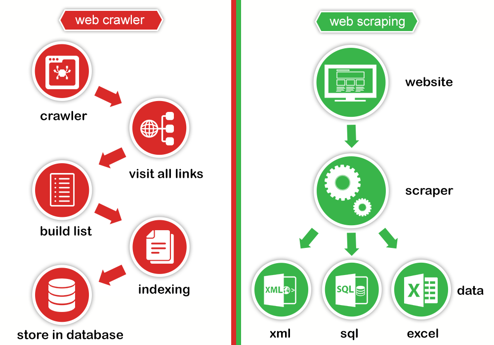

# [→ Máster en Big Data y Machine Learning](https://fictizia.com/formacion/master-big-data)
### Big Data, Machine Learning, Tensor Flow, Data Science, Data Analytics, Arquitecturas Big Data, Plataformas Big Data

# Capitulo 5: Clase 3 - Web Scraping

### ¿Cómo extraemos información de Internet?


Internet está lleno de información. Esta información ha sido y es utilizado para simplicar el proceso de búsqueda de información como han demostrado los buscadores web que almacenan la información de las páginas web con el fin de facilitar el proceso de búsqueda o el acceso a la información sin conexión. Aunque en los últimos años, toda esta información ha comenzado a ser utilizada para aporta nuevo valor mediante la utilización de datos:

- Recopilación de información para la generación de nuevas aplicaciones.
- Recolección de información para la comparación de precios. 
- Recolección de información para la generación de conjuntos de datos para aprendizaje. 
- Recolección de información para el aprendizaje de respuestas o comentarios de usuarios. 

**Recursos**

### ¿Qué es un web robot?

Los robot web (tambien denominados Web Wanderers) son programas que navegan por la web automáticamente la web. Este tipo de programas son comunmente utilizados por los navegadores web como Google o Bing para la indexación de contenido o por los sistema de spam para la detección de direcciones de correo electrónico. El modo de funcinamiento de los robots web puede ser configurado mediante la utilización del fichero robots.txt que puede ser incluido en cualquier aplicación web.    

Los propietarios de sitios web pueden crear un archivo denominado __robots.txt__ que permite dar instrucciones a los robots web acerca de las acciones que pueden realizar sobre la web. La utilización de este tipo de archivo se denomina protocolo de exclusión de robots, ya que permiten minimizar las acciones que pueden realizar este tipo de programas. Por ejemplom si un robot quisiera acceder a la página web __https://fictizia-example.com__ debería acceder primer a la url __https://fictizia-example.com/robots.txt__ donde encontraría la siguiente información: 

Funciona así: un robot quiere visitar la URL de un sitio web, por ejemplo, http://www.example.com/welcome.html. Antes de hacerlo, primero comprueba http://www.example.com/robots.txt y encuentra la siguiente información:

```
User-agent: *
Disallow: /
```

En este caso el fichero de robots contiene dos directivas: (1) la primera se corresponde con el "User-agent" que indica que lo que aparece a continuación se aplica a cualquier robot que intente acceder a la página web; y la segunda __Disallow: /__ indica al robot que puede acceder a ninguna página web del sitio. 

**Recursos**

- [Introduction to robots.txt - Google](https://support.google.com/webmasters/answer/6062608?hl=en)
- [Cómo Crear el Archivo Robots.txt Perfecto Para SEO - Neil Patel](https://neilpatel.com/es/blog/robots-txt-seo/)
- [The web robot page - Everything about robots.txt](https://www.robotstxt.org/)
- [How to Address Security Risks with Robots.txt Files](https://www.searchenginejournal.com/robots-txt-security-risks/289719/)
- [Especificaciones robots.txt](https://developers.google.com/search/reference/robots_txt?hl=es)

### ¿Qué es un web Crawler?

Un Web Crawler (también denominado Web Spider) es un programa diseñado para el análisis de páginas web de forma automática. El modo de funcionamiento estandar de este tipo de programas, consiste en definir un conjunto de direcciones web iniciales que son almacenadas en una estructura de datos (posiblemente una cola), de manera que el web crawler descarga el contenido de cada una de las direcciones, analizando el contenido en busca de enlaces a páginas nuevas. Los diferentes enlaces descubiertos son insertados en la "cola de enlaces" de manera que estos nuevos enlaces sean analizados, y así sucesivamente hasta que no existan nuevas enlaces o el proceso finalice.

### ¿Qué es un web Scraper?

Un Web Scraper es un programa diseñado para la extracción de información de páginas web de forma automática. El modo de funcionamiento es similar al de una web crawler con la diferencia de que un web scraper extrae información específica de la página web y no sólo enlaces. Por ejemplo, además de enlaces a otras páginas, puede extraer imágenes, títulos de páginas, descripciones, etc.

**Recursos**

### Diferencias entre un web crawler y un web scraper

En esencia el funcionamiento de un web crawler y un web scraper es el mismo, ya que ambos analizan páginas web buscando información que les permita seguir navegando y analizando más información. Es en el tipo de información y su tratamiento donde reside la gran diferencia entre ambos. Los web crawlers sólo se centran en la información de los enlaces, mientras que los web scraper, se centran en cualquier información que sea útil en base a la programación del sistema de parseo. 



### SCRAPY: A web Scraper para Python


El proceso de funcionamiento de Scrapy se basa en un sistema de ejecución compuesto por diferentes etapas descrito en la anterior figura:

- 1. El sistema de ejecución (Engine) realiza una solicitud (Requests) inicial de __crawleo__ mediante una araña.
- 2. El sistema de ejecución (Engine) añade la solictud al planificador (Scheduler) y solicita la siguiente solicitud (Requests) para crawlear.
- 3. El planificador (Scheduler) devuelve la siguiente solitud al sistema de ejecución (Engine).
- 4. El sistema de ejecución envía la solicitud al descargador (Downloader), mediante el sistema de descargadores (Downloader Middlewares).
- 5. Una vez que la página web ha sido descargada, el descargador (Downloader) genera una respuesta que es enviada al sistema de ejecución mediante el sistema de descargadores (Downloader Middlewares).
- 6. El sistema de ejecución (Engine) recibe la respuesta desde el descargador y lo envia a la araña, mediante el gestor de arañas (Spider Middleware), para que el resultado pueda ser procesado.
- 7. La araña procesa la respuesta y devuelve los elementos que han sido extraidos junto a la nueva solicitud (Requests) al sistema de ejecución (Requests) a través del gestor de arañas (Spider Middleware).
- 8. El sistema de ejecución (Engine) envía los items procesados mediante el gestor de items (Item Pipelines) y las solicitudes (Requests) al planificador (Scheduler).
- 9. Este proceso se repite (desde el paso 1) hasta que no queden más solicitudes en el planificador.

**Recursos**

- [Installation guide](https://docs.scrapy.org/en/latest/intro/install.html#intro-install)
- [Basic tutorial about Scrapy](https://docs.scrapy.org/en/latest/intro/tutorial.html)
- [Full documentation about Scrapy](https://docs.scrapy.org/en/latest/)
- [Download information about acrapy - Python](https://pypi.org/project/Scrapy/)
