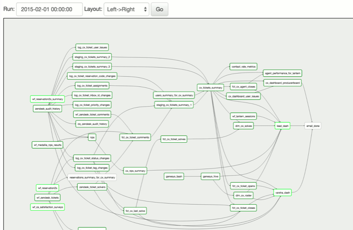

# [→ Máster en Big Data y Machine Learning](https://fictizia.com/formacion/master-big-data)
### Big Data, Machine Learning, Tensor Flow, Data Science, Data Analytics, Arquitecturas Big Data, Plataformas Big Data

## Capítulo 6 - Clase 1: Flujo de trabajo mediante Apache AirFlow ##

### Introducción a Apache Airflow ###

Apache Airflow es una plataforma para crear, programar y monitorizar flujos de trabajo (Pipelines). Un flujo de trabajo es un  secuencia de procesos que deben ser ejecutados para completar una tarea o trabajo, desde su inicio hasta su finalización. Es una forma sencilla de dividir una tarea compleja en una secuencia de tareas más sencilla que puede se reutilizadas durante el mismo flujo de trabajo o en diferentes. Apache Airflow ha sido desarrollado en base a cuatro principios:

- Dinamico: Airflow permite construir flujos de tareas (pipelines) mediante fragmentos de código (Python), permitiendo la genereación dinámica de nuevos flujos de tareas. Esto permite la creación de nuevas tareas de manera dinámica. 

- Extensible: Airflow pemirte extender de forma muy sencilla tanto la funcionalidad que tiene la libreria, así como la creación de nuevos operadores y ejecutores.

- Elegante: Airflow describe los flujos de tareas de forma sencilla y explicita. La parametrización de las tareas se puede realizar mediante el motor de plantillas [Jinja](https://jinja.palletsprojects.com/en/2.10.x/) que se encuentra integrado en el nucleo de Airflow. 

- Escalable: Airflow está construido mediante una arquiecture modulos que utiliza una cola de mensajes para orquestar la ejecución de tareas en los trabajoadores.

En mayo de 2018 Google Cloud Composer fue desplegado como servicio integrado de Google Cloud Platform (GCP), que es un servicio gestionado de Apache Airflow totalmente integrado en la plataforma de Google Cloud y que se convierte en una de las piedras angulares para orquestar servicios gestionados en Google Cloud.

**Recursos**

- [Guía de instalación](https://airflow.apache.org/docs/stable/)
- [Tutorial básico sobre Apache Airflow](https://airflow.apache.org/docs/stable/installation.html)
- [Ejemplos de Apache Airflow](https://airflow.apache.org/docs/stable/tutorial.html)
- [Download information about apache AirFlow - Python](https://pypi.org/project/apache-airflow/)
- [Listado de operadores](https://airflow.apache.org/docs/stable/_api/airflow/operators/index.html)
- [Documentación acerca de Jinja](https://jinja.palletsprojects.com/en/2.10.x/)

Apache Airflow nos permite crear flujos de trabajo de manera sencilla mediante la utilización de gráficos acíclicos dirigidos de tareas (Directed Aciclic Graphs DAGs). 

### El concepto de DAG ###

En Apache Airflow, un DAG (Directed Aciclic Graphs DAGs), o un gráfico acíclico dirigido formado por una colección de todas las tareas que van a ser ejecutadas, donde los __nodos__ del grafo se corresponden con las tareas y los __arcos__ se corresponden con las intereacciones (dirigidas) entre las tareas. Es decir, los arcos definen el flujo de ejecución de las diferentes tareas.

Tasks
Tasks represent each node of a defined DAG. They are visual representations of the work being done at each step of the workflow, with the actual work that they represent being defined by Operators.

### Operadores ###

Cada una de las tareas que componen un DAG de Airflow se corresponden con un Operator en Airflow. Es decir, para definir un DAG tendremos que definir cada uno de los Operators necesarios y establecer las relaciones y dependencias entre ellos, mediante módulos de código python. Existen multitud de Operators predefinidos aunque podemos extender los operadores para crear nuestros propios operadores. Algunos de los operadores predefinidos más utilizados son los siguientes:

- BashOperator: Permite la ejecución de comando de tipo bash. 
- PythonOperator: Permite la creación de fragmentos de códigos de tipo python. 
- EmailOperator: Permite el envio del emails. 
- SimpleHttpOperator: Permite la creación de peticiones de tipo HTTP y manipular el resultado de la petición. 
- Operadores bases de datos: Permite la ejecución de consultas sobre diferentes servidores de base de datos (MySqlOperator, SqliteOperator, PostgresOperator, MsSqlOperator, OracleOperator, JdbcOperator, etc)

Los operadores son procesos aislados entre sí, ya que no comparten información con los otros operadores, pero su orden de ejecución puede ser definido con el objetivo de simplificar la ejecución de ciertas tareas.

### Hooks ###

Los connectores (hooks) de Airflow son intefaces que permitene interactuar con systemas de terceros (third-party systems). Su objetivo es ofrecer sistemas sencillos de conexión con apis externas o bases de datos (Apache Hive, AWS S3, GCS, MySQL, Postgres, etc). Su funcionamiento es similar al de los operadores. 

- MySqlOperator
- SqliteOperator
- PostgresOperator
- MsSqlOperator 
- OracleOperator
- JdbcOperator

Toda la información referente a los credenciales para el acceso a los recursos se encuentra fuera de hooks mediante la utilización conexiones (connections) que almacenan metadados encripatados. 

### Plugins ### 

Los plugins de Airflow son una combinación de Hooks y operadores que permiten realizar ciertas tareas especiales o poco comundes, como por ejemplo transferir información desde un sistema de almacenamiento a otro. Para más información, es posible obtener la lista de plugins disponibles en el siguiente (enlace)[https://airflow.apache.org/docs/stable/plugins.html]

### Conexiones ### 
Las conexiones (connections) en Airflow son los sistemas de almacenamiento de información para credenciales o tokens de conexión. Este tipo de sistema se gestiona directamente sonre la UI web.

### Ejercicio de despligue y trabajo de Apache AirFlow ###

Para aprender a utilizar Apache Airflow, se propone el siguiente [ejercicio](https://github.com/Fictizia/Master-en-Big-Data-y-Machine-Learning_ed1/blob/master/capitulo_6/recursos/ejercicio_1.md) en el cual aprenderemos como desplegar Apache Airflow en docker y como construir varios dags con diferentes tareas que incluyen diferentes tecnologías. 
