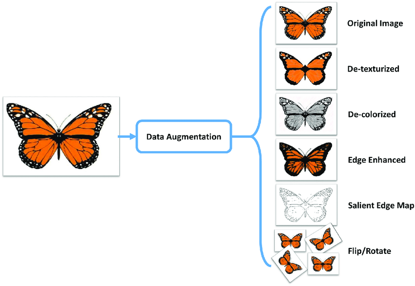

# [→ Máster en Big Data y Machine Learning](https://fictizia.com/formacion/master-big-data)
### Big Data, Machine Learning, Tensor Flow, Data Science, Data Analytics, Arquitecturas Big Data, Plataformas Big Data

## Capítulo 6 - Clase 2: Augmentación de la información##

Uno de los principales problemas a los cuales nos debemos enfrentar en el mundo del Big Data es la falta de información "lack of information" o en su defecto a la falta de información con precisión. Esta falta de información puede influir negativamente en algunos procesos relacionados con el ciclo de vida de los datos, ya que es necesarios tener un volumen de datos lo suficientemente elevado con el fin de producir, por ejemplo, un sistema de predicción o un análisis estadístico significativo.

Uno de los campos en los cuales esta falta de información es más significativa es en la construcción de modelos basados en Aprendizaje Automático mediante la utilización de imágenes etiquetadas. En estos casos es muy común no tener un conjunto de imágenes lo suficientemente grande con el fin de poder construir un modelo que ofrezca un nivel de confianza aceptable o que haya utilizado un conjunto de entrenamiento con un número de ejemplos suficiente. 

**Recursos**

- [Tutorial básico sobre Apache Airflow](https://airflow.apache.org/docs/stable/installation.html)
- [Ejemplos de Apache Airflow](https://airflow.apache.org/docs/stable/tutorial.html)
- [Documentación sobre el paquete Imgaug](https://github.com/aleju/imgaug)
- [Instalación de Imgaug mediante Pypi](https://pypi.org/project/imgaug/)
- [Documentación sobre el paquete albumentations](https://github.com/albumentations-team/albumentations)
- [Instalación de Imgaug mediante Pypi](https://pypi.org/project/albumentations/)

### El concepto de Augmentación ###

El proceso de "augmentación" de datos (__Data Augmentation__) consiste en generar nueva información mediante la aplicación de transformaciones simples con el objetivo de aumentar el número información. Es decir, si consideramos que el elemento básico de un nuestro conjunto de datos es una imagen, el proceso de augmentación de datos consiste en dada una imagen generar un conjunto finito de imagenes mediante la aplicación de diferentes funciones que realizan pequeñas transformaciones sobre la imagen original. En el caso de ejemplo presentado en la figura, podemos generar un conjunto de imágene finito a partir de una única imagen de manera que todas las imagenes generados pueden utilizarse como datos. 

El principal objetivo del proceso de augmentación consiste en aumentar el conjunto de instancias que tenemos de un tipo de datos con el fin de mejorar nuestro conjunto de datos mediante la generación de instancias. Este tipo de técnicas son muy utilizadas en las fases previas del Aprendizaje Automático con el fin de construir conjunto de entrenamientos más numerosos que permiten construir mejores modelos. 

### Ejercicio de Augmentación de datos mediante Apache AirFlow ###

Para aprender a utilizar Apache Airflow, se propone el siguiente [ejercicio](https://github.com/Fictizia/Master-en-Big-Data-y-Machine-Learning_ed1/blob/master/capitulo_6/recursos/ejercicio_2.md) en el cual aprenderemos como desplegar un flujo de trabajo para la generación de imágenes mediante técnicas de augmentación. 
