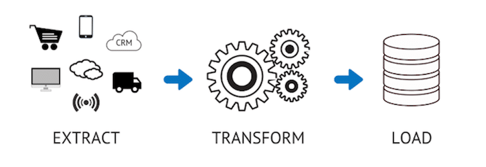
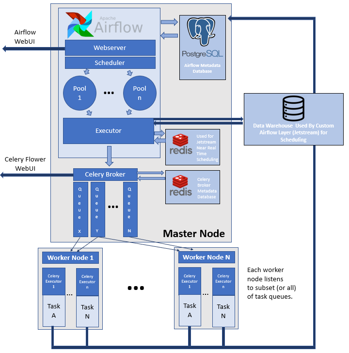

# [→ Máster en Big Data y Machine Learning](https://fictizia.com/formacion/master-big-data)
### Big Data, Machine Learning, Tensor Flow, Data Science, Data Analytics, Arquitecturas Big Data, Plataformas Big Data

## Capítulo 6 - Clase 3: Construcción de sistemas de Extract, transform and Load (ETLs)

ETL (Extract, transform and Load) se definen como proceso de extracción de datos de diferentes sistemas de origen, luegoestos datos son transformados mediante diferentes tipos de operaciones y finalmente son cargados en un sistema de almacenamiento local o en el cloud. Este tipo de sistemas nos permiten unificar datos de diferentes fuentes y almancenarlo en un sistema de almacenamiento global en base a un conjunto de reglas y representación común de manera que pueden ser procesados, almacenados y tratados de manera más sencilla y eficiente. 

**Recursos**

- [Tutorial básico sobre Apache Airflow](https://airflow.apache.org/docs/stable/installation.html)
- [Ejemplos de Apache Airflow](https://airflow.apache.org/docs/stable/tutorial.html)
- [Creando ETLs con Apache Airflow](https://gtoonstra.github.io/etl-with-airflow/)
- 

**Etapa 1: Extracción**

La primera fase de una ETL es el proceso de extracción (Extract) donde la información se extrae a partir de diferentes fuentes. Este proceso consiste en obtener la información desde cada una de las diferentes fuentes de información y convertirla en información temporal o de intercambio que será procesada. En la fase de extracción se puede aplicar pequeñas transformaciones con el fin de eliminar información incorrecta o validar por ejemplo formatos. La información a extraer en este proceso puede ser de cualquier tipo y la forma de comunicación debe ser de cualquier tipo:

- Bases de datos relacionales
- Bases de datos no relaciones
- Información generada dinámicamente por el hardware
- Mainframes
- Aplicaciones personalizadas
- Dispositivos de punto de contacto como por ejemplo cajeros automáticos
- Dispositivos de texto
- Archivos de texto
- Archivos con información no extructurada (logs)
- Archivos con información semi-extructurada (hojas de cálculo, csv, json, xml)

Durante el proceso de extracción es posible aplicar diferente tipos de operaciones de bajo coste que suelen estar relacionadas con la limpieza y tratamiento de los datos:

- Eliminación de datos incorrecto o no deseados
- Comprobación de tipo de datos
- Homogeneización de datos (número de decimales, formato de caracteres, etc)
- Eliminación de datos duplicados en origen
- Unificación de datos fragmentados
- Identificación de información corrupta

**Etapa 2: Transformación**

La segunda fase de una ETL es el proceso de tranformación (Transform). Este proceso suele ser el más costojo y complejo ya que implica la generación de un conjunto de procesos que tiene que manipular la información extraida por diferentes fuentes con el fin de unificar toda la información. Para ello es necesario aplicar proceso de limpieza y transformación que nos permite __manipular__ y __enriquecer__ nuestro conjuntos de datos con el fin de conseguir __extraer valor de los datos__. Dependiendo del tipo y estado de los datos extraido en la fase anterior podemos diferentes dos procesos de tratamiento de datos:

- Procesos de movimiento directo: Este tipo de procesos de transformación son los más sencillo, ya que no implican ningún tipo de transformación debido a que el dato ha sido generado de manera __correcta__ en origen y podemos utilizar sin realizar ningún tipo de transformación. Este es el caso ideal y menos común, ya que sólo ocurre en situaciones donde la fuente de datos, por ejemplo, es propieda de la empresa que desarrolla la ETL. Es decir en esto caso el proceso de transformación es sólo un proceso de tranferencia de datos.

- Procesos de movimiento indirecto: Este tipo de procesos de transformación son los más complejos, ya que implican un proceso de tranformación y limpieza de los datos. Este es el caso más cómun, ya que al extraer información de diferentes fuentes, la estructura y representación de los datos es diferente y es necesario aplicar procesos de tratamiento con el __objetivo__ de unificar la forma de representación de la información. 

A la hora de aplicar las diferentes operaciones o funciones de transformación, nos podemos encontrar con situaciones muy comunes como por ejemplo:

- Variaciones ortografía que pueden venir definidas por la existencia de información en diferentes idiomas o dialectos. Por ejemplo, el nombre de una persona se puede excribir de manera diferente en las lenguas cooficiales de un país. Marc en catalán y Marcos en español.
- Denominaciones formales de un ente. Por ejemplo, existen diferentes formas de denotar el nombre de una empresa como Google, Google Inc.
- Es posibles que la misma información este almacenada de manera diferente en varias fuentes. Por ejemplo, la dirección puede ser almacenada como Calle, C/ o C en fuente de datos diferentes. 
- Existan campos obligatorios en el nuevo sistema de almancenamiento que no aparecen en ninguna de las fuentes de datos. 

Para poder evitar este tipo de problemas se aplican diferente tipos de reglas, con el fin de preparar y unificar la información de los datos

- Uso de reglas y tablas de búsqueda para la estandarización de datos
- Conversión de juegos de caracteres 
- Conversión de unidades de medida como formato de fecha y hora, conversiones de moneda, conversiones numéricas, etc.
- Comprobación de validación del umbral de datos. Por ejemplo, la edad no puede tener más de dos dígitos.
- Los campos obligatorios no deben dejarse en blanco, de forma que se descarta toda la información o se pone en cuarentena. 
- Limpieza de datos (por ejemplo, asignación de NULL a 0 o género masculino a "M" y femenino a "F", etc.)
- Fusión de datos de diferentes fuentes de datos mediante la utilización de sistemas de almacennamiento intermedio. 

**Etapa 3: Carga**

La tercera y última fase de una ETL es el proceso de carga (Load). Este proceso consiste en carga la información en nuestro nuevo sistema de almacenamiento (Data Warehouse, Data Lake, SQL DDBB or NoSQL DDBB). Este proceso es el más crítico de todos, ya que una vez que la información ha sido extraido y procesada debe ser siempre almacenada, por lo que es necesario construir sistemas que aseguren la carga de datos con un porcentaje de fiabilidad muy elevado cercano al 100%. Dependiendo del tipo de carga de datos que estemos haciendo nos podemos encontrar con tres tipos de carga:

- Carga Inicial: Este tipo de carga suele ser la más pesada de todas ya que implica la carga de un gran conjunto de información inicial. Es posible que deba realizar se forma expecial o mediante proceso de carga más complejos debido al alto volumen de información. 
- Carga incremental: Este tipo de carga es la más común y es la que se suele realizar de forma periodica, con el objetivo de incluir nueva información o realizar actualizaciones parciales. 
- Carga de actualización: Este tipo de carga es poco común y sólo se suele aplicar en ciertas situaciones en las cuales es necesario aplicar algún tipo de modificación en un conjunto completo de información. Por ejemplo, porque se ha detectado algún tipo de error en los datos o se ha detectado un error en alguno de los procesos de transformación.

### Ejercicio de recogida y manipulación de datos mediante ETLs ###

Para aprender a construir una sencilla ETL, se propone el siguiente [ejercicio](https://github.com/Fictizia/Master-en-Big-Data-y-Machine-Learning_ed1/blob/master/capitulo_6/recursos/ejercicio_3.md). 
