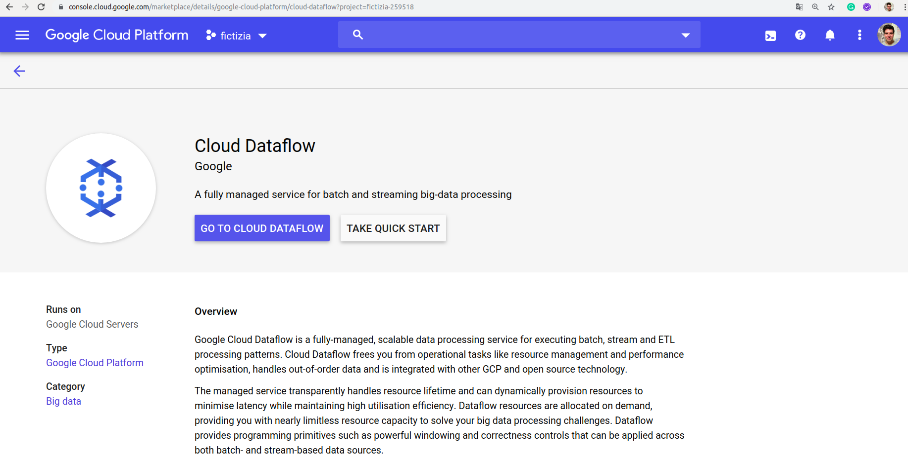
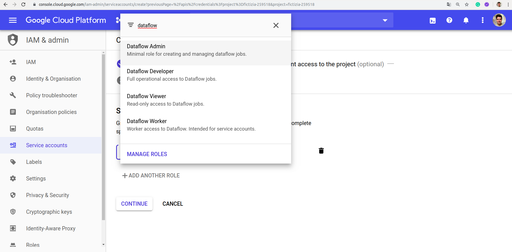
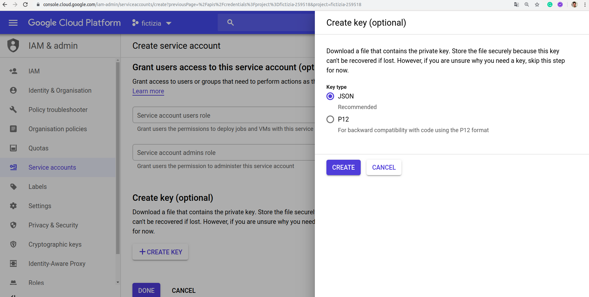

# [→ Máster en Big Data y Machine Learning](https://fictizia.com/formacion/master-big-data)
### Big Data, Machine Learning, Tensor Flow, Data Science, Data Analytics, Arquitecturas Big Data, Plataformas Big Data

## Capítulo 6 - Ejercicio 04: Tratamiento y manipulación de la información en Cloud DataFlow ##

El objetivo de este ejercicio consiste en realizar diferentes procesos de tratamiento y manipulación de la información sobre diferentes conectores de entrada y salida. 


### Recursos ###

Para el desarrollo de este ejercicio vamos a utilizar las diferentes tecnologías y recursos.

- [Introducción a Cloud DataFlow](https://airflow.apache.org/docs/stable/)
- [Guía de uso rápido de Cloud DataFlow para Python](
https://cloud.google.com/dataflow/docs/quickstarts/quickstart-python?hl=es-419)
- [Guía de uso rápido de Cloud DataFlow para Java](https://cloud.google.com/dataflow/docs/quickstarts/quickstart-java-maven?hl=es-419)
- [QuickLabs Cloud DataFlow](https://www.qwiklabs.com/focuses/1100?locale=es&parent=catalog)
- [Instalación de Cloud DataFlow mediante Pypi - Python](https://pypi.org/project/google-cloud-dataflow/)
- [Página oficial del proyecto Apache Beam](https://beam.apache.org/)
- [Documentación oficial del proyecto Apache Beam](https://beam.apache.org/documentation/)
- [Guía de inicio sobre Apache Beam](https://beam.apache.org/get-started/beam-overview/)

Cómo en los anteriores ejercicios vamos a utilizar Docker como tecnología de creación de contenedores mediante la utilización de imágenes. Existen diferentes maneras de construir nuestra imagen basada en Apache Airflow: (1) mediante la utilización de  una imagen previamente desarrollada y almacenada en Docker Hub; o (2) mediante la generación de un fichero de despliegue (docker-compose.yml). En este caso vamos a utilizar una imagen previamente construir que desplegaremos mediante un fichero de despliegue.

**Paso 1: Activación de DataFlow**

Para comenzar con la realización de este tutorial necesitamos utilizar Cloud Dataflow, para ello tendremos que acceder a la consola de GCP y activar el servicio de Cloud Dataflow. Para ellos podremos buscar a través de nuestro buscador __Dataflow__ y activar el servicio como se puede observar en la siguiente imagen:



**Paso 2: Generación de credenciales básicos**

Para poder acceder a los recursos de Google Cloud DataFlow (GCD) es necesario generar unos credenciales de acceso que serán utilizados por el driver de acceso para python que utilizaremos en el ejercicio. Para ello, deberemos acceder en nuestra consola de Google Cloud Platform y acceder a la sección de APIs & Servicios y proceder a crear unas credenciales de tipo Services account Key. Una vez hayamos accedido deberemos crear una nueva cuenta de servicio como se muestra en la siguiente imagen:



Para ello, seleccionaremos como rol para la cuenta de servicio el rol de __Administrador de DataFlow__ con el fin de tener permisos para acceder a todos los recursos disponibles. Cuando se crea una cuenta de credenciales es obligatorio asignar los persimos específicos para los procesos, pero al ser un ejercicio en un entorno controlado vamos a concederle todos los permisos que tenemos disponibles mediante la utilización del rol de __administrador__. Una vez definidos los roles de nuestra cuenta de servicio tenemos que decidir el formato de nuestros credenciales, que en este caso seránn de tipo JSON, como se observa en la siguiente imagen.
En primer lugar vamos a descargar la imagen que queremos instalar, para comprobar que imágenes tenemos disponibles podemos ir acceder al listado de imágenes disponibles en DockerHub para Apache [Airflow](https://hub.docker.com/r/apache/airflow). La imagenes disponibles han sido desarrolladas por el equipo de desarrolladores de Apache Airflow. 



**Paso 3: Preparando el proyecto de Dataflow**

Para poder trabajar con Google DataFlow podemos utilizar diferentes lenguajes de programación. En este caso vamos a utilizar el conector de python que se puede descargar en el siguiente [enlace](https://pypi.org/project/google-cloud-dataflow). Para ellos vamos a crear un nuevo proyecto que contendrá los siguiente elementos:

```
total 20
drwxrwxr-x 5 momartin momartin 4096 ene 28 11:15 .
drwxrwxr-x 6 momartin momartin 4096 ene 28 11:06 ..
drwxrwxr-x 2 momartin momartin 4096 ene 28 11:15 credentials
-rw-r--r-- 1 momartin momartin    0 ene 28 11:06 Dockerfile
drwxrwxr-x 2 momartin momartin 4096 ene 28 11:06 src
drwxrwxr-x 5 momartin momartin 4096 ene 28 11:08 venv
```

Este proyecto se va a preparar para poder ser dockerizado pero inicialmente vamos a trabajar sobre el host. Para ello vamos a necesitas un carpeta para almacenar los diferentes credenciales, un archivo Dockerfile por si es necesario desplegar los componentes en un contenedor, una carpeta para el almacenamiento de los diferentes archivos que utilizaremos para desplegar procesos y una carpeta para el entorno virtual. Una vez definidos los diferentes componentes de proyecto, podemos comenzar a instalar la librería para python mediante el siguiente comando:

```
pip install google-cloud-dataflow
```

**Paso 4: Connectando con Google Cloud Storage**

Ahora vamos a crear el primero de los ejercicios que consistirá en el desarrollo de un proceso de tratamiento de datos que seran almacenados tanto en la entrada como en la salida mediante Google Cloud Storage. 

**Paso 5: Connectando con Google Big Query**

**Paso 6: Connectando con Apache Kafka**
