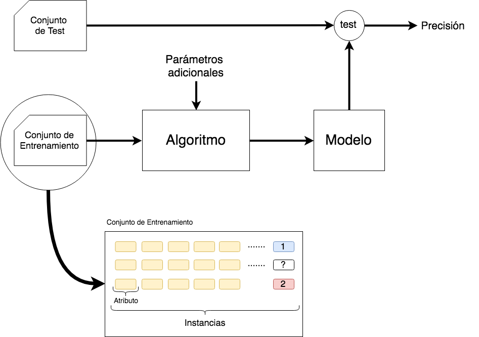
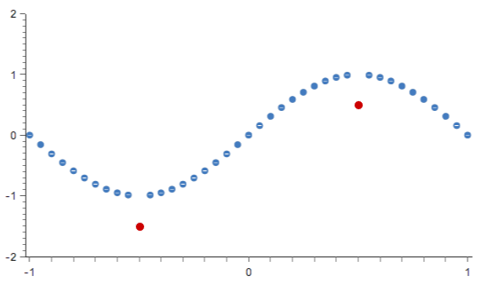
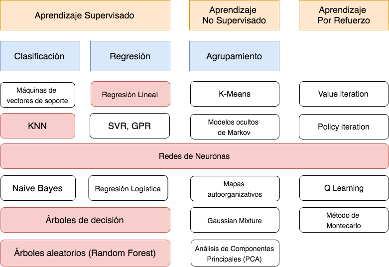

# [→ Máster en Big Data y Machine Learning](https://fictizia.com/formacion/master-big-data)
### Big Data, Machine Learning, Tensor Flow, Data Science, Data Analytics, Arquitecturas Big Data, Plataformas Big Data

## Capítulo 7 - Aprendizaje Automático ##

La capacidad de aprender es una de la funciones mentales más importantes de los seres vivos ya que les permite adaptarse a las necesidades del entorno con el objetivo de aumentar sus
posibilidades de supervivencia. Mediante el proceso de aprendizaje los seres vivos son capaces de modificar, adaptar y/o adquirir habilidades, destrezas, conocimientos y/o
comportamientos mediante la interacción con el entorno que les rodea. Este proceso puede ser incluso mucho más complejo desde la perspectiva de los seres humanos donde el proceso de
aprendizaje no se limita sólo al entorno y a sus interacciones con el, sino que también influyen ciertos factores sociales relacionados con valores y principios morales que influyen de manera
significativa sobre las diferentes habilidades, destrezas, conocimientos y conductas que somos capaces de aprender. Este tipo de diferencias (sesgo) se pueden apreciar significativamente
cuando comparamos dos individuos con las mismas capacidades cognitivas que han crecido en diferentes zonas geográficas del planeta donde existen significativas diferencias en la forma
de vida. Probablemente ambos individuos se comportarán de forma diferente ante estímulos similares ya que han creado modelos de comportamientos diferentes en base a la información
que han recibido.

Esta poderosa capacidad para construir modelos de comportamiento en base a la extracción y manipulación la información del entorno hicieron que los investigadores comenzaran a imitar el
proceso de aprendizaje humano con el fin de aumentar las capacidades de los diferentes algoritmos de Inteligencia Artificial los cuales estaban limitados por el conocimiento experto que
se les introducía para poder razonar y por los comportamientos (acciones, operaciones, etc) que eran definidos por los diseñadores de los sistemas. Es decir, los diferentes algoritmos de
Inteligencia Artificial no eran capaces de adaptarse a nuevas situaciones si están no habían sido previstas en los modelos que eran utilizados para producir el proceso de razonamiento.
Este nuevo área conocimiento perteneciente a la Inteligencia Artificial comenzó a denominarse __Aprendizaje Automático__ (Machine Learning, ML, en sus siglas en inglés) debido a que su
objetivo era construir modelos de comportamiento mediante el aprendizaje en base a la información disponible del entorno. Dependiendo de cómo se produce el proceso de
construcción de los modelos de aprendizaje podemos diferenciar entre diferentes modos de aprendizaje:

- Aprendizaje inductivo: Este tipo de modo de aprendizaje consiste en construir modelos a partir de un proceso de generalización mediante ejemplos simples. Es decir, permite identificar un conjunto de patrones comunes que permitan definir ciertas características
de los diferentes ejemplos utilizados en el proceso de aprendizaje. Este proceso se basa en el razonamiento inductivo[11] mediante el cual los humanos extraemos
conclusiones generales de forma independiente a través de un proceso de análisis de la información disponible con el fin de resolver un determinado problema. El conocimiento
utilizado siempre se considera nuevo y puede modificar o invalidar el modelo previamente aprendido.
- Aprendizaje analítico o deductivo: Este tipo de modo de aprendizaje consiste en construir modelos a partir de un proceso deductivo mediante la identificación de una
descripción general a partir de un conjunto de ejemplos los cuales son explicados de forma específica y completa. Este proceso se basa en el razonamiento deductivo mediante el cual los humanos aprendemos comunmente en el colegio donde se
presentan una serie de reglas o leyes las cuales son demostradas en base a una serie de ejemplos que explican de forma el funcionamiento de las diferentes leyes. El nuevo
conocimiento no invalida el conocimiento previo sólo lo completa o refuerza.
- Aprendizaje analógico: Este tipo de modo de aprendizaje consiste en construir modelos que permiten generar soluciones a problemas nuevos mediante la búsqueda de
similitudes con problemas previamente resueltos de forma que la solución de los problemas similares es adaptada a las particularidades del nuevo problema con el fin de
aprender una solución[13]. Este tipo de concepto de aprendizaje es el aplicado para diseñar los sistemas de razonamiento basados en caso descritos en el tema anterior. Algunos investigadores no lo consideran como un proceso total de aprendizaje ya que
depende de una fase de adaptación de puede producir muchisimas variaciones en la solución final.
- Aprendizaje conexionista: Este tipo de modo de aprendizaje consiste en construir modelos basados en las conexiones de entidades sencillas[] con el fin de aprender
ciertos conceptos en base a como se configuran estas conexiones. Este tipo de procesos de aprendizaje se han intentado aplicar en el proceso de construcción de
redes de neuronas con el fin de crear sistemas dinámicos que adaptan sus conexiones.
- Aprendizaje conductista: Este tipo de modo de aprendizaje, basado en la psicologia conductista, consiste en construir modelos en base a la observación y análisis de las
reacciones (conductas) aplicadas en el entorno como respuesta a un determinado estímulo que puede suponer una determinada recompensa.

La aparición del Aprendizaje Automático supuso un cambio radical en la forma en la que se estaba abordando el proceso de creación de sistemas basados en Inteligencia Artificial, ya que
a partir de este momento no se intentaban construir algoritmos que fuera capaces de resolver problemas de forma automática sino que se intentan construir algoritmos que fueran capaces
de aprender modelos en base a la información que tienen disponible. Esto supuso la aparición de diferentes tipos de familias de métodos que abordaban diferentes facetas del proceso de
aprendizaje comenzando con las primeras versiones del perceptrón[2][3] hasta los complejos modelos construidos mediante la utilización del Aprendizaje Profundo (Deep Learning) en base
a millones de datos y complejas estructuras basadas en redes de neuronas[4]. En los últimos años la aparición de diferentes frameworks[14][15], que facilitan el procesamiento y generación
de modelos de aprendizaje, ha supuesto que las empresas hayan centrado sus esfuerzos en utilizar este tipo de técnicas para ofrecer nuevos servicios y funcionalidades en un amplio grupo
de áreas como por ejemplo:

- Movilidad: Identificación de rutas por carretera más eficientes que minimicen el número de embotellamientos en las principales arterias de las ciudad disminuyendo el tiempo,
consumo y/o contaminación.
- Sistemas de producción: Predicción de errores de funcionamiento en sistema de producción supervisado o semisupervisado.
- Finanzas: Prevención de fraudes bancarías, lavado de dinero y personalizar la oferta de productos basados en datos del usuario y del mercado con el fin de conocer que tipo de
productos se adaptan mejor a un determinado usuario.
- Agricultura: Identificación de las mejores áreas de cultivo para cada tipo de producto, identificación de fechas de recogida de los productos en el momento óptimo de maduración, así como la identificación de los posible problemas en el proceso de crecimiento, identificación de enfermedades (visión artificial).
- Energía: Predicción de errores e identificación de zonas en la cual es necesario realizar algún tipo de mantenimiento preventivo. Identificación de los cambios en el coste de la
energía con el fin de recomendar a los clientes cuando aumentar o disminuir su consumo con el fin de minimizar los costes.
- Salud: Diagnostico y detección de enfermedades mediante el análisis de la información del usuario. Así como el uso de sistema de visión artificial para la detección de tumores.
- Farmacéutico: Optimizar de los diferentes estudios clínicos realizados mediante la selección automática de pacientes en base a sus características.

## FUNDAMENTOS BÁSICOS DEL APRENDIZAJE AUTOMÁTICO ##

Desde la perspectiva de una máquina el aprendizaje automático puede definirse como el proceso de adquisición de conocimiento de manera automática mediante la utilización de
ejemplos de entrenamiento que define las características del concepto que se desea aprender. Este proceso de adquisición de conocimiento (aprendizaje) puede ser visto como un proceso
de generación de cambios en el sistema que aprende (estudiante) los cuales son definidos por la información obtenida del entorno (ejemplos de entrada). Esta información puede ser definida
mediante otro sistema que nos enseña (profesor) que realiza una identificación de la información (datos etiquetados) o bien mediante la extracción de información en bruto que no
está identificada (datos no etiquetados). Estos implica que los sistemas de aprendizaje deben ser capaces de trabajar con un rango muy amplio de información de entrada, que pueden
incluir datos incompletos, inciertos, ruido, inconsistencias, etc con el fin de construir modelos imperfectos los cuales pueden ser analizados con el fin de conocer su grado de existo y
adecuación al problema. Dependiendo de cómo se utilice la información de entrada y salida durante el proceso de aprendizaje se pueden diferenciar entre cuatro grandes grupos o familias
de técnicas: aprendizaje supervisado, aprendizaje no supervisado, aprendizaje semisupervisado y el aprendizaje por refuerzo. 

- Atributo: Los atributos, variables de entrada o componentes son las unidades básicas e indivisibles de información utilizada para representar algún tipo de conocimiento. Este tipo de información representa una característica básica que intenta describir algún tipo
de propiedad sobre los datos (color, tamaño, distancia, etc). Los atributos suelen clasificarse en dos categorías en base a los valores que pueden tomar:
- Continuos: Son aquellos atributos que toman un valor fijo dentro de un intervalo no finito perfectamente acotado donde dados dos valores observables siempre existe
un tercer valor intermedio que podría tomar el atributo continuo. Por ejemplo, la temperatura de una determinada habitación medida en grados centígrados puede
tomar valores de tipo real en un rango comprendido entre -50º y 50º centígrados.
- Discretos: Son aquellos atributos que toman su valor entre los elementos que forman un conjunto finito. Por ejemplo, los posible colores de pintura utilizados para pintar un vehículo.
- Instancia: Una instancia es la estructura de información básica utilizada para representar cada uno de los ejemplos que forma parte de los conjuntos de datos que
serán utilizados en el proceso de aprendizaje. Cada instancia, a su vez, está compuesta por un conjunto finito de atributos que la describen. Las instancia de un mismo conjunto
tienen que estar formadas por el mismo tipo de atributos. La Tabla 1 muestra un conjunto de instancia referentes a la climatología del entorno con el fin de saber si se
puede o no jugar un partido de tenis. Cada una de las instancias está compuesta por atributos de tipo continuo (Humedad) y discreto (Cielo, Temperatura y Viento).

ID Cielo Temperatura Humedad Viento Jugar (Etiqueta)
1 Soleado Alta 65,28 Leve Sí
2 Nublado Alta 60,45 Leve Sí
3 Lluvia Normal 68,12 Intensa No

- Objetivo (clase): Es un atributo especial utilizado para realizar la predicción, es decir es el objetivo de la predicción. Por ejemplo, la probabilidad de que un paciente tenga una
determinada enfermedad o el precio al que se venderá una vivienda.

-  Conjunto de datos: Es el conjunto de instancias que son utilizadas para el proceso de aprendizaje. La manera en la que este conjunto de información es utilizada depende del
tipo de técnica que estemos utilizando. Es decir, la información puede haber sido recogida previamente y almacenada en ficheros, u otro tipo de formato de
almacenamiento, que serán utilizados para construir en modelos o puede ser recogida en tiempo real durante el proceso de entrenamiento.

- Modelo: Es el resultado del proceso de aprendizaje. De manera formal se puede definir como el conjunto de reglas o patrones inferidos a partir del conjunto de entrenamiento
utilizado para construirlo.

- Algoritmo: Es el mecanismo mediante el cual se produce el proceso de aprendizaje. Este algoritmo funciona de manera diferentes dependiendo del tipo de salida y de
entrada que queremos utilizar para construir el modelo. Cada uno de los diferentes algoritmos de aprendizaje supervisado, no supervisado y semisupervisado puede
definirse como uno de los tres tipos de técnicas.

- Clasificación: Los algoritmos de clasificación son aquellos que tratan de predecir una salida de tipo discreto que consiste en un atributo de tipo discreto (clases) a partir de
un conjunto de datos que pueden estar o no etiquetados. Las diferentes instancias de entrada (entrenamiento y test) se encuentran
ordenadas en categorias o clases. Cada una de estas clases son las etiquetas que han sido asignadas a los datos. Se suelen diferenciar dos tipos de algoritmos:
clasificación binaria donde sólo es necesario predecir dos clases objetivo (Si o No) y clasificación multiclase donde se debe predecir más de 2 clases objetivo.

-  Regresión: Los algoritmos de regresión o estimación son aquellos que tratan de predecir una salida de tipo continuo que consiste en un valor numérico (número real)
a partir de un conjunto de datos etiquetados (Imagen central Figura 2 ). Cada una de las diferentes instancias de entrada (entrenamiento y test) tiene un atributo de
“salida” de tipo continuo.

- Agrupamiento: Los algoritmos de agrupamiento (clustering) son aquellos que tratan de predecir una salida de tipo discreto a partir de un conjunto de datos que pueden
estar o no etiquetados (Imagen derecha Figura 2 ). Es decir estos algoritmos son capaces de agrupar los elementos en base a las similitudes entre sus atributos en
un conjunto determinado de grupos, cuyo número debe ser incluido como una entrada más del algoritmo.

**El modelo de aprendizaje**

El proceso descrito en la sección anterior nos permite conocer cual son los componentes básicos para poder generar un modelo de aprendizaje pero no es tan sencillo. En primer lugar
este proceso difiere dependiendo de cada unas de las diferentes familias de métodos. Los algoritmos de aprendizaje no supervisado no suelen incluir una fase de test ya no la
información utilizada para el proceso de aprendizaje no está etiquetada y los algoritmos de aprendizaje por refuerzo modelan la información mediante la utilización de estados, acciones y
recompensas que de un punto de vista muy general pueden ser similares cambian por completo el proceso de aprendizaje. Los pares estado acción pueden ser visto como instancias
y el refuerzo como algo parecido a la clase. Todo esto será descrito de forma detallada en el siguiente tema de este curso.

Con respecto al proceso de aprendizaje en general es necesario introducir algunos conceptos básicos referentes al modelo y al tratamiento de la información utilizada para construirlo.

- Discretización: Es el proceso mediante el cual una variable de tipo continuo es transformada en una variable de tipo discreto. Este proceso normalmente se realiza
mediante la utilización de los valores disponibles en el conjunto de entrenamiento, en base a sus valores el conjunto es dividio en rangos donde cada uno se corresponderá
con un valor discreto de la nueva variable. Esta división se realiza comumente de manera manual lo cual hace que se introduzcan sesgos en el proceso de aprendizaje. Aunque existen técnicas que realizan divisiones automáticas del conjunto en rangos de
tamaño similar.

- Normalización: Es el proceso de ajuste de los diferentes valores de un atributo con el fin de disminuir importantes diferentes entre los valores o representarlos en otro tipo de
escala que permita analizar de forma más efectiva su efecto sobre el resto de los atributos o su significado. Lo más común es realizar una normalización a valores entre
0 y 1.

-  Valor atípico: Los valores atípicos o outliers son valores que pueden tomar los atributos muy distantes con respecto al resto de valores que poseen las otras instancias de los
conjuntos (entrenamiento y test) empleados en el proceso de aprendizaje. Estos cambios tan importantes en los valores de un atributo pueden significar que se ha
producido un error en medición o que se ha detectado un caso inusual que no es común que se reproduzca. Normalmente este tipo de valores son eliminados de los
conjuntos de entrenamiento y/o test debido a que pueden afectar de manera significativa al proceso de generación del modelo. Aunque este proceso de eliminación
puede ser bastante complicado si los conjuntos utilizados en el proceso de aprendizaje son muy grandes, por lo que algunas técnicas incluyen procesos para detección de
valores atípicos con el fin de eliminarlos y/o tratarlos de manera diferente durante el proceso de aprendizaje. Algunos de los métodos más utilizados para la detección de
estos valores son: (1) Métodos monovariables que búscan valores atípicos de forma individual en cada atributo con el fin de eliminarlos; (2) los Métodos multivariables que
buscan valores atípicos de instancias mediante la combinación de múltiples atributos; y (3) el Método de error de Minkowski que a diferencia de los otros dos no intentna
eliminar los valores atípicos sino minimizar su impacto en el modelo con el fin de no manipular el conjunto de entrenamiento como realizan los otros métodos. Un ejemplo
de valores atípicos serían los presentando en la Figura 3 , donde el valor de los atributos de los valores atipicos (rojo) difieren del valor que les debería corresponder
siguiente la trayectoria de la sigmoidal.

- Sobreajuste: El sobreajuste, sobreaprendizaje u overfitting es el efecto que se produce al sobreentrenar un modelo mediante un algoritmo de aprendizaje supervisado. Uno de
los problemas. El proceso de aprendizaje debe generar un modelo que permita predecir el resultado de otras instancias generalizando a partir de lo aprendido
mediante la utilización de la instancias de entrenamiento. Sin embargo, cuando el conjunto de entrenamiento se encuentra formado por instancias que no representan de
forma global el problema o está formado por casos muy minoritarios o poco comunes se puede producir un efecto de sobreentrenamiento. Este efecto hace que el modelo
generado por el algoritmo no sea capaz de generalizar y quede ajustado a unas características muy específicas de los datos de entrenamiento que no tiene relación
causal con la función objetivo.

- Ruido: El ruido es el conjunto de atributos o valores de un atributo específico que no aportan nada al proceso de aprendizaje y que pueden haber sido introducidos
mediante un proceso de medición incorrecto, un error en la inserción de los datos y simplemente son valores atípicos que puede afectar al proceso de aprendizaje debido
a su rareza. Es decir, es imposible utilizar este conjunto de valores y/o atributos con el fin de generar un modelo que sea capaz de generalizar en base a las instancias
utilizadas para construirlo. El ruido normalmente aporta muchísimas desventajas a la hora de construir un modelo, ya que tiende a aumentar la complejidad de los datos
complicando la ejecución de los algoritmos los cuales terminan generando modelos que no generalizan correctamente. Antes de construir un modelo es muy importante
analizar las instancias de entrenamiento con el fin de eliminar el posible ruido que existe. Este proceso puede ser muy complicado dependiendo del tamaño de los
conjunto de entrenamiento y test, por lo que existen diferentes aplicaciones que intentan eliminar el ruido de manera automática aunque no este tipo de herramiento no
suele asegurar la eliminación total del ruido o incluso pueden eliminar de manera erronea información que es relevante para el proceso de aprendizaje.
- Sesgo: El sesgo es probablemente uno de los conceptos más importante del Aprendizaje Automatico debido a su aparición puede producir que nuestro modelos
sean inservibles. El sesgo puede considerarse como un error del modelo generado el cual realiza predicciones “sesgadas” debido a que los datos utilizados para construirlo
están distorsionados de manera directa o indirecta. Un ejemplo típico de sesgo que ha aparecido en muchos de los primeros sistemas basados en visión artificial utilizados en
los vehículos autónomos donde el proceso de entrenamiento había sido sólo realizado con adultos de estatura media. Esto producía que el modelo no fuera capaz de
identificar a los niños como humanos. En el tema 9 de este curso se hará una descripción más detallada del concepto de sesgo y cual es su influencia en las
diferentes técnicas de Inteligia Artificial.

**Técnicas de Aprendizaje Automático**

Actualmente el Aprendizaje Automático está formado por un amplio número de técnicas, las cuales pueden ser clasificados en cuatro familias de técnicas en base a cómo se encuentra
modelada la información que usan para definir las entradas y la salida.

- Supervisado: Este tipo de técnicas son denominas como técnicas de aprendizaje mediante profesor debido a que la información que utilizan durante el proceso de
aprendizaje es completa. Es decir, las instancias de entrenamiento y test está formadas por atributos que definen las entradas las entradas y la salida esperada para cada
instancia (datos etiquetados). Su funcionamiento consiste en la identificación de una función (modelo) que sea capaz de realizar un mapeo entre las entradas y las salidas
conocida. Las técnicas de este grupo están basadas en clasificación y regresión.

- No supervisado: Este tipos de técnicas son más complejas que la anteriores debido a que la información que utilizan durante el proceso de aprendizaje es incompleta. Es
decir, las instancias de entrenamiento y test están formadas únicamente por atributos de entrada. No se conoce la salida esperada para ninguna de las instancias (datos no
etiquetados). Su funcionamiento consiste en la identificación de una función (modelo) que sea capaz de agrupar las diferentes instancias en base a ciertas características
comunes. Las técnicas de este grupo están basadas en clasificación y agrupamiento.

- Semisupervisado: En algunas ocasiones este tipo de técnicas son incluidos en uno de los grupos anteriores ya que la mayor parte de los algoritmos de este grupo puede
incluirse en alguno de los anteriores debido a que aplican algún tipo de transformación en los datos de entrada con el fin de poder aplicar alguno de los algoritmo de los grupos
anteriores o combinan algoritmos de ambos grupos. En mi opinión, debe ser clasificados en un grupo independiente debido a que utilizan información parcialmente
incompleta. Es decir, las instancias de entrenamiento o test no tienen una estructura totalmente similar debido a que algunas instancias están etiquetadas y otras no.

- Por refuerzo: Este es un tipo especial de técnicas de aprendizaje automático no supervisado debido a que utilizan una forma diferente de representación de la ejemplos
de entrenamiento basada en la utilización de estados y acciones, donde la aplicaciones de las acciones produce una realimentación en el entorno mediante recompensas. En el
 aprendizaje por refuerzo el objetivo consiste en construir un política para resolver un determinado problema. Esta política suele ser una secuencia de acciones que permiten
resolver le problema de manera óptima.

En la Figura 4 se presentan diferentes tipos de algoritmos de Aprendizaje Automático
distribuidos por familia (Supervisado, No supervisado y Por refuerzo) y por técnica (Regresión,
Clasificación y Agrupamiento). En esta figura sólo se presentan algunos de las técnicas más
utilizados, pero existen muchas más e incluso diferentes versiones de cada una de ellas. En
rojo se marcan los diferentes técnicas que serán descritas de forma detallada en este tema.
