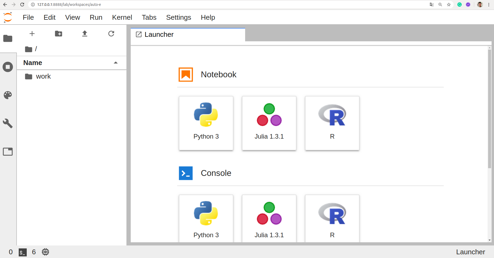
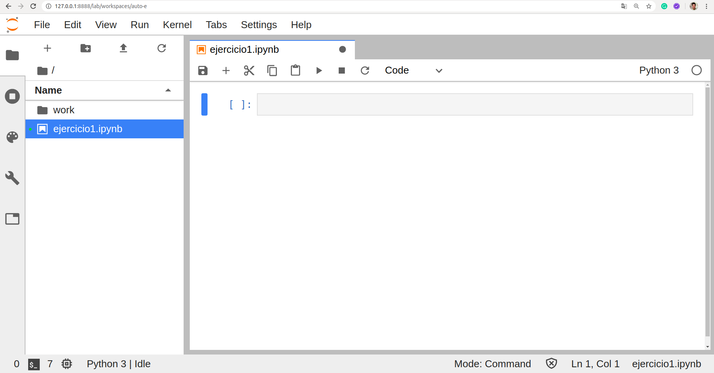

# [→ Máster en Big Data y Machine Learning](https://fictizia.com/formacion/master-big-data)
### Big Data, Machine Learning, Tensor Flow, Data Science, Data Analytics, Arquitecturas Big Data, Plataformas Big Data

## Capítulo 7 - Ejercicio 03: Redes de neuronas convolucionales ##

El objetivo de este ejercicio es construir regresiones lineales de tipo simple y múltiple. Para poder construir nuestros modelos de Machine Learning de forma sencilla vamos a utilizar un servidor de Jupyter Notebooks. Para ello, vamos a construir un contenedor que contenga un servidor Jupyter Notebooks fin de poder desarrollar diferentes tipos de algoritmos de manera sencilla. Este ejercicio ba a estár compuesto de tres fases:

- 1 Desplegando nuestro contenedor Jupyter Notebook
- 2 Construyendo nuestra red de neuronas convolucional mediante TensorFlow
- 3 Construyendo nuestra red de neuronas convolucional mediante Keras

### Desplegando nuestro contenedor Jupyter Notebook

Docker nos permite desplegar de forma sencilla contenedores utilizando imágenes previamente creadas, para aprender como reutilizar estas imágenes vamos a desplegar un servidor Jupyter Notebook. Existe diferentes maneras de construir nuestro contenedor Jupyter Notebook, (1) mediante la utilización el despligue de una imagen; o (2) mediante la generación de un fichero de despliegue (docker-compose.yml)

**Paso 1: Descargando la imagen**

En primer lugar vamos a descarga la imagen que queremos instalar, para comprobar que imágenes tenemos disponibles podemos ir acceder al listado de imágenes disponibles en dockerhub. Para este ejercicio vamos a utilizar una imagen espécifica para Data Scientisth, que puede descargarse en el siguiente [enlace](https://hub.docker.com/r/jupyter/datascience-notebook/) . 

```
$ docker pull jupyter/datascience-notebook:latest
```

A continuación comprobaremos si la imagen se ha descargado correctamente y está disponible en nuestro repositorio local de imágenes, mediante el siguiente comando:

```
$ docker images 
```

Obteniendo la siguiente salida que nos indica que hemos descargado la imagen mongo en su versión (tag) 3.4.21-xenial hace 6 semanas. 

```
REPOSITORY                     TAG                 IMAGE ID            CREATED             SIZE
jupyter/datascience-notebook   latest              9e64f3a158ed        2 weeks ago         4.91GB
```

**Paso 2: Desplegandando la imagen**

Una vez que hemos descargado la imagen podemos deplegarla para levantas nuestro servidor MongoDB, mediante el siguiente comando:

```
$ docker run --name=jupyter_server -p 8888:8888 -e JUPYTER_ENABLE_LAB=yes jupyter/datascience-notebook:latest -d
```

**Paso 3: Desplegandando la imagen mediante compose**

La otra alternativa a la creación de nuestro contenedor por linea de comando, es crear nuestro contenedor mediante un fichero de despliegue, para ello tenemos que crear nuestro fichero docker-compose.yml. Además incluiremos la configuración de red necesario para desplegar nuestro contenedor dentro de una futura red de contenedores. 

```
version: '3.4'
services:
  
  jupyter:
    restart: always
    image: jupyter/datascience-notebook:latest
    container_name: jupyter_server 
    ports:
      - "8888:8888"
    volumes:
      - ./notebooks:/home/jovyan/work
    environment:
      - JUPYTER_ENABLE_LAB=yes
    networks:
      fictizia_ml:
        ipv4_address: 172.24.1.3

networks:
  fictizia_ml:
    driver: bridge
    driver_opts:
      com.docker.network.enable_ipv6: "true"
    ipam:
      driver: default
      config:
        - subnet: 172.24.1.0/24
```

Una vez construido nuestro fichero de despliegue podemos lanzar nuestro fichero de despliegue mediante el siguiente comando:

```
$ docker-compose -f docker_compose.yml up --build -d
```

**Paso 4: Accediendo a nuestro Jupyter Notebook server**

Una vez que hemos desplegado correctamente nuestro servidor Jupyter Notebook podremos acceder a el mediante la siguiente url:

```
http://localhost:8888/
```

Pero al intentarlo nos solicitará un token de acceso. Para obtener el token de acceso es necesario acceder a los logs del contenedor que hemos desplegado mediante el siguiente comando:


```
$ docker logs jupyter_server
```

La salida de este comando nos mostará todo el log del contenedor donde podremos encontrar el token de acceso para acceder a nuestro servidor Jupyter Notebooks. 

```
Executing the command: jupyter lab
[I 06:21:03.420 LabApp] Writing notebook server cookie secret to /home/jovyan/.local/share/jupyter/runtime/notebook_cookie_secret
[I 06:21:04.777 LabApp] JupyterLab extension loaded from /opt/conda/lib/python3.7/site-packages/jupyterlab
[I 06:21:04.778 LabApp] JupyterLab application directory is /opt/conda/share/jupyter/lab
[I 06:21:05.881 LabApp] Serving notebooks from local directory: /home/jovyan
[I 06:21:05.881 LabApp] The Jupyter Notebook is running at:
[I 06:21:05.881 LabApp] http://5778cabb64d7:8888/?token=1e6d710c051275c055ab068fe46b7ef9f5b8a6eb24519bc0
[I 06:21:05.881 LabApp]  or http://127.0.0.1:8888/?token=1e6d710c051275c055ab068fe46b7ef9f5b8a6eb24519bc0
[I 06:21:05.881 LabApp] Use Control-C to stop this server and shut down all kernels (twice to skip confirmation).
[C 06:21:05.886 LabApp] 
    
    To access the notebook, open this file in a browser:
        file:///home/jovyan/.local/share/jupyter/runtime/nbserver-6-open.html
    Or copy and paste one of these URLs:
        http://5778cabb64d7:8888/?token=1e6d710c051275c055ab068fe46b7ef9f5b8a6eb24519bc0
     or http://127.0.0.1:8888/?token=1e6d710c051275c055ab068fe46b7ef9f5b8a6eb24519bc0
```

**Paso 5: Creando nuestro notebook python**

Una vez que hemos desplegado nuestro servidor Jupyter Notebook y hemos accedido a la consola de inicio. Podremos trabajar con el interfaz:



Como podemos observar en la imagen, el posible crear diferentes tipos de elementos (notebooks, scripts, etc). Para la realización de este ejercicio vamos a utilizar un notebook de tipo Python 3. De forma que una vez que pulsemos sobre el botón de python 3 crearemos un nuevo notebook, como se muestra en la siguiente imagen:



Este interfaz nos permite crear incluir fragmentos de código python y analizar su resultado una vez que ha sido ejecutado el fragmento de código, cada uno de estos fragmento es representado mediante un id entre corchetes, siendo su significado el siguiente:

- [id]: Identifica un fragmento de código con el id. 
- [*]: Identificado un fragmento de códico en ejecución. 

### 1. Construyendo nuestra red de neuronas convolucional

**Paso 1.1: Instalando paquetes en Jupyter**

Los notebooks son como entidades independientes que permiten la utilización de cualquier tipo de páquete python y para ellos nos ofrece la posibilidad de instalar paquete mediante la utilización de la sistema de instalación de paquetes pip. Para la instalación de los diferentes paquetes que utilizaremos para la realización de nuestro paquetes tenemos que ejecutar el siguiente comando:

```
!pip install pandas scikit-learn numpy seaborn matplotlib tensorflow==1.15
```

Como podemos observar, es necesario incluir el caracter __!__ antes del comando de instalación. A continuación hay que seleccionar el fragmento y pulsar la tecla play para ejecutar el código contenido en el fragmento. Siendo el resultado de la ejecución de esta linea, el siguiente:

```
WARNING: pip is being invoked by an old script wrapper. This will fail in a future version of pip.
Please see https://github.com/pypa/pip/issues/5599 for advice on fixing the underlying issue.
To avoid this problem you can invoke Python with '-m pip' instead of running pip directly.
Requirement already satisfied: pandas in /opt/conda/lib/python3.7/site-packages (0.25.3)
Requirement already satisfied: scikit-learn in /opt/conda/lib/python3.7/site-packages (0.22.1)
Requirement already satisfied: numpy in /opt/conda/lib/python3.7/site-packages (1.17.5)
Requirement already satisfied: seaborn in /opt/conda/lib/python3.7/site-packages (0.9.0)
Requirement already satisfied: matplotlib in /opt/conda/lib/python3.7/site-packages (3.1.1)
Collecting tensorflow==1.15
  Using cached tensorflow-1.15.0-cp37-cp37m-manylinux2010_x86_64.whl (412.3 MB)
```

En este caso no se ha realizado la instalación de ningún paquete debido a que todos ya estaban instalados en el servidor Jupyter. 

**Paso 1.2: Importando librerías**

Una vez que se ha realizado la instalación de los diferentes paquetes python, es necesario importar aquellas clases y métodos necesarios para la realización del ejercicio.

```
import input_data
import numpy as np
import matplotlib.pyplot as plt
import tensorflow as tf
import os

os.environ["CUDA_VISIBLE_DEVICES"] = "0"
```

En este caso vamos a utilizar los datos contenidos en el dataset de [Zalando sobre ropa](https://github.com/zalandoresearch/fashion-mnist). Además hemos incluido una serie de librerias para la manipulación de los datos (numpy y input_data), otras para el proceso de aprendizaje (tensorflow) y otras para la visualización de los resultados (matplotlib). Además en este caso hemos desactivado la opción del sistema operativo para visualizar dispositivos que utilizan CUDA, con el fin de evitar que nuestro proceso de aprendizaje se ejecute en una GPU. 

**Paso 1.3: Análisis y manipulación de los datos**

A continuación vamos a cargar nuestro datos. Para ellos vamos a utilizar las funciones contenidas en la librería input_data. Esta libreras podra cargarme mediante el framework de tensorflow:

```
from tensorflow.examples.tutorials.mnist import input_data
```

Pero al realizarlo se produce un error de ejecución, por lo que necesario cargar el código de la libreria y generar un archivo el local que es el que utilizaremos. Para ello es necesario descargar el código de la siguiente [url](https://github.com/tensorflow/tensorflow/blob/master/tensorflow/examples/tutorials/mnist/input_data.py) y crear un archivo denominado __input_data.py__. Una vez definido este archivo podemos realizar la carga de datos. Para ellos ejecutaremos la función __read_data_sets__ que nos permite cargar dataset desde una url, utilizando las siguiente opciones:

- Nombre del dataset
- source_url: Se corresponde con la url donde estará almacenada la información. 
- one_hot:  Realiza una transformación sobre las variables categorizadas a una codificación binaria. Es decir si tenemos n valores para una variables categorica se crearan n features binarias (0,1) de forma que sólo una de ellas tendrá el valor 1 correspondiendose con uno de los valores de la variable categorica. En este ejercicio, se utiliza para convertar la caraterística label (Clase de salida) en una coficiación binaria. 

```
full_data = data = input_data.read_data_sets('data/fashion', 
                                             source_url='http://fashion-mnist.s3-website.eu-central-1.amazonaws.com',
                                             one_hot=True)

LABELS = {
 0: 'T-shirt/top',
 1: 'Trouser',
 2: 'Pullover',
 3: 'Dress',
 4: 'Coat',
 5: 'Sandal',
 6: 'Shirt',
 7: 'Sneaker',
 8: 'Bag',
 9: 'Ankle boot',
}
```

Además vamos a realizar una diccionario con las diferentes clases que se podran dar con el fin de mostrar el resultado de manera más legible para el usuario. 

Con el fin de visualizar los datos a utilizar y comprobar que son correctos vamos a construir una función denominada __plot_image__ que nos permite visualizar imágenes con su etiqueta y utilizará 5 parámetros de entrada:

- plt: Es la figura sobre la que se insertará la imagen. 
- data: Se corresponde con la imagen que queremos visualizar. 
- label: Se corresponde con la etiqueta asignada a la imagen. Es un vector de n valores. 
- size: El tamaño de la imagen. Es una tupla con dos valores. 
- location: Es la localización de la imagen en la figura. Se corresponde con un secuencia de tres número enteros. 

```
def plot_image(plt, data, label, size, location):
    plt.subplot(location)
    img = np.reshape(data, size)
    label = np.argmax(label)
    plt.imshow(img)
    plt.title("(Label: " + str(LABELS[label]) + ")")
```

**Paso 1.4: Preparación de los datos**

El siguiente paso consiste en preparar los datos para que sean utilizados durante el proceso de aprendizaje. En primer lugar definiremos el tamaño de la las imagenes (28 pixeles). A continuación crearemos los conjunto de entrenamiento y test. En este caso no tenemos que aplicar ninguna distribución sobre los datos de entrada, ya que los conjuntos vienen definidos desde el origen. 

```
size = 28 #pixeles

train_X = data.train.images
test_X = data.test.images

train_y = data.train.labels
test_y = data.test.labels
```

**Paso 1.5: Construyendo capas de neuronas**

Una vez que hemos prepado nuestros datos tenemos que construir nuestro algoritmo de aprendizaje. En este caso el algoritmo se divide en dos fases. 

- 1. Construcción de la red de neuronas que queremos utilizar. 
- 2. Construcción del bucle de entrenamiento. 

Para la construcción de la red de neuronas vamos a definir una serie de variables para almacenar la información de las diferentes capas:

- n_input: Se corresponde con el número de neuronas de entrada.
- n_output: Se corresponde con el número de neuronas de salida. Este valor se corresponderá con el número de labels o etiquetas. 
- weights: Se corresponde con un conjunto de pesos, cada uno aplicado a una capa. 
- biases: Se corresponde con un conjunto de bias, cada uno aplicado a una de las capas de las red. Existe una correspondencias 1 a 1 entre los elementos de la lista weights y la lista biases. 

```
n_input = size x size #784 = 28 x 28
n_output = len(LABELS) 
weights = list()
biases = list()
```
A continuación vamos a construir tres funciones para construir nuestras capas convolucionales (convolución + bias + function) y nuestras capas fully connected. Para ello crearemos una función denominada __conv2d__ que utilizará 4 parámetros de entrada:

- x: Se corresponde con la capa anterior. En el caso de la primera capa, este valor se corresponde con la imagen de entrada. Es importante tener en cuenta que el shape de este valor debe ser igual que el shape de los pesos (weights) de la capa. 
- W: Se corresponde con los pesos que se asignarán a la capa convolucional. 
- b: Se corresponde con el bias que se aplicará sobre las capa convolucional. 
- strides: Se corresponde con el salto de la ventana deslizante para cada una de las dimensiones de la entrada de la capa. Su valor puedes ser 1, 2 o 4 y por defecto es siempre 1. En este caso el valor de la primera capa debe ser 1 debido a que estamos trabajando con imágenes en blanco y negro que sólo tiene un canal y por tanto una dimensión. Si se da un único valor, se replica en la dimensión Height y Weight.

```
def conv2d(x, W, b, strides=1):
    x = tf.nn.conv2d(x, W, strides=[1, strides, strides, 1], padding='SAME')
    x = tf.nn.bias_add(x, b)
    return tf.nn.relu(x) 
```

Esta función construye la estructura de una red de neuronas basada en una capa convolucional que utiliza los pesos, un bias (sesgo) y por última la utilización de una función de activación. En este caso hemos decidido utilizar un función [relu](https://www.kaggle.com/dansbecker/rectified-linear-units-relu-in-deep-learning). 

Con respecto a la función __conv2d__ de tensorflow que aplicar el filtro convoluciona, es importande describir el objeto de la opción __padding__. Se selecciona el valor  __SAME__ para la opción padding con el objetivo de garantizar que los pixeles de los bordes la imagen no se omitan durante el proceso de convolución. De forma que se añadiran pixeles con ceros alrededor de la imagen con el objetivo que se pueda aplicar el filtro de la convolución sobre todos los pixeles. 

La segunda función que vamos a definir es al función denominada __maxpool2d__ que tendrá dos parámetros de entrada:

- x: Se corresponde con la entrada y es el resultado de la la función __conv2d__. 
- k: Se corresponde con el tamaño del kernel aplicado a la capa de pooling (k x k). Su valor por defecto es 2. 

```
def maxpool2d(x, k=2):
    return tf.nn.max_pool(x, ksize=[1, k, k, 1], strides=[1, k, k, 1], padding='SAME')
```

Esta función realiza una operación de tipo pool con un kernell de 2x2. Al igual que en el filtro convolucional, se realiza un padding con el fin de incluir todos los pixeles de la imagen. 

Por último vamos a crear una función denominado __fully_connected__ que tendrá 3 paramétros de entrada:

- x: Se corresponde con la capa anterior. En el caso de la primera capa, este valor se corresponde con la imagen de entrada. Es importante tener en cuenta que el shape de este valor debe ser igual que el shape de los pesos (weights) de la capa. 
- W: Se corresponde con los pesos que se asignarán a la capa convolucional. 
- b: Se corresponde con el bias que se aplicará sobre las capa convolucional. 

```
def fully_connected(x, w, b):
    x = tf.reshape(x, [-1, w.get_shape().as_list()[0]])
    x = tf.add(tf.matmul(x, w), b)
    return tf.nn.relu(x)
```

Debido a que estamos realizando un proceso de clasificación debemos aplicar una función de fully connected que conecta cada neurona en la capa anterior (última capa convolucional) a cada neurona en la capa siguiente. Este proceso se puede considerar como como la aplicación de perceptrón multicapa (MLP) tradicional. La matriz de aplanada atraviesa una capa completamente conectada para clasificar las imágenes.

**Paso 1.6: Creando nuestra red de neuronas**

Una vez que hemos definidos nuestras funciones auxiliares para la creación de la capas de nuestra red vamos construir una función para la generación de redes convolucionales genéricas. Para ellos crearemos la función __generate_network__ que tendrá 6 parámetros de entrada:

- x: Se corresponde con la estructura de la imagen de entrada. 
- weights: Se corresponde con la lista de pesos de todas la capas de la red. El orden de los pesos en la lista se corresponde con el orden de las capas de las red.  
- biases: Se corresponde con la lista de bias de todas la capas de la red. El orden de los bias en la lista se corresponde con el orden de las capas de las red y por tanto existe una correspondecia 1 a 1 con la lista de pesos. 
- layers: Es un array que indica el tipo de las capas. Siendo su valor 1 para las capas de tipo convolucional y 2 para la capas de tipo Fully connected layer. Normalmente las red de neuronas convolucional sólo tiene una capa de fully connected al final pero es posible añadir más. 
- drop_out: Es un valor boolean que indica si se quiere aplicar drop out para la red. Su valor por defecto es False. 
- dropout: Es el valor de drop our que se quiere aplicar sobre la red. 

```
def generate_network(x, weights, biases, layers, drop_out=False, dropout=None):
    
    # Tensor input 4-D: [Batch Size, Height, Width, Channel]
    previous_layer = tf.reshape(x, shape=[-1, 28, 28, 1])
    new_layer = None
    
    for i in range(len(layers)-1):
        if layers[i] == 1: #Convolutional layer
            new_layer = conv2d(previous_layer, weights[i], biases[i])
            new_layer = maxpool2d(new_layer, k=2)
        
        if layers[i] == 2: #Fully connected layer
            new_layer = fully_connected(previous_layer, weights[i], biases[i])
        
        previous_layer = new_layer
        
    if drop_out:
        previous_layer = tf.nn.dropout(previous_layer, dropout)
    
    return tf.add(tf.matmul(previous_layer, weights[len(layers)-1]), biases[len(layers)-1])
```

Esta función construye una red de neuronas formada por diferentes capas convoluciones y fully connected añadiendo al final el coeficiente de dropout y la última capa que generar el resultado de las n neuronas de salida que se corresponde con las diferentes clases en las que queremos clasificar nuestras imagenes. Cada una de las neuronas devolverá una valor numérico siendo la clases con mayor valor la que indica la clasificación. 

Una vez que hemos definido la función de generación, podemos construir nuestra red de neuronas y definir las variables necesarias para el proceso de aprendiaje.  En este caso utilizaremos sólo un tipo de variable de tensorflow:

- placeholder: Son las variables de entrada (inputs) y salida (output) del algoritmo. Se generan mediante el método __tf.placeholder__. 

```
tf.reset_default_graph()

x = tf.placeholder("float", [None, n_input])
y = tf.placeholder("float", [None, n_output])

#Capa convolucional 32 filtro 3x3
weights.append(tf.get_variable('W0', shape=(3,3,1,32)))
biases.append(tf.get_variable('B0', shape=(32)))
#Capa convolucional 64 filtro 3x3
weights.append(tf.get_variable('W1', shape=(3,3,32,64)))
biases.append(tf.get_variable('B1', shape=(64)))
#Capa Densa 1024 unidades
weights.append(tf.get_variable('D1', shape=(7*7*64, 512)))
biases.append(tf.get_variable('BD1', shape=(512)))
#Capa salida 10 clases
weights.append(tf.get_variable('OUT', shape=(512,n_output)))
biases.append(tf.get_variable('BOUT', shape=(n_output)))
```

Una vez definadas la variables de entrada y salida con su formato (shape) podemos construir nuestra red de neuronas que estará compuesta de tres 5 capas: 

- Capa convolucional 1: Capa convolucional que aplica un filtro convolucional de 3 x 3, pooling de 2 x 2 con una función de activación ReLU con entrada de 28 neuronas y salida de 32 neuronas. 
- Capa convolucional 2: Capa convolucional que aplica un filtro convolucional de 3 x 3, pooling de 2 x 2 con una función de activación ReLU con entrada de 32 neuronas y salida de 64 neuronas. 
- Capa fully connected: Capa fully connected con una función de activación ReLU con entrada de 64 y salida 512 neuronas. 
- Capa salida: Capa de salida con entrada de 512 neuronas y salida de 10 neuronas (labels). 


**Paso 1.8: Construyendo nuestro proceso de aprendizaje**

Para la realización del proceso de aprendizaje es necesario definir algunos elementos básicos. En primer lugar vamos a definir la función de activación de la salida de la red de neuronas. Debido a que estamos construyendo un modelo de clasificación multi-clase utilizaremos un función de activación de tipo __softmax__ sobre las neuronas de salida de forma que obtengamos un valor probabilstico para cada uno de los labels. Esta función será combinada con un  [cross-entropy](https://ml-cheatsheet.readthedocs.io/en/latest/loss_functions.html) para calcular la función de loss. Vamos a utilizar esta función debido dos propiedades esenciales que se esperan para una función de coste: (1) el resultado es siempre positivo; y (2) el resultado tiende a cero según mejora la salida deseada (y) para todas las entradas del conjunto de entrenamiento (X). 

```
cost = tf.reduce_mean(
    tf.nn.softmax_cross_entropy_with_logits(
        logits=net, 
        labels=y))
```

A continuación tenemos que definir la función de obtimización que utilizaremos para minimizar el valor de función de coste. Para este ejecicio vamos a utilizar el algoritmo de [Adam](https://arxiv.org/abs/1412.6980https://arxiv.org/abs/1412.6980) con el fin de minimizar el coste del error mediante la función __tf.train.AdamOptimizer__. 

```
optimizer = tf.train.AdamOptimizer(
    learning_rate=learning_rate).minimize(cost)
```

Además de las dos operaciones básicas de un proceso de aprendizaje, vamos a añadir dos funciones más a nuestro grafo de operaciones más para realizar el proceso de test. Estas operaciones serán __correct_prediction__ y __accuracy__ que nos permitirán evaluar el modelo después de cada iteración de entrenamiento utilizando todos los elementos del conjunto de entrenamiento. 

```
correct_prediction = tf.equal(tf.argmax(net, 1), tf.argmax(y, 1))
accuracy = tf.reduce_mean(tf.cast(correct_prediction, tf.float32))
    
```

Una vez que se han definido todas las variables y funciones necesarias para el proceso de aprendizaje, podemos construir el bucle en tensorflow. Para ello primero deberemos inicializar la variables mediante el método __tf.global_variables_initializer__. Este método inicializará todas las variables definidas previamente cuando se ejecute dentro de la sesion. A continuación será necesario crear una sesión en tensorflow para poder ejecutar todas nuestras funciones, siendo la primera la que inicializa la variables mediante la ejecución del método __session.run(init)__ de la sesión previamente creada. A continuación definiremos un conjunto de variables que almacenarán la información de cada una de nuestras iteraciones con el fin de poder visualizar la evolución del proceso. 

```
    init = tf.global_variables_initializer()

    with tf.Session() as session:

        session.run(init)
        
        train_loss = []
        test_loss = []
        train_accuracy = []
        test_accuracy = []

        summary_writer = tf.summary.FileWriter('./output', sess.graph)
```

Una vez inicializadas las variables podemos comenzar el bucle de aprendizaje que se ejecutará tantas veces como iteraciones de entrenamiento. Cada iteraciones (epoch) se divirá en un conjunto de micro iteraciones utiliando barch de imágenes. Para cada uno de esto barch se aplicará la función de optimización y luego se obtendrá el coste (loss) y la exactitud (accuracy) del modelo. 

```
        for epoch in range(training_iters):

            for batch in range(len(train_X)//batch_size):

                batch_x = train_X[batch*batch_size:min((batch+1)*batch_size,len(train_X))]
                batch_y = train_y[batch*batch_size:min((batch+1)*batch_size,len(train_y))]    

                opt = sess.run(optimizer, feed_dict={x: batch_x, y: batch_y})
                loss, acc = sess.run([cost, accuracy], feed_dict={x: batch_x,
                                                                  y: batch_y})
```
Estos valores se mostrarán cada 10 iteraciones con el fin de visualizar la evolución de nuestro proceso de entrenamiento. 

```
            if (epoch + 1) % 10 == 0:
                print("Iteración " + str(epoch+1) + ", Loss= " + \
                      "{:.6f}".format(loss) + ", Exactitud= " + \
                      "{:.5f}".format(acc))
                
```

Una vez finalizado el proceso de entrenamiento, calcularemos los resultados finales con respeto . 

```

        test_acc, valid_loss = sess.run([accuracy,cost], feed_dict={x: test_X,y : test_y})
        train_loss.append(loss)
        test_loss.append(valid_loss)
        train_accuracy.append(acc)
        test_accuracy.append(test_acc)
        print("Exactitud test:","{:.5f}".format(test_acc))

        summary_writer.close()
        
        return [train_loss, test_loss, train_accuracy, test_accuracy]
```

**Paso 1.6: Visualizando el resultado del proceso de entrenamiento**

Una vez realizado el proceso de entrenamiento vamos a utilizar la información recolectada por el proceso de entrenamiento con el fin de visualizar su evolución. Para ellos vamos a crear una función que denominaremos __print_results__ y utilizará 7 parámetros de entrada:

- train_loss: Es el conjunto de los valores de coste (loss) del conjunto de entrenamiento en cada iteración. 
- test_loss: Es el conjunto de los valores de coste (loss) del conjunto de test en cada iteración. 

```
def print_results(train_loss, test_loss):
    
    plt.plot(range(len(train_loss)), train_loss, 'b', label='Loss entrenamiento')
    plt.plot(range(len(test_loss)), test_loss, 'r', label='Loss test')
    plt.title('Entrenamiento y test')
    plt.xlabel('Iteraciones',fontsize=16)
    plt.ylabel('Loss',fontsize=16)
    plt.legend()
    plt.figure()
    plt.show()
```

**Paso 1.7: Ejecutando nuestro proceso de aprendizaje**

Una vez construidas nuestras funciones podemos ejecutar nuestro proceso de aprendizaje de la siguiente manera, ejecutando el proceso de aprendizaje durante 100 iteraciones con una tasa de aprendizaje del 0.001 y un tamaño de batch de 128 imágenes. 

```
results = train(10, 0.001, 128)
print_results(results[0], results[1])
```

Siendo el resultado obtenido tras ejecutar el codígo el siguiente:

```
Iteración 10, Loss= 0.091082, Exactitud= 0.94531
Aprendizaje finalizado
Exactitud test: 0.89510
```


Ahora podemos modificar el número de iteraciones y la tasa de aprendizaje con el fin de aplicar todos los procesos de regresión simple sobre el dataset elegido de forma sencilla. Puedes ver el código completo en la (solución)[../ejercicio_3/convolutional_networks_1.ipynb]
