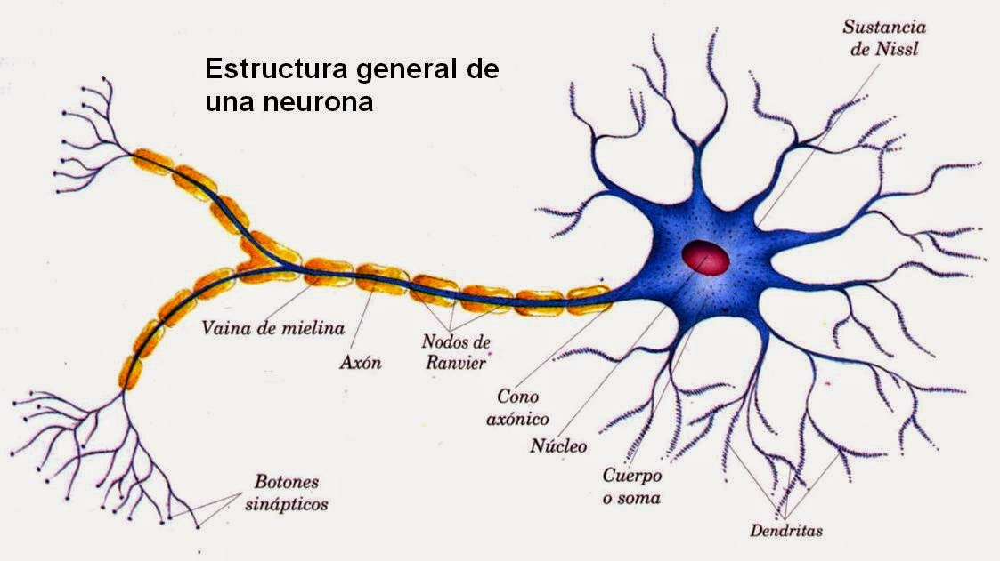
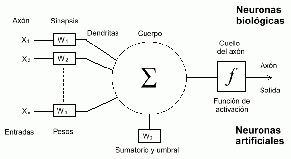
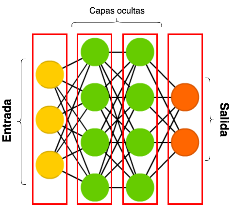

# [→ Máster en Big Data y Machine Learning](https://fictizia.com/formacion/master-big-data)
### Big Data, Machine Learning, Tensor Flow, Data Science, Data Analytics, Arquitecturas Big Data, Plataformas Big Data

## Capítulo 7 - Aprendizaje Automático ##
### Clase 2 - Redes de neuronas ##

Una Red de Neuronas Artificial (RNA) es una red representada de manera espacial mediante un grafo dirigido donde cada uno de los nodos representan neuronas y los arcos representan las sinapsis o conexiones entre las neuronas. Esta estructura intenta imitar la distribución de las neuronas en el cerebro humano con el fin de construir un tipo de algoritmo que sea capaz de simular la capacidad de procesamiento de nuestros cerebros. Para ello es necesario realizar una breve introducción de la estructura de una neurona humana con el fin de entender cuales sus similitudes. Las neuronas fueron descubiertas o identificadas por el científico español Ramón y Cajal en 1888, donde definió el cerebro como una red de aproximadamente 100 * 106 células individuales, denominadas neuronas, ampliamente interconectadas entre sí. Las neuronas humanas están formadas por tres elementos: (1) el soma o cuerpo celular es la parte principal de la neuronas (10 a 80 micras de longitud); (2) las múltiples prolongaciones que salen de distintas partes del soma, denominadas dendritas, cuya función consiste en recibir impulsos de otras neuronas y enviarlos hasta el soma; y (I3) el axón, que es una prolongación del soma que se extiende en dirección opuesta a las dendritas y tiene la función de conducir un impulso nervioso desde el soma hacia otra neurona, músculo o glándula del cuerpo humano. La Figura 8 presenta la estructura detallada de una neurona humana y sus diferentes partes. 

En base a esta estructura biológica, los investigadores Pitts y McCulloch definieron el primer modelo de red neuronal en 1943. Este modelo consistía en una red con dos capas de neuronas conectadas entre sí, donde la primera capa estaba formada por conjunto de nodos o neuronas formales (neuronas presinápticas) que representaban la entrada de la red y la segunda capa estaba formada por  un único nodo o neurona formal (neurona postsináptica) que representaba la salida de la red. Una neurona formal era una puerta lógica con dos posibles estados internos (encendido o apagado) representados por una variable. Esta red funcionaba como un discriminador del estado de la puerta lógica, de forma que las neuronas de la primera capa recibían las entradas, que eran enviadas a la segunda capa donde se aplicaba una operación matemática obteniéndose un valor sobre el cual se aplicaba una función que activación, basada en un umbral, que definía el estado de la salida. Es decir, si el valor obtenido de la operación sobre las entradas era mayor que el umbral la salida era 1 y sino la salida era 0.  A partir de este y otros modelos que se desarrollaron en los siguiente años,  Rumelhart y McClelland introdujeron en 1986 lo que se conoce actualmente como el modelo estándar de neurona artificial, el cual se encuentra representado en la Figura , donde se presentan los componentes de una neurona artificial así como la correspondencia entre los elementos de una neurona biológica y una neurona artificial. Como se puede observar en la imagen la neurona artificial intenta imitar de forma completa la estructura de la neurona biológica. 

Un conjunto de entradas xj y un conjunto de pesos wij, denominados sinápticos, donde  j es un valor entre 1 y n. 
Una función de propagación hi definida a partir del conjunto de entradas y los pesos sinápticos. Es decir:

La función de propagación define la operación matemática mediante la cual se combinan las diferentes entradas que recibe la neurona. La función de propagación más comunmente utilizada consiste en combinar linealmente las entradas y los pesos sinápticos, mediante la siguiente operación matemática: 

Además es muy común añadir a la función de propagación un parámetro adicional θi, que comummente denomina umbral, el cual se suele restar al resultado de la operación

Una función de activación, que representa simultaneamente la salida de la neurona y su estado de activación. De forma matemática la función de activación se puede definir:

**Arquitectura de las redes de neuronas**

Una vez definidos los componentes básicos, es decir las neuronas, es necesario definir como se encuentran distribuidos y conectadas en la red. La distribución de las diferentes conexiones de la red determina en gran medida el funcionamiento de la red de neuronas. Los distintos nodos (neuronas) que componen la red se encuentran conectados entre sí mediante las sinapsis. Estas conexiones son unidireccionales, es decir, la información sólo se propaga en un único sentido desde la neurona presináptiva a la neurona possináptica. En general, las neuronas se agrupan entre si en base a la función de propagación que utilizan en entidades más grandes denominadas capas. La combinación secuencial de diferentes capas constituyen una red de neuronas artificial. En cualquier red de neuronas  artificial se pueden distinguir tres tipos de capas:

- Capa de entrada o sensorial: Es la capa inicial de la red de neuronas y está compuesta por neuronas que reciben información (datos o señales) del entorno.
- Capa de salida: Es la capa final de la red de neuronas y genera la salidad o respuesta de la red. 
- Capa oculta: Es la capa o capas intermedias de la red de neuronas donde se realizan las diferentes operaciones matemáticas que permiten a la red procesar y manipular la información con el fin de generar la salida de la red de neuronas. El caso más sencillo es que sólo exista una capa, pero pueden incluirse todas las capas que sean necesarias. La inclusión de múltiples capas ocultas ha dado lugar a las redes de neuronas profundas que se han popularizado en los últimos años mediante el Aprendizaje profundo (Deep Learning). Aunque este tipo de arquitecturas son muy eficientes para ciertos procesos aumenta en gran medida la complejidad de la red de neuronas. 

Dependiendo del número de capas ocultas que incluyamos en nuestra de red de neuronas artificial podemos hablar de redes monocapa que sólo están compuesta por una única capa oculta o redes multicapa donde existen múltiples capas ocultas. Además dependiendo de las conexiones entre las diferentes capas podemos distinguir entre tres tipos de redes de neuronas artificiales:

- Redes Unidireccionales (feedforward): La redes de neuronas unidireccionales o prealimientadas (debido a que las neuronas obtiene información de la capa anterior o del entorno) son las primera y más sencilla estructura de red neuronal artificial construida por el ser humano []. Es esta estructura de red, la información se mueve en una única dirección. Es decir, de la capa de entrada, a través de los diferentes capas ocultas (si existen) hacia los capas de salida. En este tipo de redes no existen ningún tipo de bucle o retroalimentación hacia atrás. Este tipo de redes, a pesar de su sencillez, ofrecen muy buenos resultados en procesos en los cuales no se requiera el uso de información de eventos futuros dentro de la red. 
- Redes Elman (simple feeback): La redes de neuronas Elman son denominadas redes recurrentes simples ya que incluyen retroalimentación entre las capas contiguas. Es decir, en este tipo de red poseen una memoria de los eventos inmediatamente anteriores. Esta información es utilizada en el proceso de actualización de los pesos durante el proceso de apredizaje. 
- Redes recurrentes (full feedback): La redes de neuronas recurrentes completamente conectadas, a diferencia de las redes de neuronas Elman, tienen conexiones de retroalimentación a todos los elementos que forman la red. Cada neurona de la red está conectada a todos los elementos que la rodean desde un punto de vista espacial.  Es decir, una neurona está conectada a las neuronas de las capas posterioes y anteriores y a si misma. 

Una vez que se ha definido la estructura de la red de neuronas es necesario computar el valor de los diferente pesos de cada una de las capas de la red, para ello se utiliza un proceso de entrenamiento compuesto por dos fases: 
- Fase de entrenamiento: En esta fase se calcula el valor de los pesos de la red, para ello se utiliza  un conjunto de datos o patrones (ejemplos de entrenamiento) que se utilizan para calcular los pesos (parámetros) que definen el modelo de la red de neuronas. Los diferentes pesos son calculados de manera iterativa, de acuerdo con los valores de los ejemplos entrenamiento, con el objeto de minimizar el error cometido entre la salida obtenida por la red neuronal y la salida deseada. 
- Fase de test: En esta se realiza un analisis de la calidad del proceso de entrenamiento, es decir se analiza si el modelo constrido en la fase anterior es capaz de generalizar a casos nuevos o se ha ajustado demasiado a las particularidades presentes en los ejemplos de entrenamiento (sobreajuste). Para evitar el problema del sobreajuste, es aconsejable utilizar un segundo grupo de datos diferentes a los de entrenamiento, el grupo de validación, que permita controlar el proceso de calculo de los pesos.

**Tipos de redes neuronas**

Las redes de neuronas se pueden construir de diferentes maneras dependiendo del número de capas, el tipo de neuronas utilizadas y la forma en la que están conectadas las diferentes capas. Pero existen una serie de configuraciones básicas que identifican cierto tipos de redes de neuronas, algunas de las cuales son descritas a continuación:

-Perceptrón simple: El perceptrón (Perceptron, P en sus siglas en inglés) es la red de neuronas más sencilla formada por sólo dos capas (entrada y salida) que permite construir un discriminador simple.   
- Perceptrón multicapa: El perceptrón multicapa (Multilayer Perceptron MP, en sus siglas en inglés)[] es una red de neuronas basada en el perceptrón simple que introduce el concepto de capa oculata. La estructura básica de esta red está formada por al menos tres capas (entrada, oculta y salida) cuya interacción permite construir un aproximador de tipo universal. Es decir, permite aproximar cualquier tipo de función continua definida en un espacio .
- Redes recurrentes: Las redes de neuronas recurrentes (Recurrent Neural Networks, RNN en sus siglas en inglés) son una extensión del perceptrón multicapa donde se producen conexiones entre las neuronas en ambos sentidos (hacia delante y hacia atrás). Existe dos tipos de redes recurrentes: simples que sólo tienen conexión con las neuronas de las capas continuas; y completas que pueden estar conectadas con todas las neuronas de las diferentes capas incluidas ellas mismas.  
- Redes largas de memoria a corto plazo: Las redes de neuronas largas con memoria a corto plazo (Long Short-Term Memory, LSTM en sus siglas en ingles) son un tipo de red de neuronas que incluye bloques de memoria que permite recordar cierto tipo de información. 
- Redes convolucionales: Las redes de neuronas convolucionales (Convolutional Neural Networks, CNN en sus siglas en inglés) son un tipo de red de neuronas similar al perceptrón multicapa donde las neuronas de algunas de sus capas son de tipo convolucional, de reducción del muestreo y sencillas. Las neuronas convolucionales tratan de simular el funcionamiento de las neuronas de la corteza visual humana mediante la aplicación de filtros (operaciones matriciales) que permiten la extracción de características de los datos de entradas que se corresponden con los píxeles de una imagen. 
- Redes generativas antagónicas: Las redes de neuronas generativas antagónicas (Generative Adversarial Network, GAN en sus siglas en inglés) son una combinación de dos redes de neuronas que compiten mutuamente en una juego de suma cero. El cual consiste una situación en la que la ganancia o pérdida de un participante se equilibra con exactitud con las pérdidas o ganancias del otro participante.
