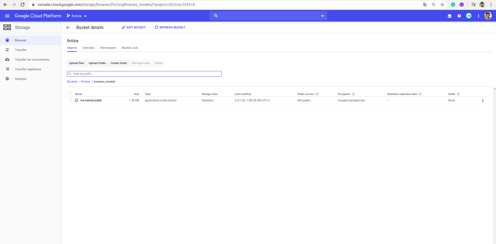
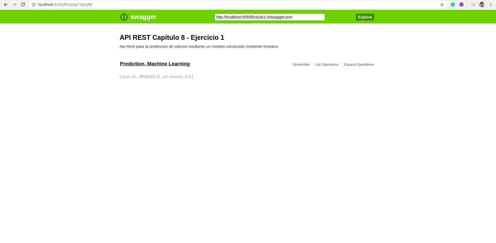

# [→ Máster en Big Data y Machine Learning](https://fictizia.com/formacion/master-big-data)
### Big Data, Machine Learning, Tensor Flow, Data Science, Data Analytics, Arquitecturas Big Data, Plataformas Big Data

## Capítulo 8 - Ejercicio 01: Desplegando nuestra máquina virtual en Cloud ##

El objetivo de este ejercicio es desplegar una máquina virtual en Google Cloud Platform y lanzar un servicio web desarrollado previamente en el máster. 

### Desplegando nuestra primera aplicación en el cloud (Machine Learning)

Mediante este ejercicio vamos a aprender como desplegar nuestras aplicaciones en el cloud, de forma que podamos desplegar nuestro servicios de acceso a datos a través de una máquina virtual o podamos realizar nuestros procesos de entrenamiento en máquinas más potentes. 

**Paso 1: Creando nuestra máquina virtual**

El primer paso consistirá en crear nuestra primera máquina virtual utilizando Google Cloud Platform. Cada una de las plataformas cloud
tiene su propia infraestructura de máquinas

GCP: [Instancias de VM](https://cloud.google.com/compute?hl=es)
AWS: [Instancias EC2](https://aws.amazon.com/es/ec2/instance-types/)
Azure: [Series](https://azure.microsoft.com/es-es/pricing/details/virtual-machines/series/)

En este caso vamos a trabajar con Google Cloud Platform (GCP) y para ello crearemos una máquina virtual en la sección de instancias de VM como se observa en la figura. 


**Paso 2: Configurando el tipo de máquina**

Una vez que hemos comenzado el proceso de configuración de la máquina debemos configuar los dos elementos más importantes:

- Localización: La localización en la que se despliegue una máquina es muy importante ya que a la hora de acceder a otros servicios de GCP el coste se incrementará dependiendo de si los servicios y máquinas virtuales se encuentra en la misma zona geográfica. Además es siempre recomendable seleccionar una zona geográfica cercana a los usuarios con el fin de minimizar latencias, uso de aplicaciones de terceros, etc. 
- Tipo de Máquinas: GCP ofrece tres tipos de máquinas: 
    - Los tipos de máquinas N1 ofrecen hasta 96 CPU virtuales, 6.5 GB de memoria por CPU virtual y están disponibles en las plataformas de CPU Intel Sandy Bridge, Ivy Bridge, Haswell, Broadwell y Skylake.
    - Los tipos de máquinas N2 ofrecen hasta 80 CPU virtuales, 8 GB de memoria por CPU virtual y están disponibles en las plataformas de CPU de Intel Cascade Lake.
    - Los tipos de máquinas E2 son VM con costo optimizado que ofrecen hasta 16 CPU virtuales con hasta 8 GB de memoria por CPU virtual. Las máquinas E2 tienen una plataforma de CPU predefinida que ejecuta un procesador Intel o AMD EPYC. Las VM E2 proporcionan una variedad de recursos de procesamiento al menor precio en Compute Engine.

En nuestro caso vamos a utilizar una máquina de tipo N1, ya que son las máquinas más sencilla y con menor coste. 


**Paso 3: Seleccionando las características básicas de nuestra máquina**

A continuación es necesario definir cuales serán las características de la máquina que vamos a utilizar. Para el desarrollo de este ejercicio vamos a utilizar la más sencilla de todas. Una máquina de tipo estandar n1-standar-1 que es la máquina más sencilla que puede ser seleccionada dentro de las máquina de de tipo N1. 

Tipos de máquinas: [Estandar N1](https://cloud.google.com/compute/docs/machine-types?hl=es-419#n1_standard_machine_types)
Tipos de máquinas: [Alta capacidad N1](https://cloud.google.com/compute/docs/machine-types?hl=es-419#n1_high-memory_machine_types)


**Paso 4: Definiendo el sistema operativo**

Una vez seleccionada la máquina tenemos que seleccionar el sistema operativo. Por defecto, GCP selecciona una máquina que utiliza el sistema operativo debian, pero nosotros vamos a cambiarla por el sistema operativo ubuntu, como se muestra en la imagen.


**Paso 5: Definiendo el disco**

Para finalizar es necesario configurar algunos parámetros referentes al disco de arranque:

- Regla de eliminación: Es importante marcar esta opción si estamos trabajando con máquinas temporales. Es decir si nuestra máquina no va a persistir en el tiempo y sólo la utilizaremos para realizar pruebas o por periodos cortos lo ideal será que eliminemos el disco con el fin de eliminar el coste. 
- Encriptado: Utilizaremos la opción por defecto para encriptar los datos del disco. 


Una vez que hayamos seleccionado todos estos elementos podremos crear nuestra nueva máquina virtual y podremos acceder al panel de máquinas virtuales de forma que veremos nuestra nueva máquina como se muestra en la imagen.


Como podemos observar nuestra máquina se ha creado con el nombre __fictizia1__ (Sólo se admiten caracteres en minúsculas) y con dos direcciones IP:
- IP interna: IP interna para interactuar con otras máquinas dentro del cluster de máquinas
- IP externa: IP externa mediante la cual nos conectaremos desde el exterior. Si levantaramos un servidor web esta sería nuestra IP para acceder al servicio.

**Paso 6: Connectando via SSH**

Para poder trabajar con nuestra máquina es necesario poder acceder a ella, por lo que podemos acceder mediante un interfaz web via ssh pulsando sobre la sección shh que aparece al final de la información de la máquina. Esto producir la aparición de una consola que comenzará a conectarse utilizando nuestro usuario de GCP.


La primera vez que intentemos iniciar este proceso se generaran un conjunto de claves SSH (Pública/Privada) para nuestro usuario con las cuales podremos acceder via shh como si una máquina cualquiera se tratase. 


**Paso 7: Configurando el acceso a nuestro proyecto**

Para facilitar el uso de los distintos productos que existen en GCP vamos a instala la herramienta [GCLOUD](https://cloud.google.com/sdk/install) que nos permitirá acceder a todos los productos de GCP mediante la consola. Para ello tendremos que instalar la versión para nuestro sistema operativo:


Una vez descargado, lo descomprimimos y los instalamos con el siguiente comando:

```
./google-cloud-sdk/install.sh
```

Una vez realizada la instalación podremos acceder iniciar nuestra configuración de google cloud mediante el siguiente comando:

```
./google-cloud-sdk/bin/gcloud init
```

A continuación nos aparecerá un interfaz con información referente a las configuraciones previas y las opciones para crear una nueva configuración

```
Welcome! This command will take you through the configuration of gcloud.

Settings from your current configuration [default] are:
compute:
  region: europe-west1
  zone: us-central1-c
core:
  account: correo@fictizia.com
  disable_usage_reporting: 'True'
  project: pruebas-data-242816

Pick configuration to use:
 [1] Re-initialize this configuration [default] with new settings 
 [2] Create a new configuration
Please enter your numeric choice:  
```

En esta caso marcaremos uno, pero si no tuvieramos ninguna configuración previa deberiamos crear una nueva configuración. El proceso de configuración está compuesto por varios pasos:

- Paso 1: Selección de la cuenta de usuario
- Paso 2: Selección del proyecto
- Paso 3: Selección de la región de computo y Zona (Es muy importante seleccionar correctamente la zona de computo)

Si todo se ha realizado correctamente deberíamos tener la siguiente configuración al ejecutar de nuevo el comando init

```
Welcome! This command will take you through the configuration of gcloud.

Settings from your current configuration [default] are:
compute:
  region: europe-west3
  zone: europe-west3-c
core:
  account: correo@fictizia.com
  disable_usage_reporting: 'True'
  project: fictizia-259518

Pick configuration to use:
 [1] Re-initialize this configuration [default] with new settings 
 [2] Create a new configuration
```

**Paso 8: Connectando via ssh desde nuestro terminal**

Una vez que hemos configurado nuestra cuenta de acceso con gcloud podremos conectarnos. Para ellos vamos a volver al panel de máquina virtuales y vamos a pulsar en la sección ssh para ver el comando que tenemos que ejecutar para conectarnos via SSH utilizando gcloud.


Copiaremos el comando y lo ejecutaremos en nuestro terminal

```
gcloud beta compute --project "fictizia-259518" ssh --zone "europe-west3-c" "fictizia1"
```

Al ejecutarlo se nos solicitará la instalación y configuración de una serie de elementos y a continuación se nos pedirá las frases para la generación de nuestras claves ssh.

```
╔════════════════════════════════════════════════════════════╗
╠═ Creating update staging area                             ═╣
╠════════════════════════════════════════════════════════════╣
╠═ Installing: gcloud Beta Commands                         ═╣
╠════════════════════════════════════════════════════════════╣
╠═ Creating backup and activating new installation          ═╣
╚════════════════════════════════════════════════════════════╝

Performing post processing steps...done.                                       

Update done!

Restarting command:
  $ gcloud beta compute --project fictizia-259518 ssh --zone europe-west3-c fictizia1

WARNING: The public SSH key file for gcloud does not exist.
WARNING: The private SSH key file for gcloud does not exist.
WARNING: You do not have an SSH key for gcloud.
WARNING: SSH keygen will be executed to generate a key.
Generating public/private rsa key pair.
Enter passphrase (empty for no passphrase): 
```

### Entrenando mi modelo desde el cloud (Machine Learning)

Este ejercicio consiste en el despliegue de un proceso de entrenamiento que almacena la información en google cloud storage. Para ello utilizaremos uno de los modelos en lo que hemos trabajado en el capitulo anterior y generaremos uno nuevo. La primera parte del ejercicio consiste en construir el proceso de entrenamiento. 

**Paso 1.1: Construcción de nuestro entorno de trabajo**

Para el desarrollo de este ejercicio vamos a utilizar una imagen de ubuntu 18.4 (En caso de que hayamos utilizado una versión diferente al configurar nuestra máquina virtual deberemos utilizar esa version). Antes de preparar nuestra sistema de despliegue basada en docker vamos a construir nuestro entorno. Para ello vamos a crear una carpeta que contendrá los siguiente directorios.

```
total 32
drwxrwxr-x 7 momartin momartin 4096 feb 27 01:53 .
drwxrwxr-x 6 momartin momartin 4096 feb 27 00:46 ..
drwxrwxr-x 3 momartin momartin 4096 feb 27 00:48 api
drwxrwxr-x 2 momartin momartin 4096 feb 27 01:56 credentials
drwxrwxr-x 2 momartin momartin 4096 feb 27 02:27 models
-rw-rw-r-- 1 momartin momartin  430 nov 14 17:34 requirements.txt
drwxrwxr-x 3 momartin momartin 4096 feb 27 00:48 trainer
drwxrwxr-x 5 momartin momartin 4096 feb 27 01:46 venv

```

La carpeta del ejercicio deberá contener los siguiente componentes donde deberemos incluir los diferentes elementos necesarios para construir nuestro sistema de entrenamiento y servicio:

- api: Este directorio contendrá todos los elementos necesarios para desplegar una api desarrollada en Flask.
- credentials: Este directorio contendrá los credenciales para acceder a Google Cloud Storage.
- models: Este directorio será generada automáticamente por el entrenador con el el objetivo de almacenar nuestros modelos. 
- requirements.txt: Este fichero contendrá las diferentes libreras python para desplegar nuestro sistema. 
- trainer: Este directorio contendrá todos los elementos necesarios para la realización de proceso de entrenamiento. 
- venv: Este directorio contendrá los diferentes directorios del entorno virtual de python.

**Paso 1.2: Definición del entrenador**

Para la construcción del entrenador vamos a crear una pequeña infraestructura de directorios con el objetivo de poder modificar el código de manera sencilla. Para ellos crearemos la carpeta __src__ que contendrá el código fuente de nuestro entrenador. 

```
drwxrwxr-x 3 momartin momartin 4096 feb 27 00:48 .
drwxrwxr-x 7 momartin momartin 4096 feb 27 01:53 ..
drwxrwxr-x 2 momartin momartin 4096 feb 27 02:10 src
```
Dentro del directorio __src__ crearemos el fichero trainer.py. Este fichero utilizar una serie de librerias en python referentes al algoritmo Kmeans (KMeans) y la generación del modelo (dump).

```
from __future__ import absolute_import
from __future__ import division
from __future__ import print_function
from sklearn.cluster import KMeans
from joblib import dump
import sklearn.datasets as datasets

import pandas as pd
import numpy as np
import os
```

Paara poder utilizar estas librerías es necesario instalar las libreras en nuestro entorno mediante el siguiente comando:

```
pip3 install sklearn joblib numpy pandas
```

**Paso 1.3: Configuración de la comunicación con GCS**

Para trabajar con Google Cloud Storage sobre python debemos incluir la librería de google-cloud-storage, para ello se debe ejecutar el siguiente comando:

```
pip3 install google-cloud-storage
```

A continuación es necesario importar la librería en nuestro entrenador mediante la siguiente linea:

```
from google.cloud import storage
```

Una vez que hayamos importado la librería podemos construir una clase para manejar algunas de las funcionalidades de Google Cloud Storage. Esta clase está formada por cuatro métodos para la carga y descarga de ficheros de Google Cloud Storage

```
class GCSHandler:

    def __init__(self, credentials_file):
        self.__client = storage.Client.from_service_account_json(credentials_file)
        self.__bucket_name_loaded = None
        self.__bucket = None

    def load_bucket(self, name):
        if name != self.__bucket_name_loaded:
            self.__bucket_name_loaded == name
            self.__bucket = self.__client.get_bucket(name)

    def get_bucket(self):
        return self.__bucket

    def download_file(self, local_path, blob_path):
        blob = self.__bucket.get_blob(blob_path)
        return blob.download_to_filename(local_path)

    def upload_file(self, local_path, blob_path):
        blob = self.__bucket.get_blob(blob_path)
        return blob.upload_from_filename(local_path)
```

**Paso 1.4: Aprendizaje del modelo**

Para la construcción de nuestro modelos vamos a utilizar el dataset Iris el cual puede ser cargado mediante la siguiente instrucción:

```
raw_data = datasets.load_iris()
```

Una vez que hemos cargado el dataset vamos a extraer las diferentes características (features) que necesitamos para construir nuestro modelo:

```
features_names = list()

for feature in raw_data['feature_names']:
    features_names.append(feature)

features_names.append('FEATURE')

data = pd.DataFrame(data=np.c_[raw_data['data'], raw_data['target']], columns=features_names)

X = np.array(data[["sepal length (cm)", "sepal width (cm)", "petal length (cm)", "petal width (cm)"]])
y = np.array(data['FEATURE'])

final_model = KMeans(n_clusters=3).fit(X)
centroids = final_model.cluster_centers_
```

El modelo generado será almacenado en la variables __final_model__. Para poder almacenar este modelo en un fichero debermos utilizar la función __dump__, pero antes es necesario definir una serie de variables referentes a la localización remota y local de nuestro modelo. Para ello incluiremos el siguiente código en nuestro entrenador (trainer.py):

```
file_name = TRAINED_MODEL_NAME + '.joblib'
file_local_path = os.path.join(TRAINED_MODEL_PATH, file_name)
```

Para poder construir las diferentes rutas, es necesario definir una serie de variables. Estas variables toman sus valores en base a la estructura de directorios que hemos creado para esta solución. 

```
TRAINED_MODEL_PATH = '../../models'
TRAINED_MODEL_NAME = 'iris-trained'
BLOB_FOLDER = 'kmeans_models'
```

A continuación comprobaremos si el directorio de almacenamiento de nuestro modelo existe y sino lo crearemos para luego utilizar la función dump que permite almacenar el modelo en fichero. 

```
mode = 0o777

if not os.path.exists(TRAINED_MODEL_PATH):
    os.mkdir(TRAINED_MODEL_PATH, mode)

error = dump(final_model, file_local_path)
```

**Paso 1.5: Almacenamiento en Google Cloud Storage**

Una vez que hemos construido nuestro modelo y lo hemos almacenado en una carpeta del nuestro host, vamos a almacenarlo en uno de nuestros buckets. Para ellos utilizaremos las diferentes funciones que hemos incluido en nuestra clase __GCSHandler__.

```
file_remote_path = os.path.join(BLOB_FOLDER, file_name)

if error is not None:
    gcs_handler = GCSHandler('../../credentials/credentials.json')
    gcs_handler.load_bucket('fictizia')
    gcs_handler.upload_file(file_local_path, file_remote_path)
```

**Paso 1.6: Desplegando nuestro archivos en la Máquina Virtual**

Una vez finalizado nuestro código de entrenamiento deberemos generar el fichero de requisitos (requirements.txt) mediante el siguiente comando:

```
pip3 freeze > requirements.txt
```

A continuación deberemos subir nuestro archivo mediante la utilizar del comando __scp__. El comando scp pertime copiar archivo de forma segura entre dos máquinas. Para ello utilizaremos el siguiente comando (Para más información utilizar el comando man scp)

```
scp -i ruta_de_clave_privada path_fichero_local host@login:path_fichero_remoto
```

Una vez que hemos lanzado el fichero podremos conectarnos via ssh a la máquina remota y ejecutar nuestro entrenador mediante el siguiente comando:

```
ssh -i ruta_de_clave_privada host@login
```

Si todo ha funcionado correctamente nuestro fichero se habrá almacenado en nuestro google cloud storage. 



### Realizando predicciones desde el cloud (Machine Learning)

Este ejercicio consiste en el despliegue de un proceso de entrenamiento que almacena la información en google cloud storage y que despligue los modelos mediante una API REST. Para ello utilizaremos uno de los modelos en lo que hemos trabajado en el capitulo anterior o generaremos uno nuevo. En esta parte del ejercicio construiremos el proceso de despliegue del sistema de predicciones. 

**Paso 2.1: Añadiendo nuevo componente de tipo API**

Para el desarrollo de este ejercicio vamos a utiizar la configuración que hemos definido para el caso anterior (En caso de que hayamos utilizado una versión diferente al configurar nuestra máquina virtual deberemos utilizar esa version). Para ello deberemos añadir un nuevo componente denominado __api__ que será nuestra api de despliegue del sistema de predición, donde la carpeta __api__ contendrá una carpeta __src__ con los siguiente elementos:

```
total 20
drwxrwxr-x 3 momartin momartin 4096 feb 27 02:27 .
drwxrwxr-x 3 momartin momartin 4096 feb 27 00:48 ..
-rw-rw-r-- 1 momartin momartin 1462 feb 27 02:10 api.json
-rw-rw-r-- 1 momartin momartin 2751 feb 27 02:27 functions.py
-rw-rw-r-- 1 momartin momartin  996 feb 27 02:01 server.py
```

Cada uno de los ficheros de la carpeta __src__ se corresponden con el servidor (server.py), las funciones con la lógica de los diferentes recursos (functions.py), la configuración de la API REST (api.json).

**Paso 2.2: Configuración del servidor**

El primer paso consiste en desarrollar el código de nuestro servidor para ellos vamos a utilizar [Flask](https://flask.palletsprojects.com/en/1.1.x/) que es un paquete de python que nos permite desplegar servidor web de forma sencilla y rápido. Para ello debemos instalar algunos paquetes utilizando pip3 (linux). 

```
pip3 install Flask connexion connexion[swagger-ui]
```

Una vez instalados estos paquetes podemos comenzar con la configuración de nuestro servidor en el fichero server.py. Si no creaste este archivo en el paso anterior, es momento de crear e incluir las siguiente lineas de código:

```
import connexion

server = connexion.App(__name__, options= {"swagger_ui": True})
server.add_api('api.json', base_path='/fictizia/1.0')

if __name__ == "__main__":
    server.run(port=5555)
    exit(0)
```

1. Para construir nuestra API REST utilizaremos el paquete connexion, para ello tendremos que importar el paquete y a continuación crear un objeto para nuestra aplicación (server) indicando que se debe activar el interfaz de usuario mediante la opción swagger_ui. 
2. A continuación deberemos definir nuestra API, para ello utilizaremos el archivo __api.json__ donde describiremos los diferentes recursos de nuestra API y además indicaremos cual será la estructura de las URI de acceso a nuestra API indicando el nombre del servicio __fictizia__ y la versión __1.0__. 
3. Para finalizar debemos arrancar nuestra aplicación mediante el método run de nuestro de nuestro objeto server indicando el puesto a través del cual se desplegará nuestra aplicación. En este caso hemos elegido el puerto 5005. 

**Paso 2.3: Creación de las funciones de predicción**

Para nuestra api debemos construir una única funcialidad que denominaremos predicción. Esta funcionalidad no permitirá introducir los 4 valores que define una flor de tipo iris y nos indicará a que clase pertenece. Para ello, deberemos construir el código de la función de predicción en el archivo __functions.py__ de la siguiente manera:

```
from __future__ import absolute_import
from __future__ import division
from __future__ import print_function
from sklearn.cluster import KMeans
from joblib import load

def predict(field_1: float, field_2: float, field_3: float, field_4: float):

    input = [[field_1, field_2, field_3, field_4]]
    output = dict()

    model: KMeans = load(file_local_path)

    try:
        output['class'] = int(model.predict(input)[0])
        return output, 200
    except Exception as e:
        return str(e), 300
```

Esta función carga un modelo que debe haber sido descargado previamente de nuestro espacio en Google Cloud Storage (GCS) y predice la clase a la que corresponde el ejemplo cuyo valores se corresponden con los 4 campos field de entrada. Para poder realizar la descarga desde GCS es necesario incluir el siguiente código previo a la función predict:

```
from google.cloud import storage

import os

TRAINED_MODEL_PATH = '../../models'
TRAINED_MODEL_NAME = 'iris-trained'
DOWNLOADED_MODEL_NAME = 'iris-loaded'
BLOB_FOLDER = 'kmeans_models'

PATH = os.path.join(os.getcwd())


class GCSHandler:

    def __init__(self, credentials_file):
        self.__client = storage.Client.from_service_account_json(credentials_file)
        self.__bucket_name_loaded = None
        self.__bucket = None

    def load_bucket(self, name):
        if name != self.__bucket_name_loaded:
            self.__bucket_name_loaded == name
            self.__bucket = self.__client.get_bucket(name)

    def get_bucket(self):
        return self.__bucket

    def download_file(self, local_path, blob_path):
        blob = self.__bucket.get_blob(blob_path)
        return blob.download_to_filename(local_path)

    def upload_file(self, local_path, blob_path):
        blob = self.__bucket.get_blob(blob_path)
        return blob.upload_from_filename(local_path)


remote_file_name = TRAINED_MODEL_NAME + '.joblib'
local_file_name = DOWNLOADED_MODEL_NAME + '.joblib'
file_local_path = os.path.join(TRAINED_MODEL_PATH, local_file_name)
file_remote_path = os.path.join(BLOB_FOLDER, remote_file_name)


if os.path.exists(file_local_path):
    os.remove(file_local_path)

gcs_handler = GCSHandler('../../credentials/credentials.json')
gcs_handler.load_bucket('fictizia')
gcs_handler.download_file(file_local_path, file_remote_path)
```

**Paso 2.3: Preparación del método de acceso de la API**

Una vez construido los elementos básicos de nuestro servidor y de nuestro función de predicción vamos a configurar nuestra API REST. Para ellos vamos a definir la estructura del recursos __predict__ que utilizará la función predict definida previamente, cuya URI será la siguiente:

```
http://localhost:5005/fictizia/1.0/predict
```

Para construir el recurso, debemos crear la descripción del recursos en fichero api.json mediante el siguiente framento de código:

```
{
    "swagger": "2.0",
    "info": {
      "description": "Api Rest para la predicción de valores mediante un modelo construido mediante Kmeans",
      "version": "1.0",
      "title": "API REST Capítulo 8 - Ejercicio 1"
    },
    "paths": {
      "/predict": {
        "get": {
          "operationId": "functions.predict",
          "tags": [
            "Prediction, Machine Learning"
          ],
          "parameters": [
            {
              "name": "field_1",
              "in": "query",
              "required": true,
              "type": "number"
            },
            {
              "name": "field_2",
              "in": "query",
              "required": true,
              "type": "number"
            },
            {
              "name": "field_3",
              "in": "query",
              "required": true,
              "type": "number"
            },
            {
              "name": "field_4",
              "in": "query",
              "required": true,
              "type": "number"
            }
          ],
          "responses": {
            "200": {
              "description": "Se ha procesado la petición correctamente",
              "schema": {
                "type": "object"
              }
            },
            "300": {
              "description": "Se ha producido un error",
              "schema": {
                "type": "object"
            }
          }
        }
      }
    }
  }
}
```

Este json define la estructura básica de la API (descripción, versión, title) y la estructura de los diferentes recursos como elementos de path. En ese caso hemos creado un recurso al que se accede a través de __predict__ en la URI mediante una operación de tipo get y que utilizando para generar el contenido de la respuesta el método __predict__ del fichero functions.py.

**Paso 2.4: Despligue de la máquina virtual**

Una vez finalizado nuestro código de entrenamiento deberemos generar el fichero de requisitos (requirements.txt) mediante el siguiente comando:

```
pip3 freeze > requirements.txt
```

A continuación deberemos subir nuestro archivo mediante la utilizar del comando __scp__. El comando scp pertime copiar archivo de forma segura entre dos máquinas. Para ello utilizaremos el siguiente comando (Para más información utilizar el comando man scp)

```
scp -i ruta_de_clave_privada path_fichero_local host@login:path_fichero_remoto
```

Una vez que hemos lanzado el fichero podremos conectarnos via ssh a la máquina remota y ejecutar nuestro entrenador mediante el siguiente comando:

```
ssh -i ruta_de_clave_privada host@login
```

Si todo ha funcionado correctamente nuestro fichero se habrá almacenado en nuestro google cloud storage. 



**Paso 2.5: Monitorizando nuestro componente**

Una vez que hemos desplegado nuestros elementos podemos analizar los elementos básicos de nuestra máquina virtual mediante la pestaña de detalle:


Además esta pantalla de datalle nos permite visualizar estadisticas básicas acerca del uso de CPU y de red pulsando en la pestaña __monitoring__. 


