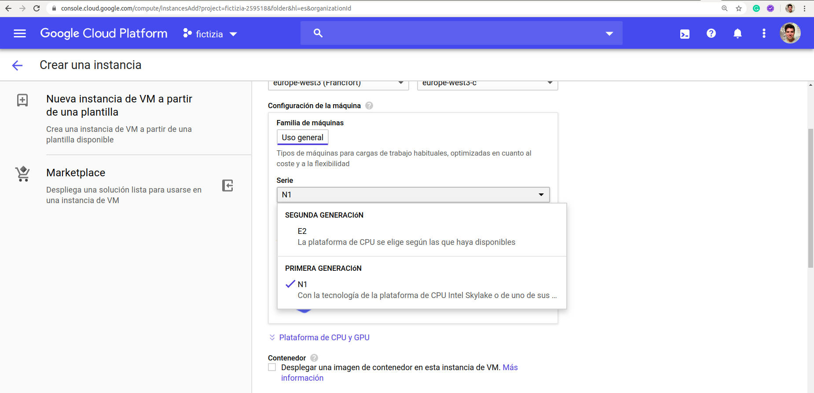
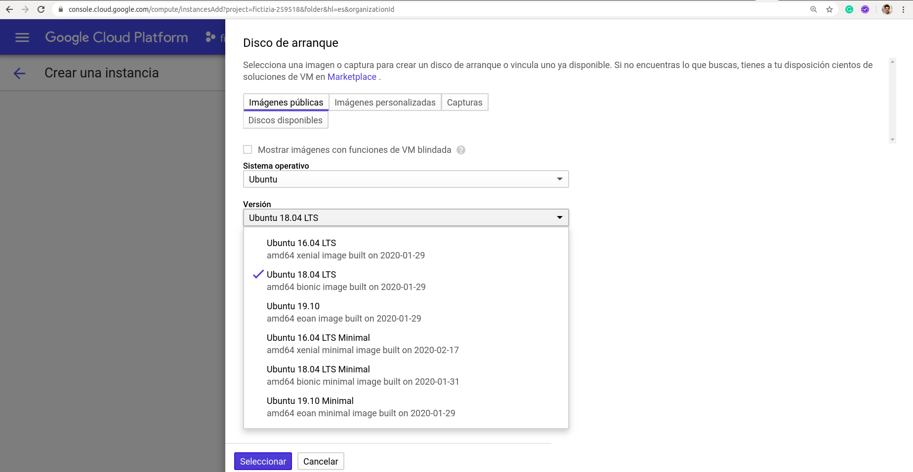
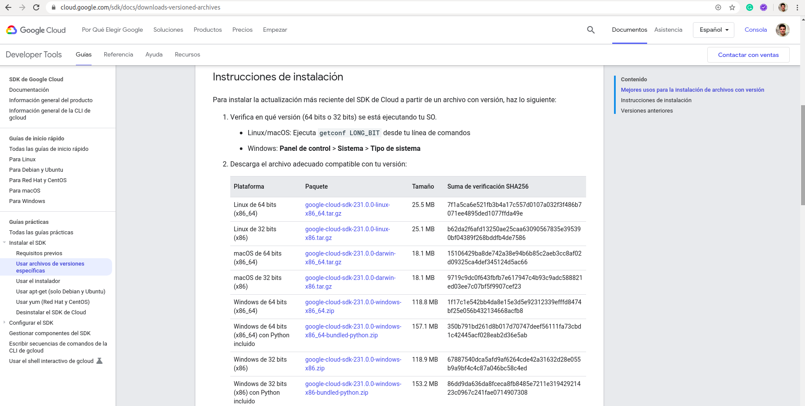

# [→ Máster en Big Data y Machine Learning](https://fictizia.com/formacion/master-big-data)
### Big Data, Machine Learning, Tensor Flow, Data Science, Data Analytics, Arquitecturas Big Data, Plataformas Big Data

## Capítulo 8 - Ejercicio 01: Desplegando nuestra máquina virtual en Cloud ##

El objetivo de este ejercicio es desplegar una máquina virtual en Google Cloud Platform y lanzar un servicio web desarrollado previamente en el máster. 

### Desplegando nuestra primera aplicación en el cloud (Machine Learning)

Mediante este ejercicio vamos a aprender como desplegar nuestras aplicaciones en el cloud, de forma que podamos desplegar nuestro servicios de acceso a datos a través de una máquina virtual o podamos realizar nuestros procesos de entrenamiento en máquinas más potentes. 

**Paso 1: Creando nuestra máquina virtual**

El primer paso consistirá en crear nuestra primera máquina virtual utilizando Google Cloud Platform. Cada una de las plataformas cloud
tiene su propia infraestructura de máquinas

GCP: [Instancias de VM](https://cloud.google.com/compute?hl=es)
AWS: [Instancias EC2](https://aws.amazon.com/es/ec2/instance-types/)
Azure: [Series](https://azure.microsoft.com/es-es/pricing/details/virtual-machines/series/)

En este caso vamos a trabajar con Google Cloud Platform (GCP) y para ello crearemos una máquina virtual en la sección de instancias de VM como se observa en la figura. 


**Paso 2: Configurando el tipo de máquina**

Una vez que hemos comenzado el proceso de configuración de la máquina debemos configuar los dos elementos más importantes:

- Localización: La localización en la que se despliegue una máquina es muy importante ya que a la hora de acceder a otros servicios de GCP el coste se incrementará dependiendo de si los servicios y máquinas virtuales se encuentra en la misma zona geográfica. Además es siempre recomendable seleccionar una zona geográfica cercana a los usuarios con el fin de minimizar latencias, uso de aplicaciones de terceros, etc. 
- Tipo de Máquinas: GCP ofrece tres tipos de máquinas: 
    - Los tipos de máquinas N1 ofrecen hasta 96 CPU virtuales, 6.5 GB de memoria por CPU virtual y están disponibles en las plataformas de CPU Intel Sandy Bridge, Ivy Bridge, Haswell, Broadwell y Skylake.
    - Los tipos de máquinas N2 ofrecen hasta 80 CPU virtuales, 8 GB de memoria por CPU virtual y están disponibles en las plataformas de CPU de Intel Cascade Lake.
    - Los tipos de máquinas E2 son VM con costo optimizado que ofrecen hasta 16 CPU virtuales con hasta 8 GB de memoria por CPU virtual. Las máquinas E2 tienen una plataforma de CPU predefinida que ejecuta un procesador Intel o AMD EPYC. Las VM E2 proporcionan una variedad de recursos de procesamiento al menor precio en Compute Engine.

En nuestro caso vamos a utilizar una máquina de tipo N1, ya que son las máquinas más sencilla y con menor coste. 



**Paso 3: Seleccionando las características básicas de nuestra máquina**

A continuación es necesario definir cuales serán las características de la máquina que vamos a utilizar. Para el desarrollo de este ejercicio vamos a utilizar la más sencilla de todas. Una máquina de tipo estandar n1-standar-1 que es la máquina más sencilla que puede ser seleccionada dentro de las máquina de de tipo N1. 

Tipos de máquinas: [Estandar N1](https://cloud.google.com/compute/docs/machine-types?hl=es-419#n1_standard_machine_types)
Tipos de máquinas: [Alta capacidad N1](https://cloud.google.com/compute/docs/machine-types?hl=es-419#n1_high-memory_machine_types)


**Paso 4: Definiendo el sistema operativo**

Una vez seleccionada la máquina tenemos que seleccionar el sistema operativo. Por defecto, GCP selecciona una máquina que utiliza el sistema operativo debian, pero nosotros vamos a cambiarla por el sistema operativo ubuntu, como se muestra en la imagen.



**Paso 5: Definiendo el disco**

Para finalizar es necesario configurar algunos parámetros referentes al disco de arranque:

- Regla de eliminación: Es importante marcar esta opción si estamos trabajando con máquinas temporales. Es decir si nuestra máquina no va a persistir en el tiempo y sólo la utilizaremos para realizar pruebas o por periodos cortos lo ideal será que eliminemos el disco con el fin de eliminar el coste. 
- Encriptado: Utilizaremos la opción por defecto para encriptar los datos del disco. 


Una vez que hayamos seleccionado todos estos elementos podremos crear nuestra nueva máquina virtual y podremos acceder al panel de máquinas virtuales de forma que veremos nuestra nueva máquina como se muestra en la imagen.


Como podemos observar nuestra máquina se ha creado con el nombre __fictizia1__ (Sólo se admiten caracteres en minúsculas) y con dos direcciones IP:
- IP interna: IP interna para interactuar con otras máquinas dentro del cluster de máquinas
- IP externa: IP externa mediante la cual nos conectaremos desde el exterior. Si levantaramos un servidor web esta sería nuestra IP para acceder al servicio.

**Paso 6: Connectando via SSH**

Para poder trabajar con nuestra máquina es necesario poder acceder a ella, por lo que podemos acceder mediante un interfaz web via ssh pulsando sobre la sección shh que aparece al final de la información de la máquina. Esto producir la aparición de una consola que comenzará a conectarse utilizando nuestro usuario de GCP.


La primera vez que intentemos iniciar este proceso se generaran un conjunto de claves SSH (Pública/Privada) para nuestro usuario con las cuales podremos acceder via shh como si una máquina cualquiera se tratase. 


**Paso 7: Configurando el acceso a nuestro proyecto**

Para facilitar el uso de los distintos productos que existen en GCP vamos a instala la herramienta [GCLOUD](https://cloud.google.com/sdk/install) que nos permitirá acceder a todos los productos de GCP mediante la consola. Para ello tendremos que instalar la versión para nuestro sistema operativo:



Una vez descargado, lo descomprimimos y los instalamos con el siguiente comando:

```
./google-cloud-sdk/install.sh
```

Una vez realizada la instalación podremos acceder iniciar nuestra configuración de google cloud mediante el siguiente comando:

```
./google-cloud-sdk/bin/gcloud init
```

A continuación nos aparecerá un interfaz con información referente a las configuraciones previas y las opciones para crear una nueva configuración

```
Welcome! This command will take you through the configuration of gcloud.

Settings from your current configuration [default] are:
compute:
  region: europe-west1
  zone: us-central1-c
core:
  account: correo@fictizia.com
  disable_usage_reporting: 'True'
  project: pruebas-data-242816

Pick configuration to use:
 [1] Re-initialize this configuration [default] with new settings 
 [2] Create a new configuration
Please enter your numeric choice:  
```

En esta caso marcaremos uno, pero si no tuvieramos ninguna configuración previa deberiamos crear una nueva configuración. El proceso de configuración está compuesto por varios pasos:

- Paso 1: Selección de la cuenta de usuario
- Paso 2: Selección del proyecto
- Paso 3: Selección de la región de computo y Zona (Es muy importante seleccionar correctamente la zona de computo)

Si todo se ha realizado correctamente deberíamos tener la siguiente configuración al ejecutar de nuevo el comando init

```
Welcome! This command will take you through the configuration of gcloud.

Settings from your current configuration [default] are:
compute:
  region: europe-west3
  zone: europe-west3-c
core:
  account: correo@fictizia.com
  disable_usage_reporting: 'True'
  project: fictizia-259518

Pick configuration to use:
 [1] Re-initialize this configuration [default] with new settings 
 [2] Create a new configuration
```

**Paso 8: Connectando via ssh desde nuestro terminal**

Una vez que hemos configurado nuestra cuenta de acceso con gcloud podremos conectarnos. Para ellos vamos a volver al panel de máquina virtuales y vamos a pulsar en la sección ssh para ver el comando que tenemos que ejecutar para conectarnos via SSH utilizando gcloud.


Copiaremos el comando y lo ejecutaremos en nuestro terminal

```
gcloud beta compute --project "fictizia-259518" ssh --zone "europe-west3-c" "fictizia1"
```

Al ejecutarlo se nos solicitará la instalación y configuración de una serie de elementos y a continuación se nos pedirá las frases para la generación de nuestras claves ssh.

```
╔════════════════════════════════════════════════════════════╗
╠═ Creating update staging area                             ═╣
╠════════════════════════════════════════════════════════════╣
╠═ Installing: gcloud Beta Commands                         ═╣
╠════════════════════════════════════════════════════════════╣
╠═ Creating backup and activating new installation          ═╣
╚════════════════════════════════════════════════════════════╝

Performing post processing steps...done.                                       

Update done!

Restarting command:
  $ gcloud beta compute --project fictizia-259518 ssh --zone europe-west3-c fictizia1

WARNING: The public SSH key file for gcloud does not exist.
WARNING: The private SSH key file for gcloud does not exist.
WARNING: You do not have an SSH key for gcloud.
WARNING: SSH keygen will be executed to generate a key.
Generating public/private rsa key pair.
Enter passphrase (empty for no passphrase): 
```

### Desplegando nuestro sistema mediante contenedores


