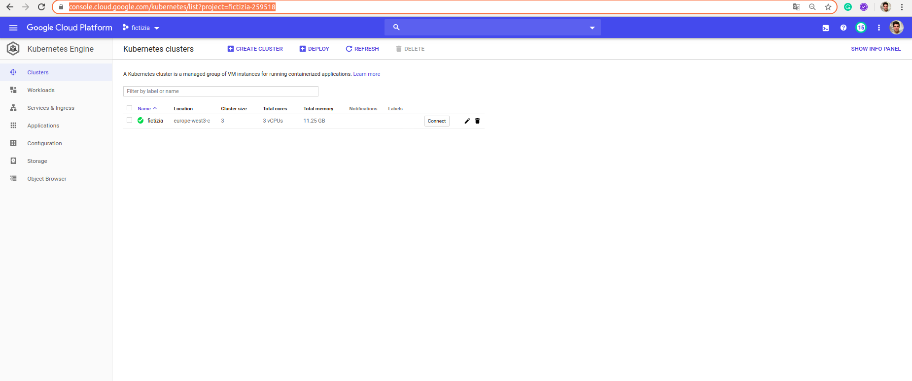

# [→ Máster en Big Data y Machine Learning](https://fictizia.com/formacion/master-big-data)
### Big Data, Machine Learning, Tensor Flow, Data Science, Data Analytics, Arquitecturas Big Data, Plataformas Big Data

## Capítulo 8 - Ejercicio 03: Desplegando nuestros contenedores en Kubernetes ##

El objetivo de este ejercicio es desplegar un micro cluster de kubernetes con el objetivo de lanzar dos servicios:

- Servicio de generación de un modelo
- Servicio de predicción basado en el anterior modelo

Para el desarrollo de este ejercicio vamos a utilizar los servicios construidos para el anterior ejercicio, pero en este caso vamos a generador dos contenedores diferentes, para la generación de nuestro contenedores.

### 1 Generando nuestros contenedor de entrenamiento

Mediante este ejercicio vamos a aprender como construir múltiples contenedores para desplegar en nuestro cluster de contenedores. 

**Paso 1.1: Construyendo nuestra estructura de despliegue**

El primer paso consistirá en definir el fichero de definición del docker del sistema de entrenamiento, para ellos utilizaremos el componente __trainer__ que construimos para el ejercicio anterior. Para ellos utilizaremos la carpeta trainer con todos sus contenidos, la cual deberá contener los diferentes elementos:

```
total 24
drwxrwxr-x 7 momartin momartin 4096 feb 21 01:53 .
drwxrwxr-x 6 momartin momartin 4096 feb 21 00:48 ..
drwxrwxr-x 2 momartin momartin 4096 feb 21 00:27 src
-rw-rw-r-- 1 momartin momartin  430 feb 21 04:34 requirements.txt
drwxrwxr-x 3 momartin momartin 4096 feb 21 00:52 Dockerfile
drwxrwxr-x 5 momartin momartin 4096 feb 21 01:51 venv
```

- src: Este directorio contendrá los diferentes scripts que se ejecutarán para el proceso de entrenamiento
- requirements: Es un fichero de tipo txt donde se indicarán las librerías necesarias para la ejecución de los scripts de src.
- Dockerfile: Es el fichero de definición del contenedor. Este es el nuevo fichero que vamos incluir para nuestro despliegue. 

**Paso 1.2: Definiendo el fichero despliegue**

En este paso vamos a construir el fichero de despligue que definirá como construimos nuestra contenedor para desplegar en nuestro cluster de kubernetes. Para ellos deberemos incluir en el archivo __Dockerfile__ el siguiente código:

```
FROM ubuntu:18.04
MAINTAINER Moisés <moises@fictizia.com>

RUN apt-get update && apt-get install -y python3 python3-pip && apt-get clean && rm -rf /var/lib/apt/lists/*
RUN mkdir /app
RUN mkdir /app/src
RUN mkdir /app/models
COPY src /app/src
COPY requirements.txt /app
WORKDIR /app
RUN pip3 install -r requirements.txt
WORKDIR /app/src
CMD ["python3", "trainer.py"]
```

Mediante este script construiremos un contenedor basado en ubuntu 18.04. Además crearemos dos carpetas: (1) models para el almacenamiento de los modelos locales; y (2) src para almacenar el código fuente de los entrenadores. 

**Paso 1.3: Definiendo el fichero despliegue**

A continuación generaremos nuestro contenedor para almacenarlo en nuestro repositorio de imágenes en el cloud. Previamente tendremos que actualizar nuestro fichero de requisitos con el objetivo de actualizar todas las libreras que hemos instalado en nuestro entorno virtual mediante el siguiente comando:

```
pip3 freeze > ../requirementes.txt
```

Una vez que hemos actualizado nuestro fichero de requisitos podemos generar nuestro contenedor, para ello utilizaremos el siguiente comando:

```
docker image build -t fictizia_trainer_8_3:v1 . 
```

Una vez que se ha creado nuestra imagen podremos comprobar si nuestra imagen se ha generado correctamente mediante el siguiente comando:

```
docker images
```

mediante el cual deberíamos obtener la siguiente salida

```
REPOSITORY             TAG                 IMAGE ID            CREATED             SIZE
fictizia_trainer_8_3   v1                  53861ce8ad48        2 minutes ago       795MB
```

**Paso 1.4: Desplegando nuestro credenciales para google cloud**

ara facilitar el uso de los distintos productos que existen en GCP vamos a instala la herramienta [GCLOUD](https://cloud.google.com/sdk/install) que nos permitirá acceder a todos los productos de GCP mediante la consola. Para ello tendremos que instalar la versión para nuestro sistema operativo:


Una vez descargado, lo descomprimimos y los instalamos con el siguiente comando:

```
./google-cloud-sdk/install.sh
```

Una vez realizada la instalación podremos acceder iniciar nuestra configuración de google cloud mediante el siguiente comando:

```
./google-cloud-sdk/bin/gcloud init
```

A continuación nos aparecerá un interfaz con información referente a las configuraciones previas y las opciones para crear una nueva configuración

```
Welcome! This command will take you through the configuration of gcloud.

Settings from your current configuration [default] are:
compute:
  region: europe-west1
  zone: us-central1-c
core:
  account: correo@fictizia.com
  disable_usage_reporting: 'True'
  project: project_id_actual

Pick configuration to use:
 [1] Re-initialize this configuration [default] with new settings 
 [2] Create a new configuration
Please enter your numeric choice:  
```

En esta caso marcaremos uno, pero si no tuvieramos ninguna configuración previa deberiamos crear una nueva configuración. El proceso de configuración está compuesto por varios pasos:

- Paso 1: Selección de la cuenta de usuario
- Paso 2: Selección del proyecto
- Paso 3: Selección de la región de computo y Zona (Es muy importante seleccionar correctamente la zona de computo)

Si todo se ha realizado correctamente deberíamos tener la siguiente configuración al ejecutar de nuevo el comando init

```
Welcome! This command will take you through the configuration of gcloud.

Settings from your current configuration [default] are:
compute:
  region: europe-west3
  zone: europe-west3-c
core:
  account: correo@fictizia.com
  disable_usage_reporting: 'True'
  project: project_id (ID de nuestro proyecto)

Pick configuration to use:
 [1] Re-initialize this configuration [default] with new settings 
 [2] Create a new configuration
```

**Paso 1.5: Desplegando nuestra imagen en el registro de contenedores**

Google cloud nos ofrece una herramienta denominada registro de contenedores que utilizamos en el ejercicio anterior. El registro de contenedores nos permiten almacenar nuestro contenedores bajo nuestro credenciales de google cloud y poder utilizarlos para el despligue de nuestras máquinas virtuales y nuestro pods de kubernetes. Vamos a identificar la imagen que queremos subir a nuestro contenedor en el registro de contenedores mediante el siguiente comando:

```
docker tag 53861ce8ad48 eu.gcr.io/project_id/fictizia_trainer_8_3:v1
```

Una vez que hemos identificado la imagen con su path en registro podremos desplegarla mediante el siguiente comando:

```
docker push eu.gcr.io/project_id/fictizia_trainer_8_3:v1
```

Este comando realizará el despligue de nuestra imagen en nuestro registro de contenedore, de forma que si acceder a la consola de google cloud podremos ver la información de nuestra nueva imagen. 


### 2 Generando nuestro contenedor de despligue

Mediante este ejercicio vamos a aprender como construir múltiples contenedores para desplegar en nuestro cluster de contenedores. 

**Paso 2.1: Construyendo nuestra estructura de despliegue**

El primer paso consistirá en definir el fichero de definición del docker del sistema de entrenamiento, para ellos utilizaremos el componente __api__ que construimos para el ejercicio anterior. Para ellos utilizaremos la carpeta api con todos sus contenidos, la cual deberá contener los diferentes elementos:

```
total 24
drwxrwxr-x 7 momartin momartin 4096 feb 21 01:53 .
drwxrwxr-x 6 momartin momartin 4096 feb 21 00:48 ..
drwxrwxr-x 2 momartin momartin 4096 feb 21 00:27 src
-rw-rw-r-- 1 momartin momartin  430 feb 21 04:34 requirements.txt
drwxrwxr-x 3 momartin momartin 4096 feb 21 00:52 Dockerfile
drwxrwxr-x 5 momartin momartin 4096 feb 21 01:51 venv
```

- src: Este directorio contendrá los diferentes scripts que se ejecutarán para el proceso de entrenamiento
- requirements: Es un fichero de tipo txt donde se indicarán las librerías necesarias para la ejecución de los scripts de src.
- Dockerfile: Es el fichero de definición del contenedor. Este es el nuevo fichero que vamos incluir para nuestro despliegue. 

**Paso 2.2: Definiendo el fichero despliegue**

En este paso vamos a construir el fichero de despligue que definirá como construimos nuestra contenedor para desplegar en nuestro cluster de kubernetes. Para ellos deberemos incluir en el archivo __Dockerfile__ el siguiente código:

```
FROM ubuntu:18.04
MAINTAINER Moisés <moises@fictizia.com>

RUN apt-get update && apt-get install -y python3 python3-pip && apt-get clean && rm -rf /var/lib/apt/lists/*
RUN mkdir /app
RUN mkdir /app/src
RUN mkdir /app/models
COPY src /app/src
COPY requirements.txt /app
WORKDIR /app
RUN pip3 install -r requirements.txt
WORKDIR /app/src
EXPOSE 5005
CMD ["python3", "server.py"]
```

Mediante este script construiremos un contenedor basado en ubuntu 18.04. Además crearemos dos carpetas: (1) models para el almacenamiento de los modelos locales; y (2) src para almacenar el código fuente de la api que desplegará el modelo. 

**Paso 2.3: Definiendo el fichero despliegue**

A continuación generaremos nuestro contenedor para almacenarlo en nuestro repositorio de imágenes en el cloud. Previamente tendremos que actualizar nuestro fichero de requisitos con el objetivo de actualizar todas las libreras que hemos instalado en nuestro entorno virtual mediante el siguiente comando:

```
pip3 freeze > ../requirementes.txt
```

Una vez que hemos actualizado nuestro fichero de requisitos podemos generar nuestro contenedor, para ello utilizaremos el siguiente comando:

```
docker image build -t fictizia_api_8_3:v1 . 
```

Una vez que se ha creado nuestra imagen podremos comprobar si nuestra imagen se ha generado correctamente mediante el siguiente comando:

```
docker images
```

mediante el cual deberíamos obtener la siguiente salida

```
REPOSITORY                                       TAG                 IMAGE ID            CREATED             SIZE
fictizia_api_8_3                                 v1                  6f088677b054        47 seconds ago      795MB
fictizia_trainer_8_3                             v1                  53861ce8ad48        16 minutes ago      795MB

```

**Paso 2.4: Desplegando nuestro credenciales para google cloud**

ara facilitar el uso de los distintos productos que existen en GCP vamos a instala la herramienta [GCLOUD](https://cloud.google.com/sdk/install) que nos permitirá acceder a todos los productos de GCP mediante la consola. Para ello tendremos que instalar la versión para nuestro sistema operativo:


Una vez descargado, lo descomprimimos y los instalamos con el siguiente comando:

```
./google-cloud-sdk/install.sh
```

Una vez realizada la instalación podremos acceder iniciar nuestra configuración de google cloud mediante el siguiente comando:

```
./google-cloud-sdk/bin/gcloud init
```

A continuación nos aparecerá un interfaz con información referente a las configuraciones previas y las opciones para crear una nueva configuración

```
Welcome! This command will take you through the configuration of gcloud.

Settings from your current configuration [default] are:
compute:
  region: europe-west1
  zone: us-central1-c
core:
  account: correo@fictizia.com
  disable_usage_reporting: 'True'
  project: project_id_actual

Pick configuration to use:
 [1] Re-initialize this configuration [default] with new settings 
 [2] Create a new configuration
Please enter your numeric choice:  
```

En esta caso marcaremos uno, pero si no tuvieramos ninguna configuración previa deberiamos crear una nueva configuración. El proceso de configuración está compuesto por varios pasos:

- Paso 1: Selección de la cuenta de usuario
- Paso 2: Selección del proyecto
- Paso 3: Selección de la región de computo y Zona (Es muy importante seleccionar correctamente la zona de computo)

Si todo se ha realizado correctamente deberíamos tener la siguiente configuración al ejecutar de nuevo el comando init

```
Welcome! This command will take you through the configuration of gcloud.

Settings from your current configuration [default] are:
compute:
  region: europe-west3
  zone: europe-west3-c
core:
  account: correo@fictizia.com
  disable_usage_reporting: 'True'
  project: project_id (ID de nuestro proyecto)

Pick configuration to use:
 [1] Re-initialize this configuration [default] with new settings 
 [2] Create a new configuration
```

**Paso 2.5: Desplegando nuestra imagen en el registro de contenedores**

Google cloud nos ofrece una herramienta denominada registro de contenedores que utilizamos en el ejercicio anterior. El registro de contenedores nos permiten almacenar nuestro contenedores bajo nuestro credenciales de google cloud y poder utilizarlos para el despligue de nuestras máquinas virtuales y nuestro pods de kubernetes. Vamos a identificar la imagen que queremos subir a nuestro contenedor en el registro de contenedores mediante el siguiente comando:

```
docker tag 6f088677b054 eu.gcr.io/project_id/fictizia_api_8_3:v1
```

Una vez que hemos identificado la imagen con su path en registro podremos desplegarla mediante el siguiente comando:

```
docker push eu.gcr.io/project_id/fictizia_api_8_3:v1
```

Este comando realizará el despligue de nuestra imagen en nuestro registro de contenedore, de forma que si acceder a la consola de google cloud podremos ver la información de nuestra nueva imagen. 


### 3 Generando nuestro cluster de kubernetes

Mediante este ejercicio vamos a aprender a construir nuestro cluster de kubernetes para desplegar nuestros dos contenedores

**Paso 3.1: Instalando kubectl**

El primer paso de este ejercicio consiste en desplegar nuestro cluster de kubernetes en Google Cloud Platform (GCP). Para ellos debemos (instalar)[https://kubernetes.io/docs/tasks/tools/install-kubectl/] kubectl en nuestro sistema operativo. Si hemos realizado el proceso de instalación correctamente podremos ejecutar el siguiente comando:

```
kubectl version --client
```

Este comando deberá generar el siguiente resultado (la versiones de kuvectl y git podrían ser diferentes):

```
Client Version: version.Info{Major:"1", Minor:"16", GitVersion:"v1.16.1", GitCommit:"d647ddbd755faf07169599a625faf302ffc34458", GitTreeState:"clean", BuildDate:"2019-10-02T17:01:15Z", GoVersion:"go1.12.10", Compiler:"gc", Platform:"linux/amd64"}
```

**Paso 3.2: Construyendo nuestro primer cluster**

Una vez que tenemos dos elementos básicos para trabajar con kubernetes en Google Cloud Platform (gcloud y kubectl) podemos generar nuestro primer cluster. Este cluster estará formado por tres máquinas del mismo tipo en una zona específica.

```
gcloud container clusters create fictizia --zone europe-west3-c
```

Este proceso generará un cluster en la zona que hayamos seleccionado con tres máquinas de tipo N1 con una CPU de 1 Ghz y 3,75 GBs de ram (máquina básica de GCP). El proceso de despligue durará unos minutos por lo que si accedemos en la consola al motor de kubernetes (Kubernetes engine) nuestro cluster no está preparado.  


Si el proceso de despligue ha sido satisfactorio nuestro cluster se habrá desplegado y estará listo para ser utilizado. El cluster estará compuesto por tres cpus virtuales (vcpus) y tendrá un total de 11.25 GB (3.75 * 3).



**Paso 3.3: Desplegando nuestro primer contenedor**

Para el despligue de nuestro primer contenedor deberemos crear un fichero de despligue de tipo yaml. Para ello crearemos un fichero denominado trainer.yml que deberá contener el siguiente contenido:

- kind: Es el tipo de contenedor que lanzaremos que en este caso es de tipo pod
- spec: Es la información donde se indican los diferentes contenedores que se desplegarán mediante el fichero yaml.
- name: Debe estar contenido dentro de containers y especifica el nombre del contedor y debe ser único
- image: Debe estar contenido dentro de containers y a continuación de -name y especifica la imagen del contenedor que será desplegado. 

```
apiVersion: v1
kind: Pod
metadata:
  name: fictizia-trainer-pod
  labels:
    name: fictizia-trainer-pod
spec:
  containers:
  - name: fictizia-trainer
    image: eu.gcr.io/project_id/fictizia_trainer_8_3:v1
```

Una vez definido el fichero de despligue podremos lanzar nuestro container mediante el siguiente comando:

```
kubectl apply -f trainer.yaml
```

En caso de que el contenedor se hubiera desplegado de forma correcta obtendríamos el siguiente resultado:

```
pod/fictizia-pod created
```

Para comprobar el estado de nuestro contenedores se puede utilizar el siguiente comando:

```
kubectl get pods
```

que generará el siguiente resultado. En este caso nuestro pod no está lista debido a algún tipo de error.

```
NAME           READY   STATUS             RESTARTS   AGE
fictizia-pod   0/1     CrashLoopBackOff   4          3m

```

Esto no implica que nuestro contenedor se ha desplegado pero da algún tipo de error, por lo que es necesario comprobar que ocurre. Para ellos podremos utilizar el siguiente comando:


```
kubectl logs -f fictizia-pod
```

Este comando nos mostrará la salida de error de nuestro pod. En este caso el error se ha producido porque nuestro cluster no tiene permisos para la conexión en Goocle Cloud Storage (GCS)

```
Traceback (most recent call last):
  File "./trainer/src/trainer.py", line 67, in <module>
    error = upload_file(file_name, blob)
  File "./trainer/src/trainer.py", line 41, in upload_file
    return blob.upload_from_filename(path)
  File "/usr/local/lib/python3.6/dist-packages/google/cloud/storage/blob.py", line 1342, in upload_from_filename
    predefined_acl=predefined_acl,
  File "/usr/local/lib/python3.6/dist-packages/google/cloud/storage/blob.py", line 1291, in upload_from_file
    _raise_from_invalid_response(exc)
  File "/usr/local/lib/python3.6/dist-packages/google/cloud/storage/blob.py", line 2235, in _raise_from_invalid_response
    raise exceptions.from_http_status(response.status_code, message, response=response)
google.api_core.exceptions.Forbidden: 403 POST https://storage.googleapis.com/upload/storage/v1/b/fictizia/o?uploadType=multipart: ('Request failed with status code', 403, 'Expected one of', <HTTPStatus.OK: 200>)

```

Para comprobar los permisos que tiene disponible nuestro cluster deberemos acceder a la información del cluster pulsando sobre su nombre en el motor de kubernetes. 


Deberemos eliminar nuestro cluster y crear uno nuevo aplicando una configuración más específica. 

**Paso 3.4: Configurando nuestro cluster**

Existen un gran número de (opciones)[https://cloud.google.com/sdk/gcloud/reference/container/clusters/create] a la hora de desplegar nuestro cluster, en este caso vamos a utilizar dos opciones:
- scopes: Nos permite indicar los permisos a diferentes servicios de GCP. La lista de posibles scopes se puede consultar (aquí)[https://cloud.google.com/sdk/gcloud/reference/container/clusters/create#--scopes].
- machine-type: Nos permite indicar el tipo de máquina que vamos a utilizar. 

Para el despligue de nuestro nuevo cluster vamos a seleccionar máquinas de tipo __g1-small__, en la zona __europe-west1-b__ y con un scope de storage-full. Para ello desplegaremos el siguiente comando:

```
gcloud container clusters create fictizia --zone europe-west1-b --machine-type g1-small --scopes=storage-full
```

Una vez desplegado el comando podremos acceder a nuestro cluster y comprobar que se ha desplegado nuestro cluster con tres nodos en la zona 2 de europa west con una memoria ram de 5.10 GB. 


Ahora ya podremos volver a desplegar nuestro contendor mediante el comando:

```
kubectl apply -f trainer.yaml
```

Obteniendo como resultado el correcto despligue del pod cuando ejecutemos el comando get pods:

```
NAME           READY   STATUS              RESTARTS   AGE
fictizia-pod   1/1     Running             0          91s
```

**Paso 3.4: Creando nuestro despliegue**

Una vez que hemos comprobado el correcto funcionamiento de nuestro pods, es necesario definir un deployment con el fin de construir la estructura de nuestro sistema, para ello introduciremos las siguientes variaciones en nuestro fichero de despligue:

```
apiVersion: extensions/v1beta1
kind: Deployment
metadata:
  name: fictizia-deployment
spec:
  replicas: 1
  selector:
    matchLabels:
      app: fictizia
  template:
    metadata:
      labels:
        app: fictizia
    spec:
      containers:
      - name: fictizia-container-trainer
        image: eu.gcr.io/fictizia-259518/fictizia_trainer_8_3:v1
      - name: fictizia-container_api
        image: eu.gcr.io/fictizia-259518/fictizia_api_8_3:v5
        ports:
        - containerPort: 5555
          name: http
        - containerPort: 22
          name: ssh
```

En este caso vamos a lanzar un único pod que desplegará nuestros contenedores. Para visualizar la información de los despligue podemos utilizar el siguiente comando:

```
kubectl get deployments
```

que nos mostrará la siguiente información acerca de nuestro despligues

```
NAME                                   READY   STATUS    RESTARTS   AGE
fictizia-deployment-549bb554df-wb6cx   1/1     Running   0          11m
```

Puesto que nuestro despligue está listo (READY) podemos comprobar que puerto estás disponibles actualmente mediante el siguiente comando:

```
kubectl describe deployment | grep Ports
```

Una vez que hemos comprobado que los puertos 5555 y 22 están abiertos podremos comprobar el funcionamiento de la nuestro servicio, para ellos seccionaremos el nombre del pod que está ejecutando el servicio y lo almacenaremos en una variable denominada __PODNAME__ mediante el siguiente comando:

```
PODNAME=$(kubectl get pods --output=template --template="{{with index .items 0}}{{.metadata.name}}{{end}}")
```

A continuación asociaremos el servicio con nuestra IP local mediante el siguiente comando:

```
kubectl port-forward $PODNAME 5555:5555
```
